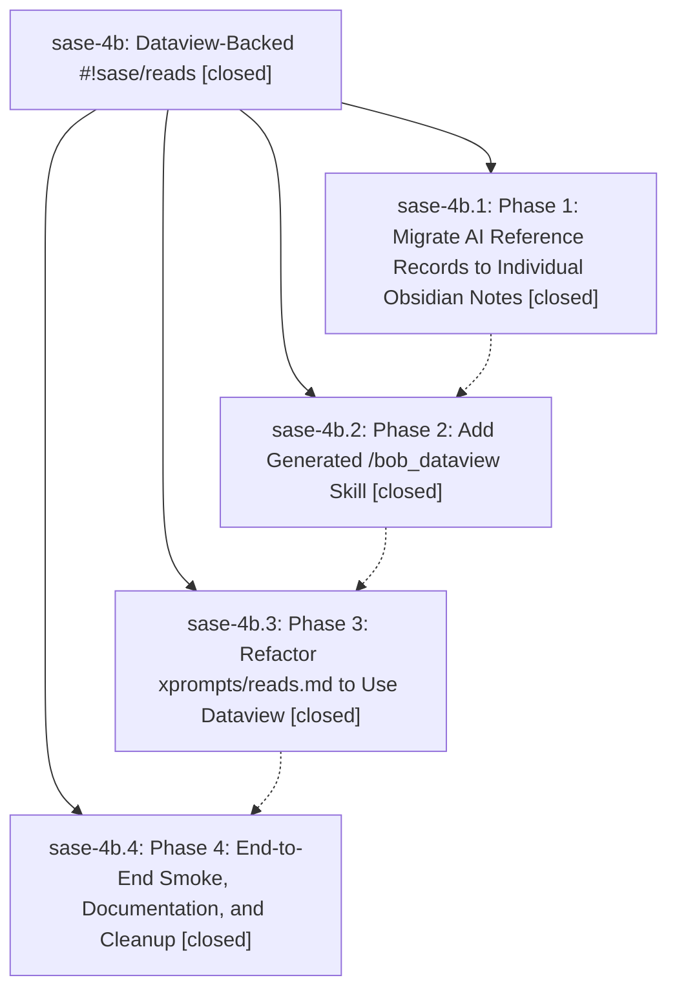

# Bead: sase-4b — Dataview-Backed #!sase/reads

[Bead Pages](../README.md) / sase-4b

**Status:** ✓ closed · **Resolution:** (unrecorded) · **Type:** plan · **Tier:** epic
**Owner:** `bryanbugyi34@gmail.com`
**Created:** 2026-06-03 19:56:32 UTC · **Closed:** 2026-06-03 21:00:45 UTC
**Plan:** [202606/bob\_dataview\_reads.md](https://github.com/sase-org/sase--plans/blob/main/202606/bob_dataview_reads.md)

## Notes

COMMIT: 3b424525d

## Phases

| Bead | Title | Status | Size | Agents | Commits |
|---|---|---|---|---:|---:|
| [sase-4b.1](sase-4b.1.md) | Phase 1: Migrate AI Reference Records to Individual Obsidian Notes | ✓ closed | small | 0 | 0 |
| [sase-4b.2](sase-4b.2.md) | Phase 2: Add Generated /bob\_dataview Skill | ✓ closed | small | 1 | 1 |
| [sase-4b.3](sase-4b.3.md) | Phase 3: Refactor xprompts/reads.md to Use Dataview | ✓ closed | small | 1 | 1 |
| [sase-4b.4](sase-4b.4.md) | Phase 4: End-to-End Smoke, Documentation, and Cleanup | ✓ closed | small | 1 | 1 |

## Lineage

## Agents

| Agent | Bead | Commits |
|---|---|---:|
| [bbugyi200.athena.sase-4b.2](https://github.com/sase-org/sase--agents/blob/main/agents/bbugyi200.athena.sase-4b.2/README.md) | [sase-4b.2](sase-4b.2.md) | 1 |
| [bbugyi200.athena.sase-4b.3](https://github.com/sase-org/sase--agents/blob/main/agents/bbugyi200.athena.sase-4b.3/README.md) | [sase-4b.3](sase-4b.3.md) | 1 |
| [bbugyi200.athena.sase-4b.4](https://github.com/sase-org/sase--agents/blob/main/agents/bbugyi200.athena.sase-4b.4/README.md) | [sase-4b.4](sase-4b.4.md) | 1 |

## Commits

| Commit | Subject | Bead | Committed (UTC) |
|---|---|---|---|
| [`a500f33`](https://github.com/sase-org/sase/commit/a500f334ed4cbdc81ae250db9ccfe5a737220d4a) | feat: add bob dataview generated skill source (sase-4b.2) | [sase-4b.2](sase-4b.2.md) | 2026-06-03 20:25:51 |
| [`b8695c9`](https://github.com/sase-org/sase/commit/b8695c980a0137552c331b85b3d5fef246cd11ec) | feat: use Dataview references in reads xprompt (sase-4b.3) | [sase-4b.3](sase-4b.3.md) | 2026-06-03 20:35:07 |
| [`826c2b7`](https://github.com/sase-org/sase/commit/826c2b7bcf3b581186a59cf338e44259444cfbb1) | chore: document Dataview reads phase 4 closeout (sase-4b.4) | [sase-4b.4](sase-4b.4.md) | 2026-06-03 20:47:33 |
