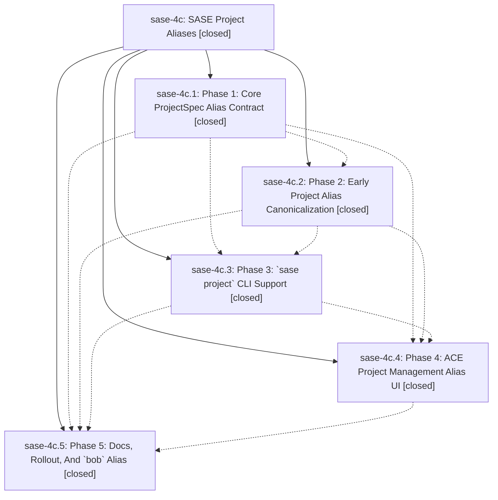

# Bead: sase-4c — SASE Project Aliases

[Bead Pages](../README.md) / sase-4c

**Status:** ✓ closed · **Resolution:** (unrecorded) · **Type:** plan · **Tier:** epic
**Owner:** `bryanbugyi34@gmail.com`
**Created:** 2026-06-04 14:32:51 UTC · **Closed:** 2026-06-04 16:20:47 UTC
**Plan:** [202606/project\_aliases.md](https://github.com/sase-org/sase--plans/blob/main/202606/project_aliases.md)

## Notes

COMMIT: c720af024

## Phases

| Bead | Title | Status | Size | Agents | Commits |
|---|---|---|---|---:|---:|
| [sase-4c.1](sase-4c.1.md) | Phase 1: Core ProjectSpec Alias Contract | ✓ closed | small | 1 | 2 |
| [sase-4c.2](sase-4c.2.md) | Phase 2: Early Project Alias Canonicalization | ✓ closed | small | 1 | 1 |
| [sase-4c.3](sase-4c.3.md) | Phase 3: \`sase project\` CLI Support | ✓ closed | small | 1 | 1 |
| [sase-4c.4](sase-4c.4.md) | Phase 4: ACE Project Management Alias UI | ✓ closed | small | 1 | 1 |
| [sase-4c.5](sase-4c.5.md) | Phase 5: Docs, Rollout, And \`bob\` Alias | ✓ closed | small | 1 | 1 |

## Lineage

## Agents

| Agent | Bead | Commits |
|---|---|---:|
| [bbugyi200.athena.sase-4c](https://github.com/sase-org/sase--agents/blob/main/agents/bbugyi200.athena.sase-4c/README.md) | [sase-4c](README.md) | 1 |
| [bbugyi200.athena.sase-4c.1](https://github.com/sase-org/sase--agents/blob/main/agents/bbugyi200.athena.sase-4c.1/README.md) | [sase-4c.1](sase-4c.1.md) | 2 |
| [bbugyi200.athena.sase-4c.2](https://github.com/sase-org/sase--agents/blob/main/agents/bbugyi200.athena.sase-4c.2/README.md) | [sase-4c.2](sase-4c.2.md) | 1 |
| [bbugyi200.athena.sase-4c.3](https://github.com/sase-org/sase--agents/blob/main/agents/bbugyi200.athena.sase-4c.3/README.md) | [sase-4c.3](sase-4c.3.md) | 1 |
| [bbugyi200.athena.sase-4c.4](https://github.com/sase-org/sase--agents/blob/main/agents/bbugyi200.athena.sase-4c.4/README.md) | [sase-4c.4](sase-4c.4.md) | 1 |
| [bbugyi200.athena.sase-4c.5](https://github.com/sase-org/sase--agents/blob/main/agents/bbugyi200.athena.sase-4c.5/README.md) | [sase-4c.5](sase-4c.5.md) | 1 |

## Commits

| Commit | Subject | Bead | Committed (UTC) |
|---|---|---|---|
| [`b9b08c2`](https://github.com/sase-org/sase/commit/b9b08c23e4e38936ccae320bfde1a5da14e80f7d) | feat: expose project aliases in lifecycle facade (sase-4c.1) | [sase-4c.1](sase-4c.1.md) | 2026-06-04 15:03:22 |
| [`sase-core@21c137e`](https://github.com/sase-org/sase-core/commit/21c137e82b2d38ca3340e44fdcf7b0e8243ecb58) | feat: add ProjectSpec alias contract (sase-4c.1) | [sase-4c.1](sase-4c.1.md) | 2026-06-04 15:04:07 |
| [`e9bbd29`](https://github.com/sase-org/sase/commit/e9bbd290e112e54b4807eb87ff5c30b572e6bed9) | feat: canonicalize project alias refs early (sase-4c.2) | [sase-4c.2](sase-4c.2.md) | 2026-06-04 15:24:34 |
| [`8483626`](https://github.com/sase-org/sase/commit/848362656edbaa2b088e644f47efe38dee79acac) | feat: add project alias CLI support (sase-4c.3) | [sase-4c.3](sase-4c.3.md) | 2026-06-04 15:41:14 |
| [`e737ed9`](https://github.com/sase-org/sase/commit/e737ed9f3f9e37153be5d249d125fbec81a8a510) | feat: add ACE project alias editing (sase-4c.4) | [sase-4c.4](sase-4c.4.md) | 2026-06-04 15:58:38 |
| [`db255fd`](https://github.com/sase-org/sase/commit/db255fd26bf7827b91a331a13aa1dd08969e6f8a) | chore: document project aliases rollout (sase-4c.5) | [sase-4c.5](sase-4c.5.md) | 2026-06-04 16:11:14 |
| [`d89738c`](https://github.com/sase-org/sase/commit/d89738cfbc12da09cf416e5a9c6f489b3245e3b0) | chore: close project aliases epic (sase-4c) | [sase-4c](README.md) | 2026-06-04 16:21:27 |
