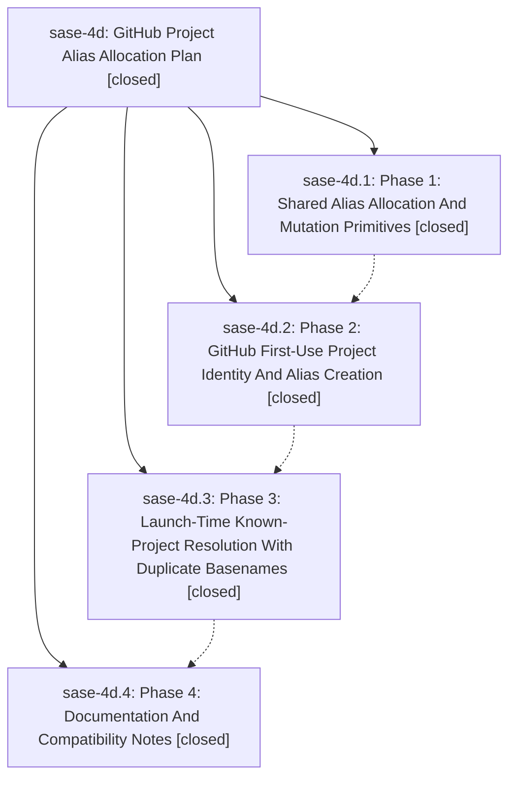

# Bead: sase-4d — GitHub Project Alias Allocation Plan

[Bead Pages](../README.md) / sase-4d

**Status:** ✓ closed · **Resolution:** (unrecorded) · **Type:** plan · **Tier:** epic
**Owner:** `bryanbugyi34@gmail.com`
**Created:** 2026-06-06 13:05:07 UTC · **Closed:** 2026-06-06 14:27:32 UTC
**Plan:** /home/bryan/.local/state/sase/workspaces/sase-org/sase/sase\_12/sdd/plans/202606/github\_project\_aliases.md

## Notes

COMMIT: 902c7928f

[2026-07-27T21:32:10Z · sase-a1.land] [2026-06-06T14:21:06Z · bryanbugyi34@gmail.com] (restored 2026-07-27) COMMIT: a75638407

## Phases

| Bead | Title | Status | Size | Agents | Commits |
|---|---|---|---|---:|---:|
| [sase-4d.1](sase-4d.1.md) | Phase 1: Shared Alias Allocation And Mutation Primitives | ✓ closed | small | 1 | 1 |
| [sase-4d.2](sase-4d.2.md) | Phase 2: GitHub First-Use Project Identity And Alias Creation | ✓ closed | small | 0 | 0 |
| [sase-4d.3](sase-4d.3.md) | Phase 3: Launch-Time Known-Project Resolution With Duplicate Basenames | ✓ closed | small | 1 | 1 |
| [sase-4d.4](sase-4d.4.md) | Phase 4: Documentation And Compatibility Notes | ✓ closed | small | 1 | 1 |

## Lineage

## Agents

| Agent | Bead | Commits |
|---|---|---:|
| [bbugyi200.athena.sase-4d](https://github.com/sase-org/sase--agents/blob/main/agents/bbugyi200.athena.sase-4d/README.md) | [sase-4d](README.md) | 2 |
| [bbugyi200.athena.sase-4d.1](https://github.com/sase-org/sase--agents/blob/main/agents/bbugyi200.athena.sase-4d.1/README.md) | [sase-4d.1](sase-4d.1.md) | 1 |
| [bbugyi200.athena.sase-4d.3](https://github.com/sase-org/sase--agents/blob/main/agents/bbugyi200.athena.sase-4d.3/README.md) | [sase-4d.3](sase-4d.3.md) | 1 |
| [bbugyi200.athena.sase-4d.4](https://github.com/sase-org/sase--agents/blob/main/agents/bbugyi200.athena.sase-4d.4/README.md) | [sase-4d.4](sase-4d.4.md) | 1 |

## Commits

| Commit | Subject | Bead | Committed (UTC) |
|---|---|---|---|
| [`05a8b9e`](https://github.com/sase-org/sase/commit/05a8b9e6947eb728b67dddfffae81a3a9d6c6f62) | feat: add shared project alias services (sase-4d.1) | [sase-4d.1](sase-4d.1.md) | 2026-06-06 13:29:46 |
| [`0692ce7`](https://github.com/sase-org/sase/commit/0692ce76c6f3e487c42640bc0327482f199f52f9) | fix: resolve GitHub project refs by workspace (sase-4d.3) | [sase-4d.3](sase-4d.3.md) | 2026-06-06 13:58:19 |
| [`5ca5ad9`](https://github.com/sase-org/sase/commit/5ca5ad9ba39c999bd737adbf17553d0710eabf9b) | chore: document GitHub project alias compatibility (sase-4d.4) | [sase-4d.4](sase-4d.4.md) | 2026-06-06 14:08:50 |
| [`0d2a6f8`](https://github.com/sase-org/sase/commit/0d2a6f8ed0eadbaa657a88ae115387eb5f5b56a3) | chore: Add SDD prompt and plan for sase\_4d\_pyvision\_cleanup\_2 (sase-4d) | [sase-4d](README.md) | 2026-06-06 14:21:18 |
| [`34c2758`](https://github.com/sase-org/sase/commit/34c2758cae5a09e88a01cbec8b7f16fdd4722dde) | chore: finalize project alias pyvision cleanup (sase-4d) | [sase-4d](README.md) | 2026-06-06 14:28:12 |
