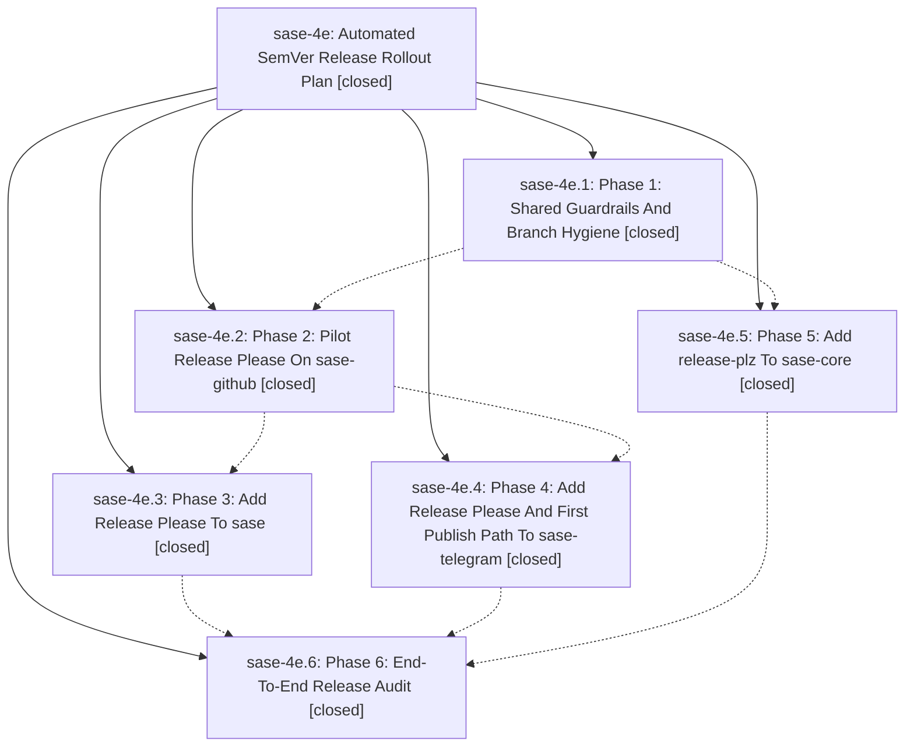

# Bead: sase-4e — Automated SemVer Release Rollout Plan

[Bead Pages](../README.md) / sase-4e

**Status:** ✓ closed · **Resolution:** (unrecorded) · **Type:** plan · **Tier:** epic
**Owner:** `bryanbugyi34@gmail.com`
**Created:** 2026-06-08 16:30:07 UTC · **Closed:** 2026-06-08 17:54:03 UTC
**Plan:** [202606/automated\_semver\_releases.md](https://github.com/sase-org/sase--plans/blob/main/202606/automated_semver_releases.md)

## Notes

COMMIT: 58170d2c4

## Phases

| Bead | Title | Status | Size | Agents | Commits |
|---|---|---|---|---:|---:|
| [sase-4e.1](sase-4e.1.md) | Phase 1: Shared Guardrails And Branch Hygiene | ✓ closed | small | 1 | 1 |
| [sase-4e.2](sase-4e.2.md) | Phase 2: Pilot Release Please On sase-github | ✓ closed | small | 0 | 0 |
| [sase-4e.3](sase-4e.3.md) | Phase 3: Add Release Please To sase | ✓ closed | small | 1 | 1 |
| [sase-4e.4](sase-4e.4.md) | Phase 4: Add Release Please And First Publish Path To sase-telegram | ✓ closed | small | 0 | 0 |
| [sase-4e.5](sase-4e.5.md) | Phase 5: Add release-plz To sase-core | ✓ closed | small | 0 | 0 |
| [sase-4e.6](sase-4e.6.md) | Phase 6: End-To-End Release Audit | ✓ closed | small | 1 | 1 |

## Lineage

## Agents

| Agent | Bead | Commits |
|---|---|---:|
| [bbugyi200.athena.sase-4e.1](https://github.com/sase-org/sase--agents/blob/main/agents/bbugyi200.athena.sase-4e.1/README.md) | [sase-4e.1](sase-4e.1.md) | 1 |
| [bbugyi200.athena.sase-4e.3](https://github.com/sase-org/sase--agents/blob/main/agents/bbugyi200.athena.sase-4e.3/README.md) | [sase-4e.3](sase-4e.3.md) | 1 |
| [bbugyi200.athena.sase-4e.6](https://github.com/sase-org/sase--agents/blob/main/agents/bbugyi200.athena.sase-4e.6/README.md) | [sase-4e.6](sase-4e.6.md) | 1 |

## Commits

| Commit | Subject | Bead | Committed (UTC) |
|---|---|---|---|
| [`9071f55`](https://github.com/sase-org/sase/commit/9071f55be3fe53ce1f2ea8b372f241b5ed6145ac) | chore: add shared release guardrails (sase-4e.1) | [sase-4e.1](sase-4e.1.md) | 2026-06-08 16:50:55 |
| [`f6cb722`](https://github.com/sase-org/sase/commit/f6cb7227c9f261bfb3908a778b0beec65071a714) | chore: add Release Please for sase package (sase-4e.3) | [sase-4e.3](sase-4e.3.md) | 2026-06-08 17:19:05 |
| [`cafc0d4`](https://github.com/sase-org/sase/commit/cafc0d40654f9867bdb7907d746b96f75e58a48b) | chore: close release audit bead (sase-4e.6) | [sase-4e.6](sase-4e.6.md) | 2026-06-08 17:42:59 |
