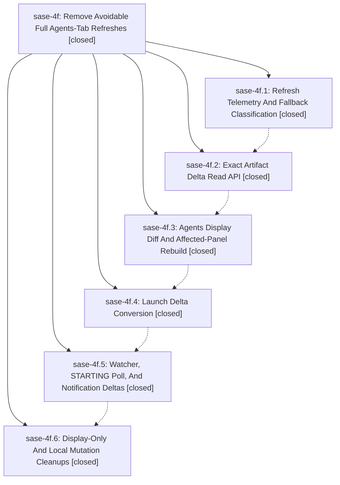

# Bead: sase-4f — Remove Avoidable Full Agents-Tab Refreshes

[Bead Pages](../README.md) / sase-4f

**Status:** ✓ closed · **Resolution:** (unrecorded) · **Type:** plan · **Tier:** epic
**Owner:** `bryanbugyi34@gmail.com`
**Created:** 2026-06-08 18:07:10 UTC · **Closed:** 2026-06-08 20:46:30 UTC
**Plan:** [202606/tui\_agent\_refresh\_optimizations.md](https://github.com/sase-org/sase--plans/blob/main/202606/tui_agent_refresh_optimizations.md)

## Notes

COMMIT: 2f561c59d

## Phases

| Bead | Title | Status | Size | Agents | Commits |
|---|---|---|---|---:|---:|
| [sase-4f.1](sase-4f.1.md) | Refresh Telemetry And Fallback Classification | ✓ closed | small | 1 | 1 |
| [sase-4f.2](sase-4f.2.md) | Exact Artifact Delta Read API | ✓ closed | small | 1 | 1 |
| [sase-4f.3](sase-4f.3.md) | Agents Display Diff And Affected-Panel Rebuild | ✓ closed | small | 1 | 1 |
| [sase-4f.4](sase-4f.4.md) | Launch Delta Conversion | ✓ closed | small | 1 | 1 |
| [sase-4f.5](sase-4f.5.md) | Watcher, STARTING Poll, And Notification Deltas | ✓ closed | small | 1 | 1 |
| [sase-4f.6](sase-4f.6.md) | Display-Only And Local Mutation Cleanups | ✓ closed | small | 1 | 1 |

## Lineage

## Agents

| Agent | Bead | Commits |
|---|---|---:|
| [bbugyi200.athena.sase-4f.1](https://github.com/sase-org/sase--agents/blob/main/agents/bbugyi200.athena.sase-4f.1/README.md) | [sase-4f.1](sase-4f.1.md) | 1 |
| [bbugyi200.athena.sase-4f.2](https://github.com/sase-org/sase--agents/blob/main/agents/bbugyi200.athena.sase-4f.2/README.md) | [sase-4f.2](sase-4f.2.md) | 1 |
| [bbugyi200.athena.sase-4f.3](https://github.com/sase-org/sase--agents/blob/main/agents/bbugyi200.athena.sase-4f.3/README.md) | [sase-4f.3](sase-4f.3.md) | 1 |
| [bbugyi200.athena.sase-4f.4](https://github.com/sase-org/sase--agents/blob/main/agents/bbugyi200.athena.sase-4f.4/README.md) | [sase-4f.4](sase-4f.4.md) | 1 |
| [bbugyi200.athena.sase-4f.5](https://github.com/sase-org/sase--agents/blob/main/agents/bbugyi200.athena.sase-4f.5/README.md) | [sase-4f.5](sase-4f.5.md) | 1 |
| [bbugyi200.athena.sase-4f.6](https://github.com/sase-org/sase--agents/blob/main/agents/bbugyi200.athena.sase-4f.6/README.md) | [sase-4f.6](sase-4f.6.md) | 1 |

## Commits

| Commit | Subject | Bead | Committed (UTC) |
|---|---|---|---|
| [`43ec668`](https://github.com/sase-org/sase/commit/43ec668316ae38938a3b50bc2ef5ca03955cb01f) | feat: add agents refresh telemetry taxonomy (sase-4f.1) | [sase-4f.1](sase-4f.1.md) | 2026-06-08 18:31:21 |
| [`8209751`](https://github.com/sase-org/sase/commit/8209751f8dbf1f703adc800d287f87759f097253) | feat: add exact artifact delta loading (sase-4f.2) | [sase-4f.2](sase-4f.2.md) | 2026-06-08 18:52:37 |
| [`5a14acc`](https://github.com/sase-org/sase/commit/5a14acc1e18db369b7333f7aff93b1b8b57ce79c) | feat: add incremental Agents display refresh (sase-4f.3) | [sase-4f.3](sase-4f.3.md) | 2026-06-08 19:20:51 |
| [`1eee25b`](https://github.com/sase-org/sase/commit/1eee25b3f825f597278a7aa386e3ea271e963af1) | feat: reconcile launch results with artifact deltas (sase-4f.4) | [sase-4f.4](sase-4f.4.md) | 2026-06-08 19:44:28 |
| [`08c945d`](https://github.com/sase-org/sase/commit/08c945d0c77786ab0f321741122aa1f296ca076c) | feat(tui): use exact agent deltas for notification refreshes (sase-4f.5) | [sase-4f.5](sase-4f.5.md) | 2026-06-08 20:06:06 |
| [`4d9c4cc`](https://github.com/sase-org/sase/commit/4d9c4ccc78f65e5967acc6b5eefeef2ab45d8732) | feat: optimize agents tab local refresh paths (sase-4f.6) | [sase-4f.6](sase-4f.6.md) | 2026-06-08 20:32:22 |
