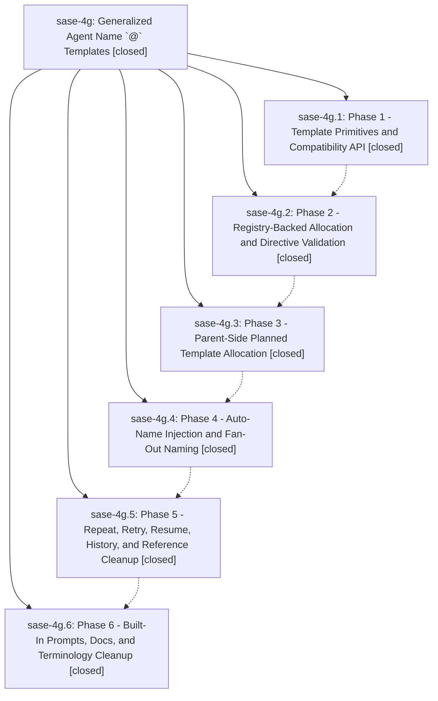

# Bead: sase-4g — Generalized Agent Name \`@\` Templates

[Bead Pages](../README.md) / sase-4g

**Status:** ✓ closed · **Resolution:** (unrecorded) · **Type:** plan · **Tier:** epic
**Owner:** `bryanbugyi34@gmail.com`
**Created:** 2026-06-08 19:03:48 UTC · **Closed:** 2026-06-08 21:34:28 UTC
**Plan:** [202606/generalized\_agent\_name\_at\_templates.md](https://github.com/sase-org/sase--plans/blob/main/202606/generalized_agent_name_at_templates.md)

## Notes

COMMIT: 1f736c827

[2026-07-27T21:32:53Z · sase-a1.land] [2026-06-08T21:32:27Z · bryanbugyi34@gmail.com] (restored 2026-07-27) COMMIT: cef82ef8e

## Phases

| Bead | Title | Status | Size | Agents | Commits |
|---|---|---|---|---:|---:|
| [sase-4g.1](sase-4g.1.md) | Phase 1 - Template Primitives and Compatibility API | ✓ closed | small | 1 | 1 |
| [sase-4g.2](sase-4g.2.md) | Phase 2 - Registry-Backed Allocation and Directive Validation | ✓ closed | small | 1 | 1 |
| [sase-4g.3](sase-4g.3.md) | Phase 3 - Parent-Side Planned Template Allocation | ✓ closed | small | 1 | 1 |
| [sase-4g.4](sase-4g.4.md) | Phase 4 - Auto-Name Injection and Fan-Out Naming | ✓ closed | small | 1 | 1 |
| [sase-4g.5](sase-4g.5.md) | Phase 5 - Repeat, Retry, Resume, History, and Reference Cleanup | ✓ closed | small | 1 | 1 |
| [sase-4g.6](sase-4g.6.md) | Phase 6 - Built-In Prompts, Docs, and Terminology Cleanup | ✓ closed | small | 1 | 1 |

## Lineage

## Agents

| Agent | Bead | Commits |
|---|---|---:|
| [bbugyi200.athena.sase-4g](https://github.com/sase-org/sase--agents/blob/main/agents/bbugyi200.athena.sase-4g/README.md) | [sase-4g](README.md) | 1 |
| [bbugyi200.athena.sase-4g.1](https://github.com/sase-org/sase--agents/blob/main/agents/bbugyi200.athena.sase-4g.1/README.md) | [sase-4g.1](sase-4g.1.md) | 1 |
| [bbugyi200.athena.sase-4g.2](https://github.com/sase-org/sase--agents/blob/main/agents/bbugyi200.athena.sase-4g.2/README.md) | [sase-4g.2](sase-4g.2.md) | 1 |
| [bbugyi200.athena.sase-4g.3](https://github.com/sase-org/sase--agents/blob/main/agents/bbugyi200.athena.sase-4g.3/README.md) | [sase-4g.3](sase-4g.3.md) | 1 |
| [bbugyi200.athena.sase-4g.4](https://github.com/sase-org/sase--agents/blob/main/agents/bbugyi200.athena.sase-4g.4/README.md) | [sase-4g.4](sase-4g.4.md) | 1 |
| [bbugyi200.athena.sase-4g.5](https://github.com/sase-org/sase--agents/blob/main/agents/bbugyi200.athena.sase-4g.5/README.md) | [sase-4g.5](sase-4g.5.md) | 1 |
| [bbugyi200.athena.sase-4g.6](https://github.com/sase-org/sase--agents/blob/main/agents/bbugyi200.athena.sase-4g.6/README.md) | [sase-4g.6](sase-4g.6.md) | 1 |

## Commits

| Commit | Subject | Bead | Committed (UTC) |
|---|---|---|---|
| [`7e88250`](https://github.com/sase-org/sase/commit/7e88250d534da3bf6371ec2ed87d7e4d2720bd7f) | feat: add agent name template Python adapter (sase-4g.1) | [sase-4g.1](sase-4g.1.md) | 2026-06-08 19:31:05 |
| [`2fb3d3b`](https://github.com/sase-org/sase/commit/2fb3d3b5b1c880113d617933fbe6ed550d91cd72) | feat: support registry-backed @ name templates (sase-4g.2) | [sase-4g.2](sase-4g.2.md) | 2026-06-08 19:57:21 |
| [`8f81b30`](https://github.com/sase-org/sase/commit/8f81b30cd927a12d411799ad84629d4e75b8f22e) | feat: plan generic agent name templates (sase-4g.3) | [sase-4g.3](sase-4g.3.md) | 2026-06-08 20:19:38 |
| [`59cb6a5`](https://github.com/sase-org/sase/commit/59cb6a5e0d2b27bed270a29315ebdff4fb43fa08) | feat: allocate fan-out names through templates (sase-4g.4) | [sase-4g.4](sase-4g.4.md) | 2026-06-08 20:43:09 |
| [`f65466f`](https://github.com/sase-org/sase/commit/f65466f22828cee27dddf449c555ba405e3f18bd) | feat: clean up agent name template references (sase-4g.5) | [sase-4g.5](sase-4g.5.md) | 2026-06-08 21:01:53 |
| [`0dd2cda`](https://github.com/sase-org/sase/commit/0dd2cda86ada7142b3fa65d983dd728dd0c97fe6) | feat: update built-in templates terminology (sase-4g.6) | [sase-4g.6](sase-4g.6.md) | 2026-06-08 21:17:25 |
| [`93bfc5f`](https://github.com/sase-org/sase/commit/93bfc5f75967c01da535be54acc374cf98cf9a27) | chore: Add SDD prompt and plan for fix\_generated\_skill\_staleness\_1 (sase-4g) | [sase-4g](README.md) | 2026-06-08 21:34:56 |
