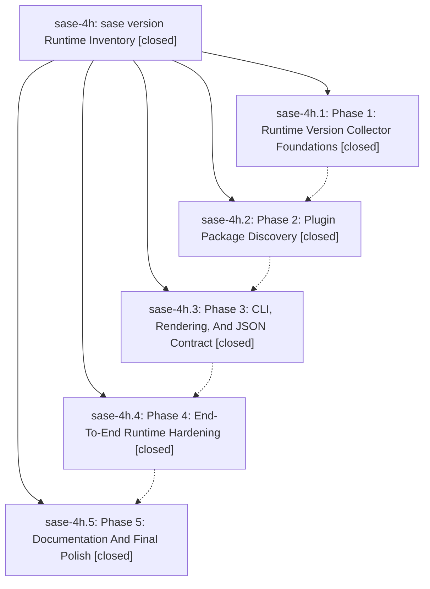

# Bead: sase-4h — sase version Runtime Inventory

[Bead Pages](../README.md) / sase-4h

**Status:** ✓ closed · **Resolution:** (unrecorded) · **Type:** plan · **Tier:** epic
**Owner:** `bryanbugyi34@gmail.com`
**Created:** 2026-06-08 19:27:29 UTC · **Closed:** 2026-06-08 21:06:00 UTC
**Plan:** [202606/version\_command.md](https://github.com/sase-org/sase--plans/blob/main/202606/version_command.md)

## Notes

COMMIT: f25ced774

## Phases

| Bead | Title | Status | Size | Agents | Commits |
|---|---|---|---|---:|---:|
| [sase-4h.1](sase-4h.1.md) | Phase 1: Runtime Version Collector Foundations | ✓ closed | small | 1 | 1 |
| [sase-4h.2](sase-4h.2.md) | Phase 2: Plugin Package Discovery | ✓ closed | small | 1 | 1 |
| [sase-4h.3](sase-4h.3.md) | Phase 3: CLI, Rendering, And JSON Contract | ✓ closed | small | 1 | 1 |
| [sase-4h.4](sase-4h.4.md) | Phase 4: End-To-End Runtime Hardening | ✓ closed | small | 1 | 1 |
| [sase-4h.5](sase-4h.5.md) | Phase 5: Documentation And Final Polish | ✓ closed | small | 1 | 1 |

## Lineage

## Agents

| Agent | Bead | Commits |
|---|---|---:|
| [bbugyi200.athena.sase-4h](https://github.com/sase-org/sase--agents/blob/main/agents/bbugyi200.athena.sase-4h/README.md) | [sase-4h](README.md) | 1 |
| [bbugyi200.athena.sase-4h.1](https://github.com/sase-org/sase--agents/blob/main/agents/bbugyi200.athena.sase-4h.1/README.md) | [sase-4h.1](sase-4h.1.md) | 1 |
| [bbugyi200.athena.sase-4h.2](https://github.com/sase-org/sase--agents/blob/main/agents/bbugyi200.athena.sase-4h.2/README.md) | [sase-4h.2](sase-4h.2.md) | 1 |
| [bbugyi200.athena.sase-4h.3](https://github.com/sase-org/sase--agents/blob/main/agents/bbugyi200.athena.sase-4h.3/README.md) | [sase-4h.3](sase-4h.3.md) | 1 |
| [bbugyi200.athena.sase-4h.4](https://github.com/sase-org/sase--agents/blob/main/agents/bbugyi200.athena.sase-4h.4/README.md) | [sase-4h.4](sase-4h.4.md) | 1 |
| [bbugyi200.athena.sase-4h.5](https://github.com/sase-org/sase--agents/blob/main/agents/bbugyi200.athena.sase-4h.5/README.md) | [sase-4h.5](sase-4h.5.md) | 1 |

## Commits

| Commit | Subject | Bead | Committed (UTC) |
|---|---|---|---|
| [`9a6fed3`](https://github.com/sase-org/sase/commit/9a6fed341fb50c609f7a9c227e60c82a0f896934) | feat: add runtime version inventory collector (sase-4h.1) | [sase-4h.1](sase-4h.1.md) | 2026-06-08 19:57:13 |
| [`28933e2`](https://github.com/sase-org/sase/commit/28933e2fc8d14065e416910cd685cbe22a1a6107) | feat: discover plugin packages in version inventory (sase-4h.2) | [sase-4h.2](sase-4h.2.md) | 2026-06-08 20:14:42 |
| [`fa6b12d`](https://github.com/sase-org/sase/commit/fa6b12d6aebdd38dfb77f6324b473cae3e97d61f) | feat: add runtime version command (sase-4h.3) | [sase-4h.3](sase-4h.3.md) | 2026-06-08 20:28:00 |
| [`e10427e`](https://github.com/sase-org/sase/commit/e10427eb38871507c5f28462e2155be0dd7c4dd1) | feat: harden version runtime inventory (sase-4h.4) | [sase-4h.4](sase-4h.4.md) | 2026-06-08 20:40:24 |
| [`9cde44b`](https://github.com/sase-org/sase/commit/9cde44be6ae5f978aa729568af016cee135f1474) | chore: document version runtime inventory (sase-4h.5) | [sase-4h.5](sase-4h.5.md) | 2026-06-08 20:54:17 |
| [`d218778`](https://github.com/sase-org/sase/commit/d218778855235a4115678f3fba9875362aa11a58) | fix(version): make verbose audit readable (sase-4h) | [sase-4h](README.md) | 2026-06-08 21:06:28 |
