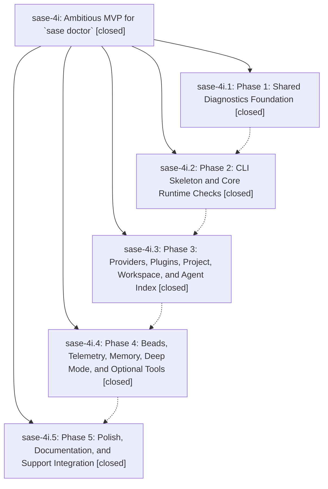

# Bead: sase-4i — Ambitious MVP for \`sase doctor\`

[Bead Pages](../README.md) / sase-4i

**Status:** ✓ closed · **Resolution:** (unrecorded) · **Type:** plan · **Tier:** epic
**Owner:** `bryanbugyi34@gmail.com`
**Created:** 2026-06-09 15:53:44 UTC · **Closed:** 2026-06-09 17:50:07 UTC
**Plan:** [202606/doctor\_command\_mvp.md](https://github.com/sase-org/sase--plans/blob/main/202606/doctor_command_mvp.md)

## Notes

COMMIT: 90c7e74e8

## Phases

| Bead | Title | Status | Size | Agents | Commits |
|---|---|---|---|---:|---:|
| [sase-4i.1](sase-4i.1.md) | Phase 1: Shared Diagnostics Foundation | ✓ closed | small | 1 | 1 |
| [sase-4i.2](sase-4i.2.md) | Phase 2: CLI Skeleton and Core Runtime Checks | ✓ closed | small | 1 | 1 |
| [sase-4i.3](sase-4i.3.md) | Phase 3: Providers, Plugins, Project, Workspace, and Agent Index | ✓ closed | small | 1 | 1 |
| [sase-4i.4](sase-4i.4.md) | Phase 4: Beads, Telemetry, Memory, Deep Mode, and Optional Tools | ✓ closed | small | 1 | 1 |
| [sase-4i.5](sase-4i.5.md) | Phase 5: Polish, Documentation, and Support Integration | ✓ closed | small | 1 | 1 |

## Lineage

## Agents

| Agent | Bead | Commits |
|---|---|---:|
| [bbugyi200.athena.sase-4i.1](https://github.com/sase-org/sase--agents/blob/main/agents/bbugyi200.athena.sase-4i.1/README.md) | [sase-4i.1](sase-4i.1.md) | 1 |
| [bbugyi200.athena.sase-4i.2](https://github.com/sase-org/sase--agents/blob/main/agents/bbugyi200.athena.sase-4i.2/README.md) | [sase-4i.2](sase-4i.2.md) | 1 |
| [bbugyi200.athena.sase-4i.3](https://github.com/sase-org/sase--agents/blob/main/agents/bbugyi200.athena.sase-4i.3/README.md) | [sase-4i.3](sase-4i.3.md) | 1 |
| [bbugyi200.athena.sase-4i.4](https://github.com/sase-org/sase--agents/blob/main/agents/bbugyi200.athena.sase-4i.4/README.md) | [sase-4i.4](sase-4i.4.md) | 1 |
| [bbugyi200.athena.sase-4i.5](https://github.com/sase-org/sase--agents/blob/main/agents/bbugyi200.athena.sase-4i.5/README.md) | [sase-4i.5](sase-4i.5.md) | 1 |

## Commits

| Commit | Subject | Bead | Committed (UTC) |
|---|---|---|---|
| [`fc2d009`](https://github.com/sase-org/sase/commit/fc2d0097d5f2306365c9f8ac2ccc26ac24e38b73) | feat: add shared diagnostics foundation (sase-4i.1) | [sase-4i.1](sase-4i.1.md) | 2026-06-09 16:17:59 |
| [`4ab5e7f`](https://github.com/sase-org/sase/commit/4ab5e7f09fb3338926d94e98940a76d04258a78c) | feat: add doctor command runtime checks (sase-4i.2) | [sase-4i.2](sase-4i.2.md) | 2026-06-09 16:40:27 |
| [`def2859`](https://github.com/sase-org/sase/commit/def285906e0289ecd1937c43c8bc7fab867f5e15) | feat: add phase 3 doctor checks (sase-4i.3) | [sase-4i.3](sase-4i.3.md) | 2026-06-09 17:00:40 |
| [`e802a84`](https://github.com/sase-org/sase/commit/e802a84efa89d36c67d835bea77eb0746e13391d) | feat: add phase 4 doctor checks (sase-4i.4) | [sase-4i.4](sase-4i.4.md) | 2026-06-09 17:22:51 |
| [`8887451`](https://github.com/sase-org/sase/commit/8887451643e417f440e542e4990c1feb7a4ae5ff) | feat: polish doctor support workflow (sase-4i.5) | [sase-4i.5](sase-4i.5.md) | 2026-06-09 17:37:37 |
