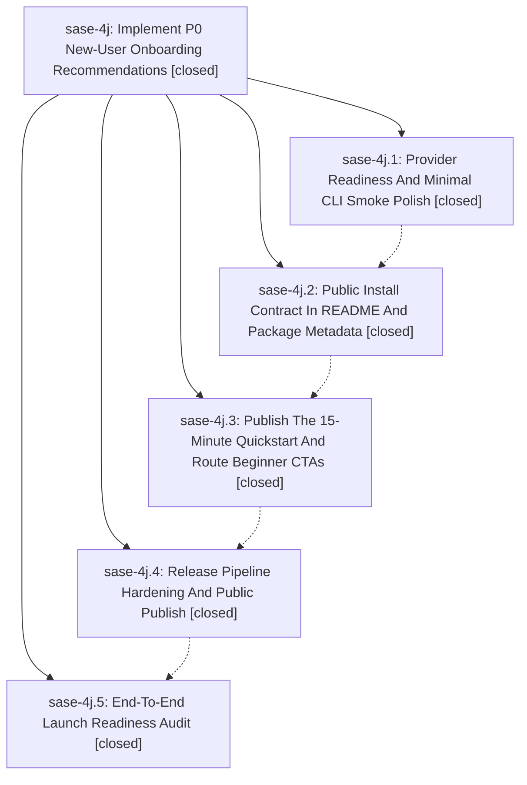

# Bead: sase-4j — Implement P0 New-User Onboarding Recommendations

[Bead Pages](../README.md) / sase-4j

**Status:** ✓ closed · **Resolution:** (unrecorded) · **Type:** plan · **Tier:** epic
**Owner:** `bryanbugyi34@gmail.com`
**Created:** 2026-06-09 22:42:52 UTC · **Closed:** 2026-06-10 00:47:25 UTC
**Plan:** /home/bryan/.local/state/sase/workspaces/sase-org/sase/sase\_11/sdd/plans/202606/p0\_onboarding.md

## Notes

COMMIT: e9de9faca

## Phases

| Bead | Title | Status | Size | Agents | Commits |
|---|---|---|---|---:|---:|
| [sase-4j.1](sase-4j.1.md) | Provider Readiness And Minimal CLI Smoke Polish | ✓ closed | small | 1 | 1 |
| [sase-4j.2](sase-4j.2.md) | Public Install Contract In README And Package Metadata | ✓ closed | small | 1 | 1 |
| [sase-4j.3](sase-4j.3.md) | Publish The 15-Minute Quickstart And Route Beginner CTAs | ✓ closed | small | 1 | 1 |
| [sase-4j.4](sase-4j.4.md) | Release Pipeline Hardening And Public Publish | ✓ closed | small | 1 | 3 |
| [sase-4j.5](sase-4j.5.md) | End-To-End Launch Readiness Audit | ✓ closed | small | 0 | 0 |

## Lineage

## Agents

| Agent | Bead | Commits |
|---|---|---:|
| [bbugyi200.athena.sase-4j](https://github.com/sase-org/sase--agents/blob/main/agents/bbugyi200.athena.sase-4j/README.md) | [sase-4j](README.md) | 1 |
| [bbugyi200.athena.sase-4j.1](https://github.com/sase-org/sase--agents/blob/main/agents/bbugyi200.athena.sase-4j.1/README.md) | [sase-4j.1](sase-4j.1.md) | 1 |
| [bbugyi200.athena.sase-4j.2](https://github.com/sase-org/sase--agents/blob/main/agents/bbugyi200.athena.sase-4j.2/README.md) | [sase-4j.2](sase-4j.2.md) | 1 |
| [bbugyi200.athena.sase-4j.3](https://github.com/sase-org/sase--agents/blob/main/agents/bbugyi200.athena.sase-4j.3/README.md) | [sase-4j.3](sase-4j.3.md) | 1 |
| [bbugyi200.athena.sase-4j.4](https://github.com/sase-org/sase--agents/blob/main/agents/bbugyi200.athena.sase-4j.4/README.md) | [sase-4j.4](sase-4j.4.md) | 3 |

## Commits

| Commit | Subject | Bead | Committed (UTC) |
|---|---|---|---|
| [`237c932`](https://github.com/sase-org/sase/commit/237c932f9d9fcaeab76a9da996fa76ef9aa090d7) | fix: surface missing LLM provider CLI setup (sase-4j.1) | [sase-4j.1](sase-4j.1.md) | 2026-06-09 23:05:17 |
| [`e4673d6`](https://github.com/sase-org/sase/commit/e4673d6ada112414f44bd728ca5af78f5484d858) | chore: publish public install contract (sase-4j.2) | [sase-4j.2](sase-4j.2.md) | 2026-06-09 23:13:55 |
| [`2498fcc`](https://github.com/sase-org/sase/commit/2498fccef377026a3499d25a35866e73c5a1344a) | chore: publish quickstart beginner path (sase-4j.3) | [sase-4j.3](sase-4j.3.md) | 2026-06-09 23:26:16 |
| [`3c9556d`](https://github.com/sase-org/sase/commit/3c9556df40d3017c80a0f52c83167dd6170891b6) | chore: harden release publish smoke (sase-4j.4) | [sase-4j.4](sase-4j.4.md) | 2026-06-09 23:35:27 |
| [`57fbce7`](https://github.com/sase-org/sase/commit/57fbce7063fd36ca5305776c94d5ecb9c41ea06f) | chore: update docs artifact quickstart check (sase-4j.4) | [sase-4j.4](sase-4j.4.md) | 2026-06-09 23:47:03 |
| [`87a6d2b`](https://github.com/sase-org/sase/commit/87a6d2b88390d36325fbf42b70033e5a5c213132) | test: add deterministic provider CLI stub (sase-4j.4) | [sase-4j.4](sase-4j.4.md) | 2026-06-09 23:52:58 |
| [`cfacfbc`](https://github.com/sase-org/sase/commit/cfacfbc0d946bf4e4c1844d502ca6c064269ae8f) | chore: Add SDD prompt and plan for finish\_sase\_4j\_publish (sase-4j) | [sase-4j](README.md) | 2026-06-10 00:48:06 |
