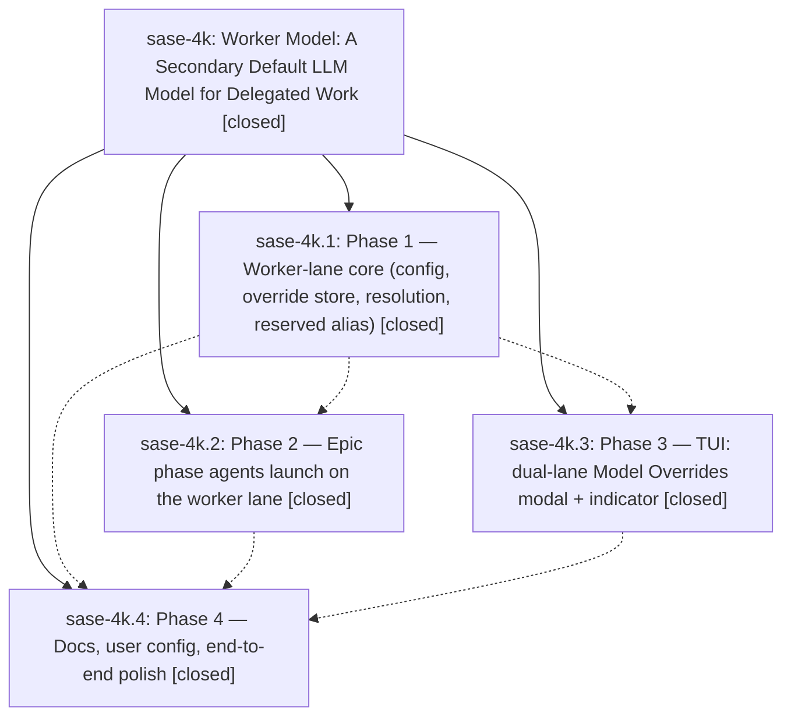

# Bead: sase-4k — Worker Model: A Secondary Default LLM Model for Delegated Work

[Bead Pages](../README.md) / sase-4k

**Status:** ✓ closed · **Resolution:** (unrecorded) · **Type:** plan · **Tier:** epic
**Owner:** `bryanbugyi34@gmail.com`
**Created:** 2026-06-10 00:41:54 UTC · **Closed:** 2026-06-10 01:53:34 UTC
**Plan:** [202606/worker\_model.md](https://github.com/sase-org/sase--plans/blob/main/202606/worker_model.md)

## Notes

COMMIT: 9df97ec31

## Phases

| Bead | Title | Status | Size | Agents | Commits |
|---|---|---|---|---:|---:|
| [sase-4k.1](sase-4k.1.md) | Phase 1 — Worker-lane core (config, override store, resolution, reserved alias) | ✓ closed | small | 1 | 1 |
| [sase-4k.2](sase-4k.2.md) | Phase 2 — Epic phase agents launch on the worker lane | ✓ closed | small | 1 | 1 |
| [sase-4k.3](sase-4k.3.md) | Phase 3 — TUI: dual-lane Model Overrides modal + indicator | ✓ closed | small | 1 | 1 |
| [sase-4k.4](sase-4k.4.md) | Phase 4 — Docs, user config, end-to-end polish | ✓ closed | small | 1 | 1 |

## Lineage

## Agents

| Agent | Bead | Commits |
|---|---|---:|
| [bbugyi200.athena.sase-4k](https://github.com/sase-org/sase--agents/blob/main/agents/bbugyi200.athena.sase-4k/README.md) | [sase-4k](README.md) | 1 |
| [bbugyi200.athena.sase-4k.1](https://github.com/sase-org/sase--agents/blob/main/agents/bbugyi200.athena.sase-4k.1/README.md) | [sase-4k.1](sase-4k.1.md) | 1 |
| [bbugyi200.athena.sase-4k.2](https://github.com/sase-org/sase--agents/blob/main/agents/bbugyi200.athena.sase-4k.2/README.md) | [sase-4k.2](sase-4k.2.md) | 1 |
| [bbugyi200.athena.sase-4k.3](https://github.com/sase-org/sase--agents/blob/main/agents/bbugyi200.athena.sase-4k.3/README.md) | [sase-4k.3](sase-4k.3.md) | 1 |
| [bbugyi200.athena.sase-4k.4](https://github.com/sase-org/sase--agents/blob/main/agents/bbugyi200.athena.sase-4k.4/README.md) | [sase-4k.4](sase-4k.4.md) | 1 |

## Commits

| Commit | Subject | Bead | Committed (UTC) |
|---|---|---|---|
| [`6afc114`](https://github.com/sase-org/sase/commit/6afc114ac2c0a212256fbba220801bb90bd77d86) | feat: add worker lane LLM resolution core (sase-4k.1) | [sase-4k.1](sase-4k.1.md) | 2026-06-10 01:08:07 |
| [`bb02d8f`](https://github.com/sase-org/sase/commit/bb02d8f9a310282bec6b2a67c73197830c5c6b79) | feat: route epic phase agents through worker model lane (sase-4k.2) | [sase-4k.2](sase-4k.2.md) | 2026-06-10 01:17:44 |
| [`838d400`](https://github.com/sase-org/sase/commit/838d40007f5e693c9ec3f1ec9f910fa291cc8b8b) | feat: add dual-lane model override TUI (sase-4k.3) | [sase-4k.3](sase-4k.3.md) | 2026-06-10 01:27:38 |
| [`7b6a9fa`](https://github.com/sase-org/sase/commit/7b6a9fafd75e5bcc7611ed1e86744f1037334de3) | chore: document worker model configuration (sase-4k.4) | [sase-4k.4](sase-4k.4.md) | 2026-06-10 01:43:01 |
| [`aac709e`](https://github.com/sase-org/sase/commit/aac709ea1c96c866e392da16af9c3070dc14ae2f) | chore: close worker model epic bead (sase-4k) | [sase-4k](README.md) | 2026-06-10 01:54:00 |
