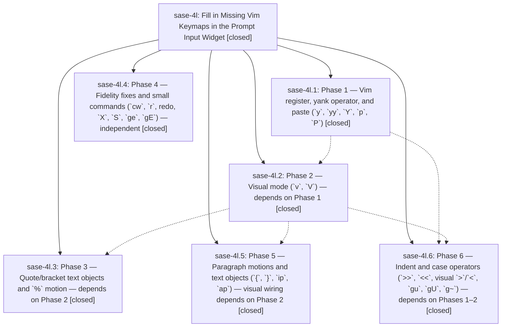

# Bead: sase-4l — Fill in Missing Vim Keymaps in the Prompt Input Widget

[Bead Pages](../README.md) / sase-4l

**Status:** ✓ closed · **Resolution:** (unrecorded) · **Type:** plan · **Tier:** epic
**Owner:** `bryanbugyi34@gmail.com`
**Created:** 2026-06-12 16:50:02 UTC · **Closed:** 2026-06-12 18:17:09 UTC
**Plan:** [202606/prompt\_vim\_keymaps.md](https://github.com/sase-org/sase--plans/blob/main/202606/prompt_vim_keymaps.md)

## Phases

| Bead | Title | Status | Size | Agents | Commits |
|---|---|---|---|---:|---:|
| [sase-4l.1](sase-4l.1.md) | Phase 1 — Vim register, yank operator, and paste (\`y\`, \`yy\`, \`Y\`, \`p\`, \`P\`) | ✓ closed | small | 1 | 1 |
| [sase-4l.2](sase-4l.2.md) | Phase 2 — Visual mode (\`v\`, \`V\`) — depends on Phase 1 | ✓ closed | small | 1 | 1 |
| [sase-4l.3](sase-4l.3.md) | Phase 3 — Quote/bracket text objects and \`%\` motion — depends on Phase 2 | ✓ closed | small | 1 | 1 |
| [sase-4l.4](sase-4l.4.md) | Phase 4 — Fidelity fixes and small commands (\`cw\`, \`r\`, redo, \`X\`, \`S\`, \`ge\`, \`gE\`) — independent | ✓ closed | small | 1 | 1 |
| [sase-4l.5](sase-4l.5.md) | Phase 5 — Paragraph motions and text objects (\`{\`, \`}\`, \`ip\`, \`ap\`) — visual wiring depends on Phase 2 | ✓ closed | small | 1 | 1 |
| [sase-4l.6](sase-4l.6.md) | Phase 6 — Indent and case operators (\`\>\>\`, \`\<\<\`, visual \`\>\`/\`\<\`, \`gu\`, \`gU\`, \`g~\`) — depends on Phases 1–2 | ✓ closed | small | 1 | 1 |

## Lineage

## Agents

| Agent | Bead | Commits |
|---|---|---:|
| [bbugyi200.athena.sase-4l.1](https://github.com/sase-org/sase--agents/blob/main/agents/bbugyi200.athena.sase-4l.1/README.md) | [sase-4l.1](sase-4l.1.md) | 1 |
| [bbugyi200.athena.sase-4l.2](https://github.com/sase-org/sase--agents/blob/main/agents/bbugyi200.athena.sase-4l.2/README.md) | [sase-4l.2](sase-4l.2.md) | 1 |
| [bbugyi200.athena.sase-4l.3](https://github.com/sase-org/sase--agents/blob/main/agents/bbugyi200.athena.sase-4l.3/README.md) | [sase-4l.3](sase-4l.3.md) | 1 |
| [bbugyi200.athena.sase-4l.4](https://github.com/sase-org/sase--agents/blob/main/agents/bbugyi200.athena.sase-4l.4/README.md) | [sase-4l.4](sase-4l.4.md) | 1 |
| [bbugyi200.athena.sase-4l.5](https://github.com/sase-org/sase--agents/blob/main/agents/bbugyi200.athena.sase-4l.5/README.md) | [sase-4l.5](sase-4l.5.md) | 1 |
| [bbugyi200.athena.sase-4l.6](https://github.com/sase-org/sase--agents/blob/main/agents/bbugyi200.athena.sase-4l.6/README.md) | [sase-4l.6](sase-4l.6.md) | 1 |

## Commits

| Commit | Subject | Bead | Committed (UTC) |
|---|---|---|---|
| [`a8603da`](https://github.com/sase-org/sase/commit/a8603da30bd21ab891a669aed1730268530f8087) | feat: add prompt Vim yank and paste (sase-4l.1) | [sase-4l.1](sase-4l.1.md) | 2026-06-12 17:19:00 |
| [`915fdc7`](https://github.com/sase-org/sase/commit/915fdc737dda451657b2775dce14dec0bd17d546) | feat(ace): add vim prompt fidelity commands (sase-4l.4) | [sase-4l.4](sase-4l.4.md) | 2026-06-12 17:25:36 |
| [`ef4363f`](https://github.com/sase-org/sase/commit/ef4363fdccea2aa38f372a2ada328b35e9c45129) | feat(ace): add prompt Vim visual mode (sase-4l.2) | [sase-4l.2](sase-4l.2.md) | 2026-06-12 17:43:38 |
| [`abb8f9e`](https://github.com/sase-org/sase/commit/abb8f9ecd38aef6c6e15385165e903f343e499b4) | feat: add vim paragraph motions to prompt input (sase-4l.5) | [sase-4l.5](sase-4l.5.md) | 2026-06-12 17:58:26 |
| [`14c0021`](https://github.com/sase-org/sase/commit/14c00218029a4a7736b264e7fecb874e242b5021) | feat(ace): add prompt vim quote and bracket text objects (sase-4l.3) | [sase-4l.3](sase-4l.3.md) | 2026-06-12 18:02:37 |
| [`db9214c`](https://github.com/sase-org/sase/commit/db9214c5f2201ad889d95ac4ea84a4f988aeb258) | feat: add prompt vim indent and case operators (sase-4l.6) | [sase-4l.6](sase-4l.6.md) | 2026-06-12 18:08:40 |
