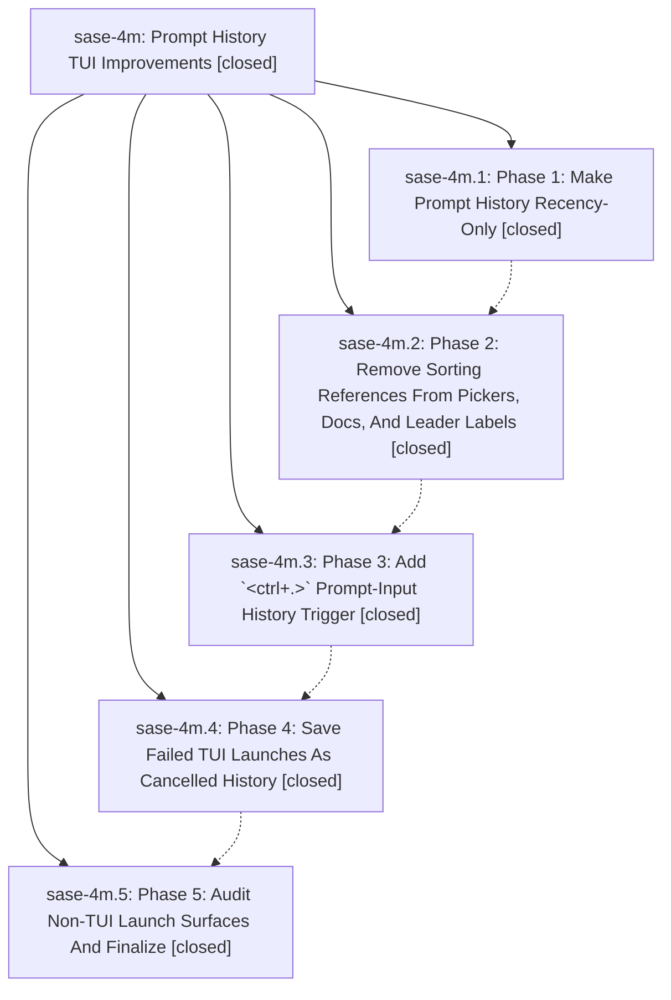

# Bead: sase-4m — Prompt History TUI Improvements

[Bead Pages](../README.md) / sase-4m

**Status:** ✓ closed · **Resolution:** (unrecorded) · **Type:** plan · **Tier:** epic
**Owner:** `bryanbugyi34@gmail.com`
**Created:** 2026-06-13 13:03:50 UTC · **Closed:** 2026-06-13 15:04:42 UTC
**Plan:** [202606/prompt\_history\_tui.md](https://github.com/sase-org/sase--plans/blob/main/202606/prompt_history_tui.md)

## Phases

| Bead | Title | Status | Size | Agents | Commits |
|---|---|---|---|---:|---:|
| [sase-4m.1](sase-4m.1.md) | Phase 1: Make Prompt History Recency-Only | ✓ closed | small | 1 | 1 |
| [sase-4m.2](sase-4m.2.md) | Phase 2: Remove Sorting References From Pickers, Docs, And Leader Labels | ✓ closed | small | 1 | 1 |
| [sase-4m.3](sase-4m.3.md) | Phase 3: Add \`\<ctrl+.\>\` Prompt-Input History Trigger | ✓ closed | small | 1 | 1 |
| [sase-4m.4](sase-4m.4.md) | Phase 4: Save Failed TUI Launches As Cancelled History | ✓ closed | small | 1 | 2 |
| [sase-4m.5](sase-4m.5.md) | Phase 5: Audit Non-TUI Launch Surfaces And Finalize | ✓ closed | small | 0 | 0 |

## Lineage

## Agents

| Agent | Bead | Commits |
|---|---|---:|
| [bbugyi200.athena.sase-4m](https://github.com/sase-org/sase--agents/blob/main/agents/bbugyi200.athena.sase-4m/README.md) | [sase-4m](README.md) | 1 |
| [bbugyi200.athena.sase-4m.1](https://github.com/sase-org/sase--agents/blob/main/agents/bbugyi200.athena.sase-4m.1/README.md) | [sase-4m.1](sase-4m.1.md) | 1 |
| [bbugyi200.athena.sase-4m.2](https://github.com/sase-org/sase--agents/blob/main/agents/bbugyi200.athena.sase-4m.2/README.md) | [sase-4m.2](sase-4m.2.md) | 1 |
| [bbugyi200.athena.sase-4m.3](https://github.com/sase-org/sase--agents/blob/main/agents/bbugyi200.athena.sase-4m.3/README.md) | [sase-4m.3](sase-4m.3.md) | 1 |
| [bbugyi200.athena.sase-4m.4](https://github.com/sase-org/sase--agents/blob/main/agents/bbugyi200.athena.sase-4m.4/README.md) | [sase-4m.4](sase-4m.4.md) | 1 |

## Commits

| Commit | Subject | Bead | Committed (UTC) |
|---|---|---|---|
| [`224b632`](https://github.com/sase-org/sase/commit/224b6324e0d5b2638b80637ec0bf7a14cac6c7a5) | feat: make prompt history recency-only (sase-4m.1) | [sase-4m.1](sase-4m.1.md) | 2026-06-13 13:38:44 |
| [`ac817e0`](https://github.com/sase-org/sase/commit/ac817e0c19098d2b3fda8f432094e69af1cb61ee) | fix(ace): remove prompt history sorting references (sase-4m.2) | [sase-4m.2](sase-4m.2.md) | 2026-06-13 13:52:42 |
| [`4e40764`](https://github.com/sase-org/sase/commit/4e40764920a28e1ee243ca753c74e43695b6e67a) | feat(ace): add prompt-input history trigger (sase-4m.3) | [sase-4m.3](sase-4m.3.md) | 2026-06-13 14:12:22 |
| [`2a562f3`](https://github.com/sase-org/sase/commit/2a562f3fc68947dc6df0114fc4c431e574180a2d) | fix: record failed TUI launches as cancelled history (sase-4m.4) | [sase-4m.4](sase-4m.4.md) | 2026-06-13 14:29:37 |
| [`3ba4e78`](https://github.com/sase-org/sase/commit/3ba4e78b4e3cb45ca10c24b707ae3c849f7917c3) | feat: Save failed agent prompts (sase-4m.4) | [sase-4m.4](sase-4m.4.md) | 2026-06-13 14:32:12 |
| [`ca7b8bf`](https://github.com/sase-org/sase/commit/ca7b8bf5ba0ccd960c7522e74c3aef625217b475) | chore: close prompt history epic (sase-4m) | [sase-4m](README.md) | 2026-06-13 15:12:43 |
