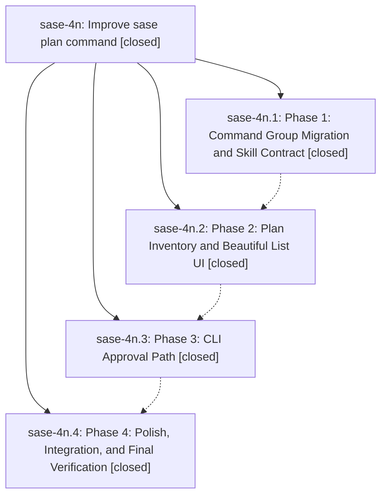

# Bead: sase-4n — Improve sase plan command

[Bead Pages](../README.md) / sase-4n

**Status:** ✓ closed · **Resolution:** (unrecorded) · **Type:** plan · **Tier:** epic
**Owner:** `bryanbugyi34@gmail.com`
**Created:** 2026-06-13 13:57:54 UTC · **Closed:** 2026-06-13 15:43:58 UTC
**Plan:** [202606/plan\_command\_subcommands.md](https://github.com/sase-org/sase--plans/blob/main/202606/plan_command_subcommands.md)

## Phases

| Bead | Title | Status | Size | Agents | Commits |
|---|---|---|---|---:|---:|
| [sase-4n.1](sase-4n.1.md) | Phase 1: Command Group Migration and Skill Contract | ✓ closed | small | 0 | 0 |
| [sase-4n.2](sase-4n.2.md) | Phase 2: Plan Inventory and Beautiful List UI | ✓ closed | small | 0 | 0 |
| [sase-4n.3](sase-4n.3.md) | Phase 3: CLI Approval Path | ✓ closed | small | 0 | 0 |
| [sase-4n.4](sase-4n.4.md) | Phase 4: Polish, Integration, and Final Verification | ✓ closed | small | 0 | 0 |

## Lineage

