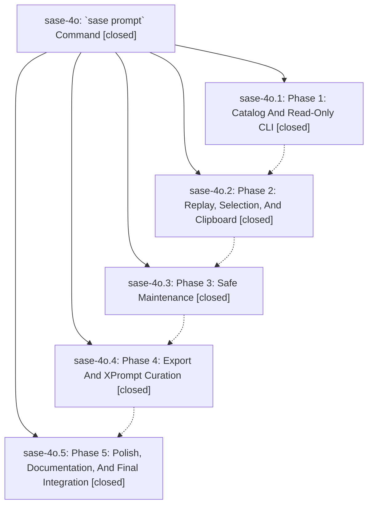

# Bead: sase-4o — \`sase prompt\` Command

[Bead Pages](../README.md) / sase-4o

**Status:** ✓ closed · **Resolution:** (unrecorded) · **Type:** plan · **Tier:** epic
**Owner:** `bryanbugyi34@gmail.com`
**Created:** 2026-06-13 18:26:10 UTC · **Closed:** 2026-06-13 20:09:34 UTC
**Plan:** /home/bryan/.local/state/sase/workspaces/sase-org/sase/sase\_11/sdd/plans/202606/prompt\_command.md

## Notes

COMMIT: 98b74849d

## Phases

| Bead | Title | Status | Size | Agents | Commits |
|---|---|---|---|---:|---:|
| [sase-4o.1](sase-4o.1.md) | Phase 1: Catalog And Read-Only CLI | ✓ closed | small | 1 | 1 |
| [sase-4o.2](sase-4o.2.md) | Phase 2: Replay, Selection, And Clipboard | ✓ closed | small | 1 | 1 |
| [sase-4o.3](sase-4o.3.md) | Phase 3: Safe Maintenance | ✓ closed | small | 1 | 1 |
| [sase-4o.4](sase-4o.4.md) | Phase 4: Export And XPrompt Curation | ✓ closed | small | 1 | 1 |
| [sase-4o.5](sase-4o.5.md) | Phase 5: Polish, Documentation, And Final Integration | ✓ closed | small | 1 | 1 |

## Lineage

## Agents

| Agent | Bead | Commits |
|---|---|---:|
| [bbugyi200.athena.sase-4o](https://github.com/sase-org/sase--agents/blob/main/agents/bbugyi200.athena.sase-4o/README.md) | [sase-4o](README.md) | 1 |
| [bbugyi200.athena.sase-4o.1](https://github.com/sase-org/sase--agents/blob/main/agents/bbugyi200.athena.sase-4o.1/README.md) | [sase-4o.1](sase-4o.1.md) | 1 |
| [bbugyi200.athena.sase-4o.2](https://github.com/sase-org/sase--agents/blob/main/agents/bbugyi200.athena.sase-4o.2/README.md) | [sase-4o.2](sase-4o.2.md) | 1 |
| [bbugyi200.athena.sase-4o.3](https://github.com/sase-org/sase--agents/blob/main/agents/bbugyi200.athena.sase-4o.3/README.md) | [sase-4o.3](sase-4o.3.md) | 1 |
| [bbugyi200.athena.sase-4o.4](https://github.com/sase-org/sase--agents/blob/main/agents/bbugyi200.athena.sase-4o.4/README.md) | [sase-4o.4](sase-4o.4.md) | 1 |
| [bbugyi200.athena.sase-4o.5](https://github.com/sase-org/sase--agents/blob/main/agents/bbugyi200.athena.sase-4o.5/README.md) | [sase-4o.5](sase-4o.5.md) | 1 |

## Commits

| Commit | Subject | Bead | Committed (UTC) |
|---|---|---|---|
| [`3bc6d17`](https://github.com/sase-org/sase/commit/3bc6d177b75b5d6c36412c0c6c38cadaceab8622) | feat(prompt): add read-only \`sase prompt\` command group (sase-4o.1) | [sase-4o.1](sase-4o.1.md) | 2026-06-13 19:02:31 |
| [`a385fa5`](https://github.com/sase-org/sase/commit/a385fa563d5cdd82a30d728964f4a45479d0e59a) | feat(prompt): add replay, selection, and clipboard commands (sase-4o.2) | [sase-4o.2](sase-4o.2.md) | 2026-06-13 19:15:30 |
| [`32d8dfd`](https://github.com/sase-org/sase/commit/32d8dfd2d746ceaa05dc039ea5c84465819ab22f) | feat(prompt): add doctor, delete, and prune maintenance commands (sase-4o.3) | [sase-4o.3](sase-4o.3.md) | 2026-06-13 19:30:47 |
| [`7e0f9f0`](https://github.com/sase-org/sase/commit/7e0f9f07de03761d89c1f7783d0d48416dac9e0b) | feat(prompt): add export and save subcommands (sase-4o.4) | [sase-4o.4](sase-4o.4.md) | 2026-06-13 19:47:32 |
| [`f163194`](https://github.com/sase-org/sase/commit/f1631941eb9ff715a60ecb7facb88299e58e7373) | feat(prompt): polish, document, and integration-test the command group (sase-4o.5) | [sase-4o.5](sase-4o.5.md) | 2026-06-13 20:03:52 |
| [`41a20b4`](https://github.com/sase-org/sase/commit/41a20b4590c32dda1edf31094ff4cb6cd0509501) | chore: Add SDD prompt and plan for prompt\_command\_completion (sase-4o) | [sase-4o](README.md) | 2026-06-13 20:12:03 |
