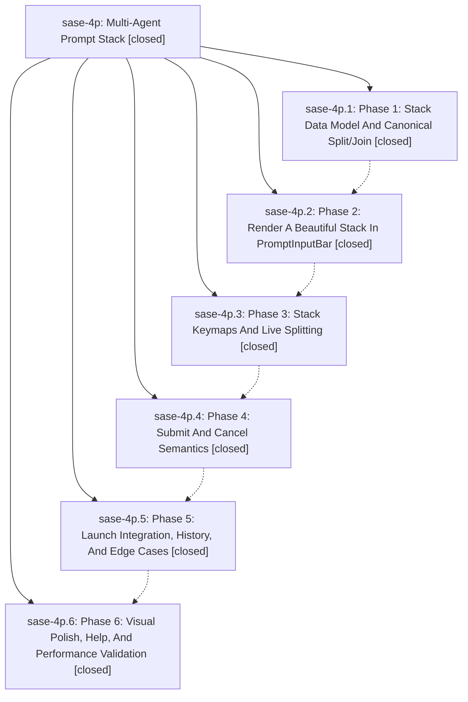

# Bead: sase-4p — Multi-Agent Prompt Stack

[Bead Pages](../README.md) / sase-4p

**Status:** ✓ closed · **Resolution:** (unrecorded) · **Type:** plan · **Tier:** epic
**Owner:** `bryanbugyi34@gmail.com`
**Created:** 2026-06-15 21:36:56 UTC · **Closed:** 2026-06-16 00:44:29 UTC
**Plan:** [202606/multi\_agent\_prompt\_stack.md](https://github.com/sase-org/sase--plans/blob/main/202606/multi_agent_prompt_stack.md)

## Notes

COMMIT: cec3d0979

## Phases

| Bead | Title | Status | Size | Agents | Commits |
|---|---|---|---|---:|---:|
| [sase-4p.1](sase-4p.1.md) | Phase 1: Stack Data Model And Canonical Split/Join | ✓ closed | small | 1 | 1 |
| [sase-4p.2](sase-4p.2.md) | Phase 2: Render A Beautiful Stack In PromptInputBar | ✓ closed | small | 0 | 1 |
| [sase-4p.3](sase-4p.3.md) | Phase 3: Stack Keymaps And Live Splitting | ✓ closed | small | 1 | 1 |
| [sase-4p.4](sase-4p.4.md) | Phase 4: Submit And Cancel Semantics | ✓ closed | small | 1 | 1 |
| [sase-4p.5](sase-4p.5.md) | Phase 5: Launch Integration, History, And Edge Cases | ✓ closed | small | 1 | 1 |
| [sase-4p.6](sase-4p.6.md) | Phase 6: Visual Polish, Help, And Performance Validation | ✓ closed | small | 1 | 1 |

## Lineage

## Agents

| Agent | Bead | Commits |
|---|---|---:|
| [bbugyi200.athena.sase-4p.1](https://github.com/sase-org/sase--agents/blob/main/agents/bbugyi200.athena.sase-4p.1/README.md) | [sase-4p.1](sase-4p.1.md) | 1 |
| [bbugyi200.athena.sase-4p.3](https://github.com/sase-org/sase--agents/blob/main/agents/bbugyi200.athena.sase-4p.3/README.md) | [sase-4p.3](sase-4p.3.md) | 1 |
| [bbugyi200.athena.sase-4p.4](https://github.com/sase-org/sase--agents/blob/main/agents/bbugyi200.athena.sase-4p.4/README.md) | [sase-4p.4](sase-4p.4.md) | 1 |
| [bbugyi200.athena.sase-4p.5](https://github.com/sase-org/sase--agents/blob/main/agents/bbugyi200.athena.sase-4p.5/README.md) | [sase-4p.5](sase-4p.5.md) | 1 |
| [bbugyi200.athena.sase-4p.6](https://github.com/sase-org/sase--agents/blob/main/agents/bbugyi200.athena.sase-4p.6/README.md) | [sase-4p.6](sase-4p.6.md) | 1 |

## Commits

| Commit | Subject | Bead | Committed (UTC) |
|---|---|---|---|
| [`5aef3e0`](https://github.com/sase-org/sase/commit/5aef3e0914fd91429450942dcd41b1a7902e5da0) | feat(ace): add prompt stack data model and canonical split/join (sase-4p.1) | [sase-4p.1](sase-4p.1.md) | 2026-06-15 22:06:52 |
| [`24ecfc4`](https://github.com/sase-org/sase/commit/24ecfc43d69ad93b98d3567289ee8540617d880f) | feat(ace): render prompt stack of panes in PromptInputBar (sase-4p.2) | [sase-4p.2](sase-4p.2.md) | 2026-06-15 22:38:38 |
| [`85b85bd`](https://github.com/sase-org/sase/commit/85b85bd31afa13211db4f24130d4a144402f80b5) | feat(ace): add stack keymaps and live splitting (sase-4p.3) | [sase-4p.3](sase-4p.3.md) | 2026-06-15 23:05:36 |
| [`2e3e85c`](https://github.com/sase-org/sase/commit/2e3e85cfe58175a1219f66cd94d20aaa242d092a) | feat(ace): submit and cancel semantics for prompt stack (sase-4p.4) | [sase-4p.4](sase-4p.4.md) | 2026-06-15 23:40:06 |
| [`f1c7112`](https://github.com/sase-org/sase/commit/f1c7112b9ddae4f16853e9219927c59acc165b08) | feat(ace): launch integration and edge cases for prompt stack (sase-4p.5) | [sase-4p.5](sase-4p.5.md) | 2026-06-15 23:56:36 |
| [`3813516`](https://github.com/sase-org/sase/commit/381351639e12dbb75f26662213e0720c9ecd6b83) | feat(ace): visual polish and stack-aware help for prompt stack (sase-4p.6) | [sase-4p.6](sase-4p.6.md) | 2026-06-16 00:30:40 |
