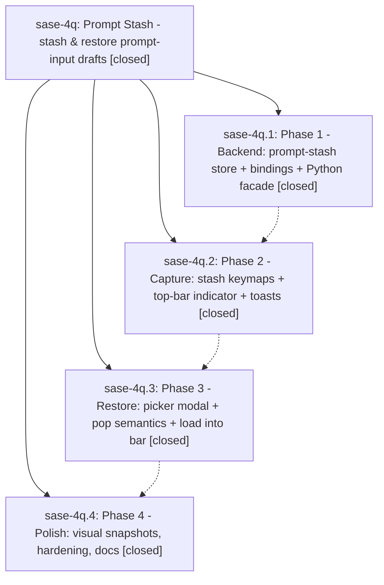

# Bead: sase-4q — Prompt Stash - stash & restore prompt-input drafts

[Bead Pages](../README.md) / sase-4q

**Status:** ✓ closed · **Resolution:** (unrecorded) · **Type:** plan · **Tier:** epic
**Owner:** `bryanbugyi34@gmail.com`
**Created:** 2026-06-16 02:08:26 UTC · **Closed:** 2026-06-16 16:15:46 UTC
**Plan:** [202606/prompt\_stash.md](https://github.com/sase-org/sase--plans/blob/main/202606/prompt_stash.md)

## Notes

COMMIT: bfd0a8653

[2026-07-27T21:34:17Z · sase-a1.land] [2026-06-16T16:07:29Z · bryanbugyi34@gmail.com] (restored 2026-07-27) COMMIT: 3fef32b31

## Phases

| Bead | Title | Status | Size | Agents | Commits |
|---|---|---|---|---:|---:|
| [sase-4q.1](sase-4q.1.md) | Phase 1 - Backend: prompt-stash store + bindings + Python facade | ✓ closed | small | 1 | 2 |
| [sase-4q.2](sase-4q.2.md) | Phase 2 - Capture: stash keymaps + top-bar indicator + toasts | ✓ closed | small | 1 | 1 |
| [sase-4q.3](sase-4q.3.md) | Phase 3 - Restore: picker modal + pop semantics + load into bar | ✓ closed | small | 1 | 1 |
| [sase-4q.4](sase-4q.4.md) | Phase 4 - Polish: visual snapshots, hardening, docs | ✓ closed | small | 1 | 1 |

## Lineage

## Agents

| Agent | Bead | Commits |
|---|---|---:|
| [bbugyi200.athena.sase-4q](https://github.com/sase-org/sase--agents/blob/main/agents/bbugyi200.athena.sase-4q/README.md) | [sase-4q](README.md) | 1 |
| [bbugyi200.athena.sase-4q.1](https://github.com/sase-org/sase--agents/blob/main/agents/bbugyi200.athena.sase-4q.1/README.md) | [sase-4q.1](sase-4q.1.md) | 2 |
| [bbugyi200.athena.sase-4q.2](https://github.com/sase-org/sase--agents/blob/main/agents/bbugyi200.athena.sase-4q.2/README.md) | [sase-4q.2](sase-4q.2.md) | 1 |
| [bbugyi200.athena.sase-4q.3](https://github.com/sase-org/sase--agents/blob/main/agents/bbugyi200.athena.sase-4q.3/README.md) | [sase-4q.3](sase-4q.3.md) | 1 |
| [bbugyi200.athena.sase-4q.4](https://github.com/sase-org/sase--agents/blob/main/agents/bbugyi200.athena.sase-4q.4/README.md) | [sase-4q.4](sase-4q.4.md) | 1 |

## Commits

| Commit | Subject | Bead | Committed (UTC) |
|---|---|---|---|
| [`7575927`](https://github.com/sase-org/sase/commit/7575927a974063ab4f4ef21486c745b2a5717b3f) | feat(prompt-stash): add Python prompt-stash facade and wire types (sase-4q.1) | [sase-4q.1](sase-4q.1.md) | 2026-06-16 14:41:38 |
| [`sase-core@cdfd149`](https://github.com/sase-org/sase-core/commit/cdfd149197e21a8f823a9ce4c45ff04472754a9c) | feat(prompt-stash): add prompt-stash store module and Python bindings (sase-4q.1) | [sase-4q.1](sase-4q.1.md) | 2026-06-16 14:42:18 |
| [`fec3f86`](https://github.com/sase-org/sase/commit/fec3f86830367ecd7914f1e3087ea5909dc9f451) | feat(prompt-stash): capture keymaps, top-bar indicator, and toasts (sase-4q.2) | [sase-4q.2](sase-4q.2.md) | 2026-06-16 15:07:43 |
| [`9729e80`](https://github.com/sase-org/sase/commit/9729e80474da713554095df0d545b84ab8f25362) | feat(prompt-stash): restore picker modal, pop semantics, load into bar (sase-4q.3) | [sase-4q.3](sase-4q.3.md) | 2026-06-16 15:39:27 |
| [`9f1f088`](https://github.com/sase-org/sase/commit/9f1f088bfc68816c29fdbd9880cb694b41031e87) | feat(prompt-stash): polish — concurrent refresh, preview fit, snapshots (sase-4q.4) | [sase-4q.4](sase-4q.4.md) | 2026-06-16 16:00:34 |
| [`ebc535e`](https://github.com/sase-org/sase/commit/ebc535eec2667cab6fe67b13050964ebbed3c939) | chore: Add SDD prompt and plan for verify\_sase\_4q\_completion (sase-4q) | [sase-4q](README.md) | 2026-06-16 16:07:42 |
