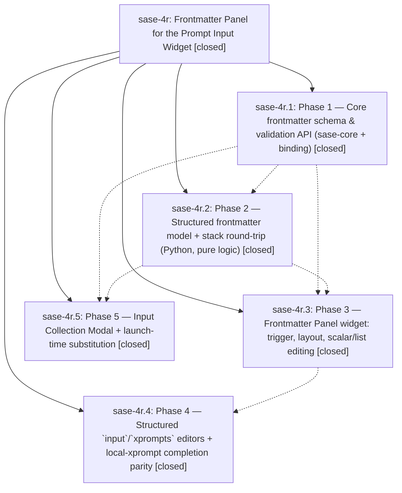

# Bead: sase-4r — Frontmatter Panel for the Prompt Input Widget

[Bead Pages](../README.md) / sase-4r

**Status:** ✓ closed · **Resolution:** (unrecorded) · **Type:** plan · **Tier:** epic
**Owner:** `bryanbugyi34@gmail.com`
**Created:** 2026-06-16 17:43:53 UTC · **Closed:** 2026-06-16 20:36:41 UTC
**Plan:** [202606/prompt\_frontmatter\_panel.md](https://github.com/sase-org/sase--plans/blob/main/202606/prompt_frontmatter_panel.md)

## Notes

COMMIT: d1d114212

[2026-07-27T21:34:26Z · sase-a1.land] [2026-06-16T20:19:32Z · bryanbugyi34@gmail.com] (restored 2026-07-27) COMMIT: 2b7a8e63f

## Phases

| Bead | Title | Status | Size | Agents | Commits |
|---|---|---|---|---:|---:|
| [sase-4r.1](sase-4r.1.md) | Phase 1 — Core frontmatter schema & validation API (sase-core + binding) | ✓ closed | small | 1 | 1 |
| [sase-4r.2](sase-4r.2.md) | Phase 2 — Structured frontmatter model + stack round-trip (Python, pure logic) | ✓ closed | small | 1 | 1 |
| [sase-4r.3](sase-4r.3.md) | Phase 3 — Frontmatter Panel widget: trigger, layout, scalar/list editing | ✓ closed | small | 1 | 1 |
| [sase-4r.4](sase-4r.4.md) | Phase 4 — Structured \`input\`/\`xprompts\` editors + local-xprompt completion parity | ✓ closed | small | 1 | 1 |
| [sase-4r.5](sase-4r.5.md) | Phase 5 — Input Collection Modal + launch-time substitution | ✓ closed | small | 1 | 1 |

## Lineage

## Agents

| Agent | Bead | Commits |
|---|---|---:|
| [bbugyi200.athena.sase-4r](https://github.com/sase-org/sase--agents/blob/main/agents/bbugyi200.athena.sase-4r/README.md) | [sase-4r](README.md) | 2 |
| [bbugyi200.athena.sase-4r.1](https://github.com/sase-org/sase--agents/blob/main/agents/bbugyi200.athena.sase-4r.1/README.md) | [sase-4r.1](sase-4r.1.md) | 1 |
| [bbugyi200.athena.sase-4r.2](https://github.com/sase-org/sase--agents/blob/main/agents/bbugyi200.athena.sase-4r.2/README.md) | [sase-4r.2](sase-4r.2.md) | 1 |
| [bbugyi200.athena.sase-4r.3](https://github.com/sase-org/sase--agents/blob/main/agents/bbugyi200.athena.sase-4r.3/README.md) | [sase-4r.3](sase-4r.3.md) | 1 |
| [bbugyi200.athena.sase-4r.4](https://github.com/sase-org/sase--agents/blob/main/agents/bbugyi200.athena.sase-4r.4/README.md) | [sase-4r.4](sase-4r.4.md) | 1 |
| [bbugyi200.athena.sase-4r.5](https://github.com/sase-org/sase--agents/blob/main/agents/bbugyi200.athena.sase-4r.5/README.md) | [sase-4r.5](sase-4r.5.md) | 1 |
| [bbugyi200.athena.sase-4r.w1](https://github.com/sase-org/sase--agents/blob/main/agents/bbugyi200.athena.sase-4r.w1/README.md) | [sase-4r](README.md) | 1 |

## Commits

| Commit | Subject | Bead | Committed (UTC) |
|---|---|---|---|
| [`20a9589`](https://github.com/sase-org/sase/commit/20a95891d2fcdc1a90f9c8b7d1aa14d461c80d9a) | feat(xprompt): add frontmatter schema adapter over sase\_core (sase-4r.1) | [sase-4r.1](sase-4r.1.md) | 2026-06-16 18:24:56 |
| [`b8ad5db`](https://github.com/sase-org/sase/commit/b8ad5db760b41da505f20a08a4205ac131bee3b4) | feat(xprompt): add structured PromptFrontmatter model + stack round-trip (sase-4r.2) | [sase-4r.2](sase-4r.2.md) | 2026-06-16 18:43:44 |
| [`5f1cbf1`](https://github.com/sase-org/sase/commit/5f1cbf1ce97e175c4a986d41ff7741c88392627f) | feat(tui): add Frontmatter Panel widget to prompt input bar (sase-4r.3) | [sase-4r.3](sase-4r.3.md) | 2026-06-16 19:26:23 |
| [`f4f4969`](https://github.com/sase-org/sase/commit/f4f496984239fa764fcdc68d3aeec5eb9ca457a5) | feat(tui): collect frontmatter inputs at launch (sase-4r.5) | [sase-4r.5](sase-4r.5.md) | 2026-06-16 19:30:30 |
| [`b3d8240`](https://github.com/sase-org/sase/commit/b3d8240bd9624433c97b3d98c39bec5394818e71) | feat(tui): add structured input/xprompts editors + local-xprompt completion parity (sase-4r.4) | [sase-4r.4](sase-4r.4.md) | 2026-06-16 20:11:49 |
| [`10a75d9`](https://github.com/sase-org/sase/commit/10a75d9ba23fc1392e5f953f7dc5929e36e72adb) | chore: Add SDD prompt and plan for prompt\_frontmatter\_panel\_closure (sase-4r) | [sase-4r](README.md) | 2026-06-16 20:19:53 |
| [`5760876`](https://github.com/sase-org/sase/commit/576087647b56ae972c1e2f612952be53429fdf56) | refactor(xprompt): close frontmatter panel epic (sase-4r) | [sase-4r](README.md) | 2026-06-16 20:37:53 |
| [`b129002`](https://github.com/sase-org/sase/commit/b129002382fdc67a08a6e653a73ca14d3bb13383) | feat(tui): add Agents-tab bulk kill-and-edit (sase-4r) | [sase-4r](README.md) | 2026-06-16 21:51:00 |
