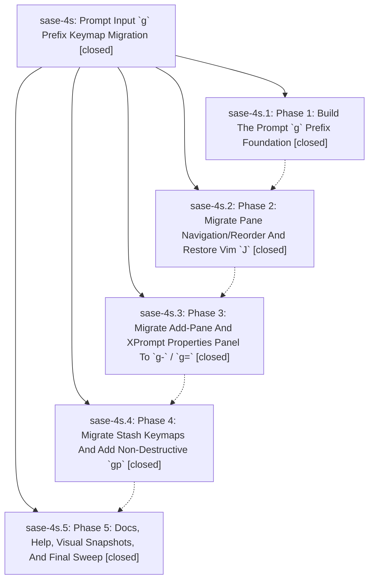

# Bead: sase-4s — Prompt Input \`g\` Prefix Keymap Migration

[Bead Pages](../README.md) / sase-4s

**Status:** ✓ closed · **Resolution:** (unrecorded) · **Type:** plan · **Tier:** epic
**Owner:** `bryanbugyi34@gmail.com`
**Created:** 2026-06-17 17:20:39 UTC · **Closed:** 2026-06-17 20:00:55 UTC
**Plan:** [202606/prompt\_g\_prefix\_keymaps.md](https://github.com/sase-org/sase--plans/blob/main/202606/prompt_g_prefix_keymaps.md)

## Notes

COMMIT: 77b81a103

## Phases

| Bead | Title | Status | Size | Agents | Commits |
|---|---|---|---|---:|---:|
| [sase-4s.1](sase-4s.1.md) | Phase 1: Build The Prompt \`g\` Prefix Foundation | ✓ closed | small | 1 | 1 |
| [sase-4s.2](sase-4s.2.md) | Phase 2: Migrate Pane Navigation/Reorder And Restore Vim \`J\` | ✓ closed | small | 1 | 1 |
| [sase-4s.3](sase-4s.3.md) | Phase 3: Migrate Add-Pane And XPrompt Properties Panel To \`g-\` / \`g=\` | ✓ closed | small | 1 | 1 |
| [sase-4s.4](sase-4s.4.md) | Phase 4: Migrate Stash Keymaps And Add Non-Destructive \`gp\` | ✓ closed | small | 1 | 1 |
| [sase-4s.5](sase-4s.5.md) | Phase 5: Docs, Help, Visual Snapshots, And Final Sweep | ✓ closed | small | 1 | 1 |

## Lineage

## Agents

| Agent | Bead | Commits |
|---|---|---:|
| [bbugyi200.athena.sase-4s](https://github.com/sase-org/sase--agents/blob/main/agents/bbugyi200.athena.sase-4s/README.md) | [sase-4s](README.md) | 1 |
| [bbugyi200.athena.sase-4s.1](https://github.com/sase-org/sase--agents/blob/main/agents/bbugyi200.athena.sase-4s.1/README.md) | [sase-4s.1](sase-4s.1.md) | 1 |
| [bbugyi200.athena.sase-4s.2](https://github.com/sase-org/sase--agents/blob/main/agents/bbugyi200.athena.sase-4s.2/README.md) | [sase-4s.2](sase-4s.2.md) | 1 |
| [bbugyi200.athena.sase-4s.3](https://github.com/sase-org/sase--agents/blob/main/agents/bbugyi200.athena.sase-4s.3/README.md) | [sase-4s.3](sase-4s.3.md) | 1 |
| [bbugyi200.athena.sase-4s.4](https://github.com/sase-org/sase--agents/blob/main/agents/bbugyi200.athena.sase-4s.4/README.md) | [sase-4s.4](sase-4s.4.md) | 1 |
| [bbugyi200.athena.sase-4s.5](https://github.com/sase-org/sase--agents/blob/main/agents/bbugyi200.athena.sase-4s.5/README.md) | [sase-4s.5](sase-4s.5.md) | 1 |

## Commits

| Commit | Subject | Bead | Committed (UTC) |
|---|---|---|---|
| [`94ac293`](https://github.com/sase-org/sase/commit/94ac2932744b98be65555ff9e6aa0db93316f1b5) | feat(tui): build prompt \`g\` prefix foundation and remove comma leader (sase-4s.1) | [sase-4s.1](sase-4s.1.md) | 2026-06-17 18:29:44 |
| [`e2369f0`](https://github.com/sase-org/sase/commit/e2369f0efb525610005285018baacfed6362e933) | feat(tui): migrate prompt pane nav/reorder to \`g\` prefix and restore Vim \`J\` (sase-4s.2) | [sase-4s.2](sase-4s.2.md) | 2026-06-17 18:50:23 |
| [`e29bd38`](https://github.com/sase-org/sase/commit/e29bd388f10b153b79fef1130f3a7b19aa85664e) | feat(tui): migrate add-pane and xprompt properties panel to \`g-\` / \`g=\` (sase-4s.3) | [sase-4s.3](sase-4s.3.md) | 2026-06-17 19:12:47 |
| [`6c2f547`](https://github.com/sase-org/sase/commit/6c2f54777c948d3a84e7e4893737030adb44e11e) | feat(tui): add non-destructive \`gp\` stash load and retire leader \`,P\` (sase-4s.4) | [sase-4s.4](sase-4s.4.md) | 2026-06-17 19:32:52 |
| [`a6bb438`](https://github.com/sase-org/sase/commit/a6bb43850d7f8b1fb755310d6449099a9adcbd42) | docs: update prompt g-prefix help references (sase-4s.5) | [sase-4s.5](sase-4s.5.md) | 2026-06-17 19:45:42 |
| [`0ab01c9`](https://github.com/sase-org/sase/commit/0ab01c9fe75aea9a5baf28c7af822efc6c8068a4) | chore: close prompt g-prefix keymap epic (sase-4s) | [sase-4s](README.md) | 2026-06-17 20:02:49 |
