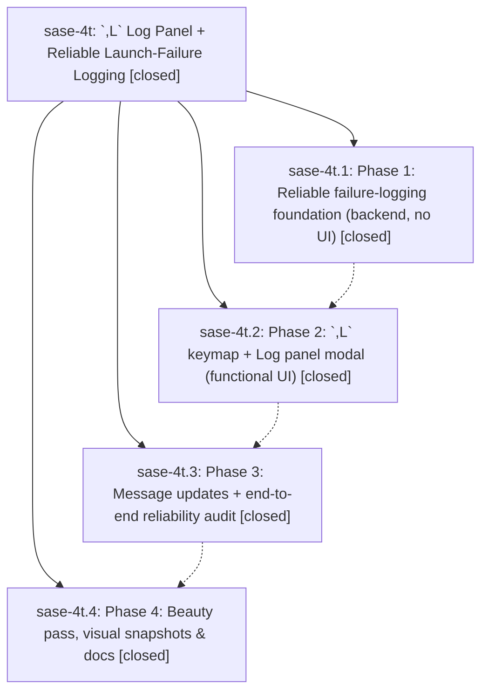

# Bead: sase-4t — \`,L\` Log Panel + Reliable Launch-Failure Logging

[Bead Pages](../README.md) / sase-4t

**Status:** ✓ closed · **Resolution:** (unrecorded) · **Type:** plan · **Tier:** epic
**Owner:** `bryanbugyi34@gmail.com`
**Created:** 2026-06-17 18:20:24 UTC · **Closed:** 2026-06-17 20:38:14 UTC
**Plan:** [202606/log\_panel.md](https://github.com/sase-org/sase--plans/blob/main/202606/log_panel.md)

## Notes

COMMIT: 96a203ac8

[2026-07-27T21:34:36Z · sase-a1.land] [2026-06-17T20:30:07Z · bryanbugyi34@gmail.com] (restored 2026-07-27) COMMIT: 40221d371

## Phases

| Bead | Title | Status | Size | Agents | Commits |
|---|---|---|---|---:|---:|
| [sase-4t.1](sase-4t.1.md) | Phase 1: Reliable failure-logging foundation (backend, no UI) | ✓ closed | small | 1 | 1 |
| [sase-4t.2](sase-4t.2.md) | Phase 2: \`,L\` keymap + Log panel modal (functional UI) | ✓ closed | small | 1 | 1 |
| [sase-4t.3](sase-4t.3.md) | Phase 3: Message updates + end-to-end reliability audit | ✓ closed | small | 1 | 1 |
| [sase-4t.4](sase-4t.4.md) | Phase 4: Beauty pass, visual snapshots & docs | ✓ closed | small | 1 | 1 |

## Lineage

## Agents

| Agent | Bead | Commits |
|---|---|---:|
| [bbugyi200.athena.sase-4t](https://github.com/sase-org/sase--agents/blob/main/agents/bbugyi200.athena.sase-4t/README.md) | [sase-4t](README.md) | 2 |
| [bbugyi200.athena.sase-4t.1](https://github.com/sase-org/sase--agents/blob/main/agents/bbugyi200.athena.sase-4t.1/README.md) | [sase-4t.1](sase-4t.1.md) | 1 |
| [bbugyi200.athena.sase-4t.2](https://github.com/sase-org/sase--agents/blob/main/agents/bbugyi200.athena.sase-4t.2/README.md) | [sase-4t.2](sase-4t.2.md) | 1 |
| [bbugyi200.athena.sase-4t.3](https://github.com/sase-org/sase--agents/blob/main/agents/bbugyi200.athena.sase-4t.3/README.md) | [sase-4t.3](sase-4t.3.md) | 1 |
| [bbugyi200.athena.sase-4t.4](https://github.com/sase-org/sase--agents/blob/main/agents/bbugyi200.athena.sase-4t.4/README.md) | [sase-4t.4](sase-4t.4.md) | 1 |

## Commits

| Commit | Subject | Bead | Committed (UTC) |
|---|---|---|---|
| [`1feff11`](https://github.com/sase-org/sase/commit/1feff110934ab6fa299d2ad87d2b2658e99ee5bc) | feat(tui): durable launch-failure logging foundation (sase-4t.1) | [sase-4t.1](sase-4t.1.md) | 2026-06-17 19:03:34 |
| [`6532710`](https://github.com/sase-org/sase/commit/65327103d203a534bfbe2c95139fbbf051ed2ba3) | feat(tui): add \`,L\` Log panel modal for launch failures (sase-4t.2) | [sase-4t.2](sase-4t.2.md) | 2026-06-17 19:49:32 |
| [`d11e66f`](https://github.com/sase-org/sase/commit/d11e66f05e324c4bc7447b93667d41375999238f) | fix: point launch failures at log panel (sase-4t.3) | [sase-4t.3](sase-4t.3.md) | 2026-06-17 20:08:17 |
| [`da3557e`](https://github.com/sase-org/sase/commit/da3557e1691b37b88be5fa709ca9430fb26421fa) | feat(ace): polish log panel display (sase-4t.4) | [sase-4t.4](sase-4t.4.md) | 2026-06-17 20:25:03 |
| [`6ddc256`](https://github.com/sase-org/sase/commit/6ddc2566469a8c00e85433b962b3afdef2dc7a10) | chore: Add SDD prompt and plan for complete\_sase\_4t (sase-4t) | [sase-4t](README.md) | 2026-06-17 20:30:23 |
| [`98b2dc1`](https://github.com/sase-org/sase/commit/98b2dc1640d41f7b806c828af07b276bd2f45cb2) | fix(tui): preserve launch failure log hints (sase-4t) | [sase-4t](README.md) | 2026-06-17 20:39:19 |
