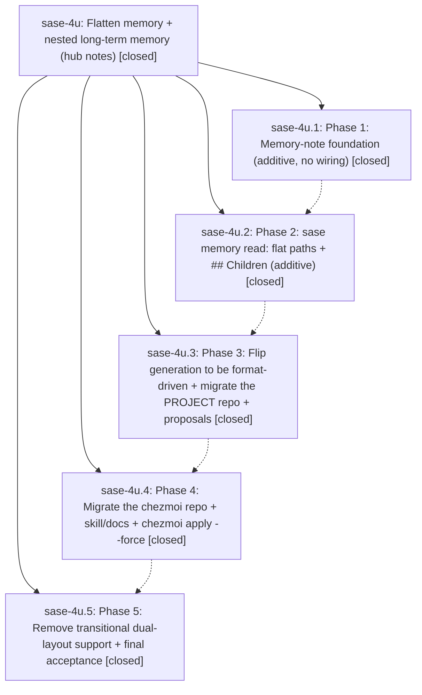

# Bead: sase-4u — Flatten memory + nested long-term memory (hub notes)

[Bead Pages](../README.md) / sase-4u

**Status:** ✓ closed · **Resolution:** (unrecorded) · **Type:** plan · **Tier:** epic
**Owner:** `bryanbugyi34@gmail.com`
**Created:** 2026-06-17 21:55:00 UTC · **Closed:** 2026-06-18 00:46:18 UTC
**Plan:** [202606/flatten\_memory\_nested\_long.md](https://github.com/sase-org/sase--plans/blob/main/202606/flatten_memory_nested_long.md)

## Notes

COMMIT: f88ef4a1d

[2026-07-27T21:34:45Z · sase-a1.land] [2026-06-18T00:31:58Z · bryanbugyi34@gmail.com] (restored 2026-07-27) COMMIT: 845fde6fb

## Phases

| Bead | Title | Status | Size | Agents | Commits |
|---|---|---|---|---:|---:|
| [sase-4u.1](sase-4u.1.md) | Phase 1: Memory-note foundation (additive, no wiring) | ✓ closed | small | 1 | 1 |
| [sase-4u.2](sase-4u.2.md) | Phase 2: sase memory read: flat paths + ## Children (additive) | ✓ closed | small | 1 | 1 |
| [sase-4u.3](sase-4u.3.md) | Phase 3: Flip generation to be format-driven + migrate the PROJECT repo + proposals | ✓ closed | small | 1 | 1 |
| [sase-4u.4](sase-4u.4.md) | Phase 4: Migrate the chezmoi repo + skill/docs + chezmoi apply --force | ✓ closed | small | 1 | 1 |
| [sase-4u.5](sase-4u.5.md) | Phase 5: Remove transitional dual-layout support + final acceptance | ✓ closed | small | 1 | 1 |

## Lineage

## Agents

| Agent | Bead | Commits |
|---|---|---:|
| [bbugyi200.athena.sase-4u](https://github.com/sase-org/sase--agents/blob/main/agents/bbugyi200.athena.sase-4u/README.md) | [sase-4u](README.md) | 2 |
| [bbugyi200.athena.sase-4u.1](https://github.com/sase-org/sase--agents/blob/main/agents/bbugyi200.athena.sase-4u.1/README.md) | [sase-4u.1](sase-4u.1.md) | 1 |
| [bbugyi200.athena.sase-4u.2](https://github.com/sase-org/sase--agents/blob/main/agents/bbugyi200.athena.sase-4u.2/README.md) | [sase-4u.2](sase-4u.2.md) | 1 |
| [bbugyi200.athena.sase-4u.3](https://github.com/sase-org/sase--agents/blob/main/agents/bbugyi200.athena.sase-4u.3/README.md) | [sase-4u.3](sase-4u.3.md) | 1 |
| [bbugyi200.athena.sase-4u.4](https://github.com/sase-org/sase--agents/blob/main/agents/bbugyi200.athena.sase-4u.4/README.md) | [sase-4u.4](sase-4u.4.md) | 1 |
| [bbugyi200.athena.sase-4u.5](https://github.com/sase-org/sase--agents/blob/main/agents/bbugyi200.athena.sase-4u.5/README.md) | [sase-4u.5](sase-4u.5.md) | 1 |

## Commits

| Commit | Subject | Bead | Committed (UTC) |
|---|---|---|---|
| [`d844d5c`](https://github.com/sase-org/sase/commit/d844d5c366ad9a068c045f1bfb22f9aca23b1a9b) | feat: add memory note foundation (sase-4u.1) | [sase-4u.1](sase-4u.1.md) | 2026-06-17 22:40:45 |
| [`45b3b0f`](https://github.com/sase-org/sase/commit/45b3b0f0ef6da127dbd23034fa7ecc76519bd51d) | feat(memory): support flat memory read paths (sase-4u.2) | [sase-4u.2](sase-4u.2.md) | 2026-06-17 22:55:08 |
| [`b78261a`](https://github.com/sase-org/sase/commit/b78261a5870221801e127ea2075c633e09e0937b) | feat(memory): generate flat project memory notes (sase-4u.3) | [sase-4u.3](sase-4u.3.md) | 2026-06-17 23:32:52 |
| [`41bed16`](https://github.com/sase-org/sase/commit/41bed160a1fd26512650df835fd4f4f4d7db0165) | docs: update flat memory guidance (sase-4u.4) | [sase-4u.4](sase-4u.4.md) | 2026-06-17 23:55:56 |
| [`257d9e6`](https://github.com/sase-org/sase/commit/257d9e6545a88ff8e495bbc420b27a435374713c) | feat(memory)!: remove legacy memory layout support (sase-4u.5) | [sase-4u.5](sase-4u.5.md) | 2026-06-18 00:24:30 |
| [`5b4ae04`](https://github.com/sase-org/sase/commit/5b4ae049b32491bcf73cb4ba15572fcb2dcd78f2) | chore: Add SDD prompt and plan for nested\_memory\_child\_reachability (sase-4u) | [sase-4u](README.md) | 2026-06-18 00:32:13 |
| [`6d1a4b5`](https://github.com/sase-org/sase/commit/6d1a4b541990f39f903fdd6bf0eeb55621ed2bfe) | fix(memory): follow parented long notes during init checks (sase-4u) | [sase-4u](README.md) | 2026-06-18 00:48:03 |
