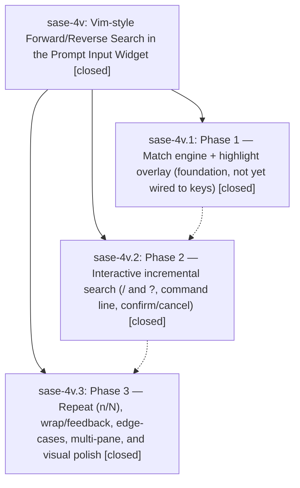

# Bead: sase-4v — Vim-style Forward/Reverse Search in the Prompt Input Widget

[Bead Pages](../README.md) / sase-4v

**Status:** ✓ closed · **Resolution:** (unrecorded) · **Type:** plan · **Tier:** epic
**Owner:** `bryanbugyi34@gmail.com`
**Created:** 2026-06-17 22:23:07 UTC · **Closed:** 2026-06-17 23:50:27 UTC
**Plan:** [202606/prompt\_input\_search.md](https://github.com/sase-org/sase--plans/blob/main/202606/prompt_input_search.md)

## Notes

COMMIT: 60beee8e5

## Phases

| Bead | Title | Status | Size | Agents | Commits |
|---|---|---|---|---:|---:|
| [sase-4v.1](sase-4v.1.md) | Phase 1 — Match engine + highlight overlay (foundation, not yet wired to keys) | ✓ closed | small | 1 | 1 |
| [sase-4v.2](sase-4v.2.md) | Phase 2 — Interactive incremental search (/ and ?, command line, confirm/cancel) | ✓ closed | small | 1 | 1 |
| [sase-4v.3](sase-4v.3.md) | Phase 3 — Repeat (n/N), wrap/feedback, edge-cases, multi-pane, and visual polish | ✓ closed | small | 1 | 1 |

## Lineage

## Agents

| Agent | Bead | Commits |
|---|---|---:|
| [bbugyi200.athena.sase-4v.1](https://github.com/sase-org/sase--agents/blob/main/agents/bbugyi200.athena.sase-4v.1/README.md) | [sase-4v.1](sase-4v.1.md) | 1 |
| [bbugyi200.athena.sase-4v.2](https://github.com/sase-org/sase--agents/blob/main/agents/bbugyi200.athena.sase-4v.2/README.md) | [sase-4v.2](sase-4v.2.md) | 1 |
| [bbugyi200.athena.sase-4v.3](https://github.com/sase-org/sase--agents/blob/main/agents/bbugyi200.athena.sase-4v.3/README.md) | [sase-4v.3](sase-4v.3.md) | 1 |

## Commits

| Commit | Subject | Bead | Committed (UTC) |
|---|---|---|---|
| [`5e1a766`](https://github.com/sase-org/sase/commit/5e1a7667962fdd2554a329883c5d1fe439d3e83d) | feat(tui): add prompt search highlight foundation (sase-4v.1) | [sase-4v.1](sase-4v.1.md) | 2026-06-17 22:57:04 |
| [`97fc3cb`](https://github.com/sase-org/sase/commit/97fc3cb2894081abfd22dc19b57ba2b4d5da55cc) | feat(tui): add interactive prompt input search (sase-4v.2) | [sase-4v.2](sase-4v.2.md) | 2026-06-17 23:15:11 |
| [`f8d2ca3`](https://github.com/sase-org/sase/commit/f8d2ca347e22f6f2571f447ba29105ab39e0abad) | feat(tui): add repeat prompt search (sase-4v.3) | [sase-4v.3](sase-4v.3.md) | 2026-06-17 23:37:23 |
