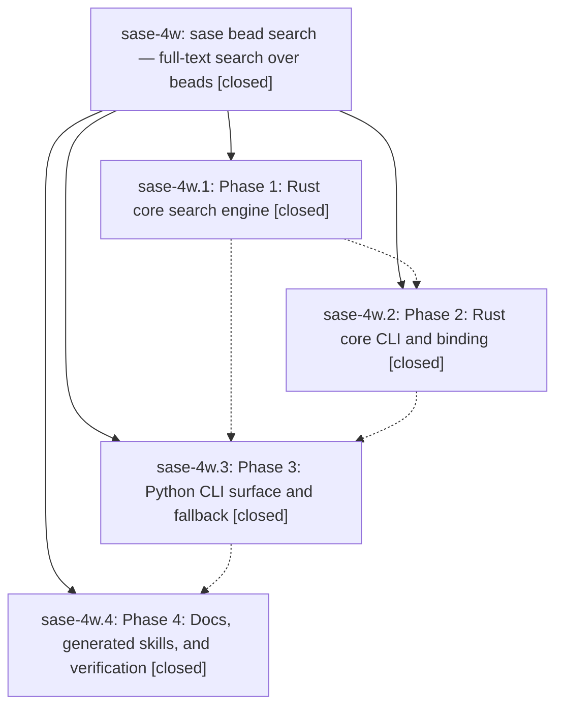

# Bead: sase-4w — sase bead search — full-text search over beads

[Bead Pages](../README.md) / sase-4w

**Status:** ✓ closed · **Resolution:** (unrecorded) · **Type:** plan · **Tier:** epic
**Owner:** `bryanbugyi34@gmail.com`
**Created:** 2026-06-18 12:13:36 UTC · **Closed:** 2026-06-18 13:53:25 UTC
**Plan:** [202606/bead\_search\_command.md](https://github.com/sase-org/sase--plans/blob/main/202606/bead_search_command.md)

## Notes

COMMIT: 99f473b0a

## Phases

| Bead | Title | Status | Size | Agents | Commits |
|---|---|---|---|---:|---:|
| [sase-4w.1](sase-4w.1.md) | Phase 1: Rust core search engine | ✓ closed | small | 0 | 0 |
| [sase-4w.2](sase-4w.2.md) | Phase 2: Rust core CLI and binding | ✓ closed | small | 0 | 0 |
| [sase-4w.3](sase-4w.3.md) | Phase 3: Python CLI surface and fallback | ✓ closed | small | 1 | 1 |
| [sase-4w.4](sase-4w.4.md) | Phase 4: Docs, generated skills, and verification | ✓ closed | small | 1 | 1 |

## Lineage

## Agents

| Agent | Bead | Commits |
|---|---|---:|
| [bbugyi200.athena.sase-4w.3](https://github.com/sase-org/sase--agents/blob/main/agents/bbugyi200.athena.sase-4w.3/README.md) | [sase-4w.3](sase-4w.3.md) | 1 |
| [bbugyi200.athena.sase-4w.4](https://github.com/sase-org/sase--agents/blob/main/agents/bbugyi200.athena.sase-4w.4/README.md) | [sase-4w.4](sase-4w.4.md) | 1 |

## Commits

| Commit | Subject | Bead | Committed (UTC) |
|---|---|---|---|
| [`90d2d6e`](https://github.com/sase-org/sase/commit/90d2d6ebec45b03e1214efe58018159d69331a40) | feat(bead): add Python search command (sase-4w.3) | [sase-4w.3](sase-4w.3.md) | 2026-06-18 13:23:21 |
| [`0a299d7`](https://github.com/sase-org/sase/commit/0a299d7af0283f2d4095df4370c25159a769c8e5) | docs(beads): document search command (sase-4w.4) | [sase-4w.4](sase-4w.4.md) | 2026-06-18 13:36:44 |
