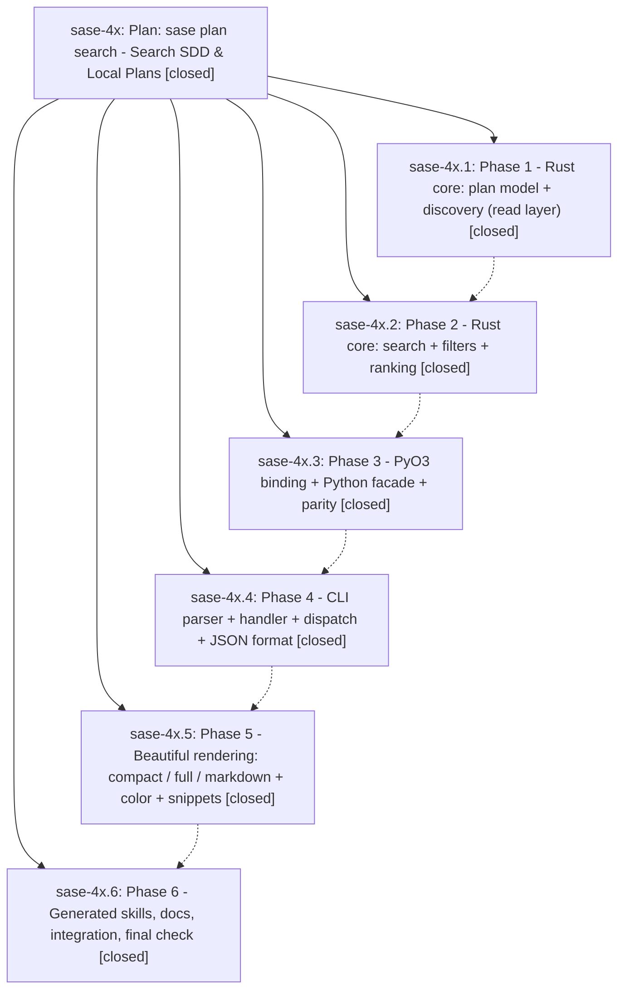

# Bead: sase-4x — Plan: sase plan search - Search SDD & Local Plans

[Bead Pages](../README.md) / sase-4x

**Status:** ✓ closed · **Resolution:** (unrecorded) · **Type:** plan · **Tier:** epic
**Owner:** `bryanbugyi34@gmail.com`
**Created:** 2026-06-19 01:30:47 UTC · **Closed:** 2026-06-19 04:21:42 UTC
**Plan:** [202606/plan\_search.md](https://github.com/sase-org/sase--plans/blob/main/202606/plan_search.md)

## Notes

COMMIT: 3ebd8e323

## Phases

| Bead | Title | Status | Size | Agents | Commits |
|---|---|---|---|---:|---:|
| [sase-4x.1](sase-4x.1.md) | Phase 1 - Rust core: plan model + discovery (read layer) | ✓ closed | small | 0 | 0 |
| [sase-4x.2](sase-4x.2.md) | Phase 2 - Rust core: search + filters + ranking | ✓ closed | small | 0 | 0 |
| [sase-4x.3](sase-4x.3.md) | Phase 3 - PyO3 binding + Python facade + parity | ✓ closed | small | 1 | 1 |
| [sase-4x.4](sase-4x.4.md) | Phase 4 - CLI parser + handler + dispatch + JSON format | ✓ closed | small | 1 | 1 |
| [sase-4x.5](sase-4x.5.md) | Phase 5 - Beautiful rendering: compact / full / markdown + color + snippets | ✓ closed | small | 1 | 1 |
| [sase-4x.6](sase-4x.6.md) | Phase 6 - Generated skills, docs, integration, final check | ✓ closed | small | 1 | 1 |

## Lineage

## Agents

| Agent | Bead | Commits |
|---|---|---:|
| [bbugyi200.athena.sase-4x](https://github.com/sase-org/sase--agents/blob/main/agents/bbugyi200.athena.sase-4x/README.md) | [sase-4x](README.md) | 1 |
| [bbugyi200.athena.sase-4x.3](https://github.com/sase-org/sase--agents/blob/main/agents/bbugyi200.athena.sase-4x.3/README.md) | [sase-4x.3](sase-4x.3.md) | 1 |
| [bbugyi200.athena.sase-4x.4](https://github.com/sase-org/sase--agents/blob/main/agents/bbugyi200.athena.sase-4x.4/README.md) | [sase-4x.4](sase-4x.4.md) | 1 |
| [bbugyi200.athena.sase-4x.5](https://github.com/sase-org/sase--agents/blob/main/agents/bbugyi200.athena.sase-4x.5/README.md) | [sase-4x.5](sase-4x.5.md) | 1 |
| [bbugyi200.athena.sase-4x.6](https://github.com/sase-org/sase--agents/blob/main/agents/bbugyi200.athena.sase-4x.6/README.md) | [sase-4x.6](sase-4x.6.md) | 1 |

## Commits

| Commit | Subject | Bead | Committed (UTC) |
|---|---|---|---|
| [`3ac4746`](https://github.com/sase-org/sase/commit/3ac47468abc82728b563511d9160fb014ed4de19) | feat(plan-search): add Python facade for plan search (sase-4x.3) | [sase-4x.3](sase-4x.3.md) | 2026-06-19 02:47:38 |
| [`668b090`](https://github.com/sase-org/sase/commit/668b090f051350835d1c92461e71d09cade64125) | feat(plan-search): add \`sase plan search\` CLI with JSON output (sase-4x.4) | [sase-4x.4](sase-4x.4.md) | 2026-06-19 03:03:13 |
| [`b733512`](https://github.com/sase-org/sase/commit/b733512740d2fb35099bf82ea241205340e2c0f2) | feat(plan-search): add compact/full/markdown rendering + color (sase-4x.5) | [sase-4x.5](sase-4x.5.md) | 2026-06-19 03:30:17 |
| [`21c14d7`](https://github.com/sase-org/sase/commit/21c14d74b2c775a773143135e5d9b5731b91a933) | feat(plan-search): add generated skill, docs, and e2e tests (sase-4x.6) | [sase-4x.6](sase-4x.6.md) | 2026-06-19 04:10:07 |
| [`1e35b52`](https://github.com/sase-org/sase/commit/1e35b52081b790a091b0d48254168e881e564060) | chore: close plan search epic (sase-4x) | [sase-4x](README.md) | 2026-06-19 04:23:37 |
