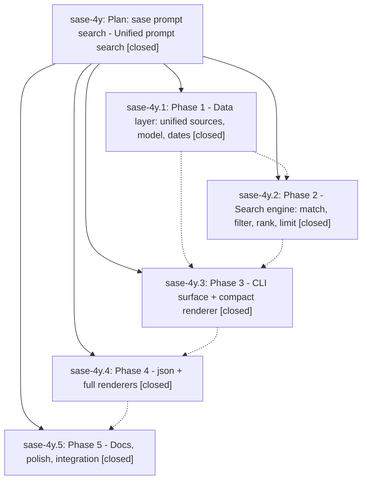

# Bead: sase-4y — Plan: sase prompt search - Unified prompt search

[Bead Pages](../README.md) / sase-4y

**Status:** ✓ closed · **Resolution:** (unrecorded) · **Type:** plan · **Tier:** epic
**Owner:** `bryanbugyi34@gmail.com`
**Created:** 2026-06-19 01:43:55 UTC · **Closed:** 2026-06-19 03:59:08 UTC
**Plan:** [202606/prompt\_search\_command.md](https://github.com/sase-org/sase--plans/blob/main/202606/prompt_search_command.md)

## Notes

COMMIT: 44ff9b8ab

[2026-07-27T21:35:45Z · sase-a1.land] [2026-06-19T03:48:45Z · bryanbugyi34@gmail.com] (restored 2026-07-27) COMMIT: 14f233c03

## Phases

| Bead | Title | Status | Size | Agents | Commits |
|---|---|---|---|---:|---:|
| [sase-4y.1](sase-4y.1.md) | Phase 1 - Data layer: unified sources, model, dates | ✓ closed | small | 1 | 1 |
| [sase-4y.2](sase-4y.2.md) | Phase 2 - Search engine: match, filter, rank, limit | ✓ closed | small | 1 | 1 |
| [sase-4y.3](sase-4y.3.md) | Phase 3 - CLI surface + compact renderer | ✓ closed | small | 1 | 1 |
| [sase-4y.4](sase-4y.4.md) | Phase 4 - json + full renderers | ✓ closed | small | 1 | 1 |
| [sase-4y.5](sase-4y.5.md) | Phase 5 - Docs, polish, integration | ✓ closed | small | 1 | 1 |

## Lineage

## Agents

| Agent | Bead | Commits |
|---|---|---:|
| [bbugyi200.athena.sase-4y](https://github.com/sase-org/sase--agents/blob/main/agents/bbugyi200.athena.sase-4y/README.md) | [sase-4y](README.md) | 2 |
| [bbugyi200.athena.sase-4y.1](https://github.com/sase-org/sase--agents/blob/main/agents/bbugyi200.athena.sase-4y.1/README.md) | [sase-4y.1](sase-4y.1.md) | 1 |
| [bbugyi200.athena.sase-4y.2](https://github.com/sase-org/sase--agents/blob/main/agents/bbugyi200.athena.sase-4y.2/README.md) | [sase-4y.2](sase-4y.2.md) | 1 |
| [bbugyi200.athena.sase-4y.3](https://github.com/sase-org/sase--agents/blob/main/agents/bbugyi200.athena.sase-4y.3/README.md) | [sase-4y.3](sase-4y.3.md) | 1 |
| [bbugyi200.athena.sase-4y.4](https://github.com/sase-org/sase--agents/blob/main/agents/bbugyi200.athena.sase-4y.4/README.md) | [sase-4y.4](sase-4y.4.md) | 1 |
| [bbugyi200.athena.sase-4y.5](https://github.com/sase-org/sase--agents/blob/main/agents/bbugyi200.athena.sase-4y.5/README.md) | [sase-4y.5](sase-4y.5.md) | 1 |

## Commits

| Commit | Subject | Bead | Committed (UTC) |
|---|---|---|---|
| [`30faa26`](https://github.com/sase-org/sase/commit/30faa263b09db638d8feb6de1d15333df3ab5786) | feat(prompt): add unified prompt search data layer (Phase 1) (sase-4y.1) | [sase-4y.1](sase-4y.1.md) | 2026-06-19 02:25:47 |
| [`6056b94`](https://github.com/sase-org/sase/commit/6056b94ad3b274bfa88b6fbdf930b9bd810d97ca) | feat(prompt): add prompt search engine (Phase 2) (sase-4y.2) | [sase-4y.2](sase-4y.2.md) | 2026-06-19 02:41:30 |
| [`0b762df`](https://github.com/sase-org/sase/commit/0b762dfc25ae1575edd606fa214906091a80fe7d) | feat(prompt): add prompt search CLI surface (Phase 3) (sase-4y.3) | [sase-4y.3](sase-4y.3.md) | 2026-06-19 03:06:25 |
| [`e189234`](https://github.com/sase-org/sase/commit/e1892344db5e0ca78daf58c3d22f5c6191b58766) | feat(prompt): add json + full search renderers (sase-4y.4) | [sase-4y.4](sase-4y.4.md) | 2026-06-19 03:21:29 |
| [`4dd94bf`](https://github.com/sase-org/sase/commit/4dd94bf60cd8577508611689223080d78df7a337) | docs(prompt): document \`prompt search\` and cover bounded output (sase-4y.5) | [sase-4y.5](sase-4y.5.md) | 2026-06-19 03:42:30 |
| [`8410b30`](https://github.com/sase-org/sase/commit/8410b30bcfd56550029fda3fc71a737c029215d4) | chore: Add SDD prompt and plan for prompt\_search\_completion (sase-4y) | [sase-4y](README.md) | 2026-06-19 03:50:20 |
| [`552cba5`](https://github.com/sase-org/sase/commit/552cba5bbd4628d7789e61ce355c27b787e34acd) | feat(prompt-search): surface local .sase/sdd snapshots in SDD search (sase-4y) | [sase-4y](README.md) | 2026-06-19 03:59:55 |
