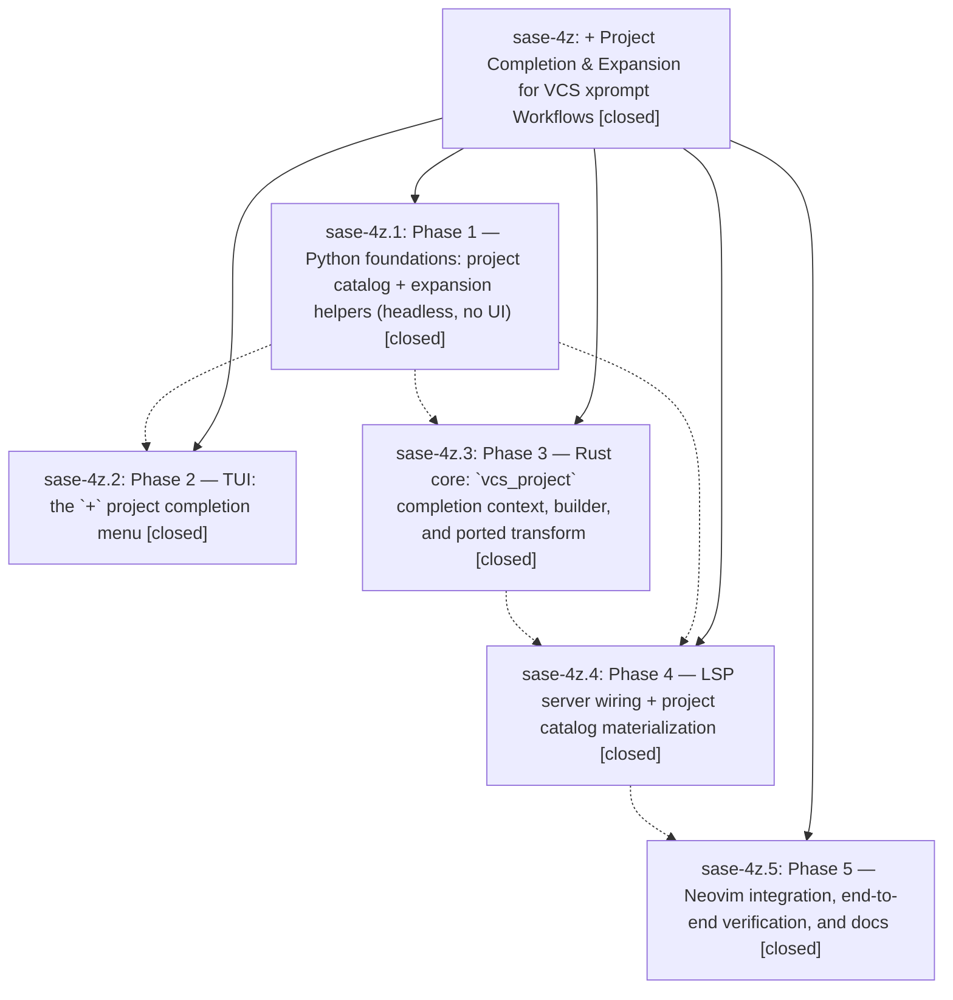

# Bead: sase-4z — + Project Completion & Expansion for VCS xprompt Workflows

[Bead Pages](../README.md) / sase-4z

**Status:** ✓ closed · **Resolution:** (unrecorded) · **Type:** plan · **Tier:** epic
**Owner:** `bryanbugyi34@gmail.com`
**Created:** 2026-06-19 13:52:16 UTC
**Plan:** /home/bryan/.sase/plans/202606/vcs\_project\_plus\_completion.md

## Phases

| Bead | Title | Status | Size | Agents | Commits |
|---|---|---|---|---:|---:|
| [sase-4z.1](sase-4z.1.md) | Phase 1 — Python foundations: project catalog + expansion helpers (headless, no UI) | ✓ closed | small | 1 | 1 |
| [sase-4z.2](sase-4z.2.md) | Phase 2 — TUI: the \`+\` project completion menu | ✓ closed | small | 1 | 1 |
| [sase-4z.3](sase-4z.3.md) | Phase 3 — Rust core: \`vcs\_project\` completion context, builder, and ported transform | ✓ closed | small | 0 | 0 |
| [sase-4z.4](sase-4z.4.md) | Phase 4 — LSP server wiring + project catalog materialization | ✓ closed | small | 1 | 1 |
| [sase-4z.5](sase-4z.5.md) | Phase 5 — Neovim integration, end-to-end verification, and docs | ✓ closed | small | 1 | 1 |

## Lineage

## Agents

| Agent | Bead | Commits |
|---|---|---:|
| [bbugyi200.athena.sase-4z.1](https://github.com/sase-org/sase--agents/blob/main/agents/bbugyi200.athena.sase-4z.1/README.md) | [sase-4z.1](sase-4z.1.md) | 1 |
| [bbugyi200.athena.sase-4z.2](https://github.com/sase-org/sase--agents/blob/main/agents/bbugyi200.athena.sase-4z.2/README.md) | [sase-4z.2](sase-4z.2.md) | 1 |
| [bbugyi200.athena.sase-4z.4](https://github.com/sase-org/sase--agents/blob/main/agents/bbugyi200.athena.sase-4z.4/README.md) | [sase-4z.4](sase-4z.4.md) | 1 |
| [bbugyi200.athena.sase-4z.5](https://github.com/sase-org/sase--agents/blob/main/agents/bbugyi200.athena.sase-4z.5/README.md) | [sase-4z.5](sase-4z.5.md) | 1 |

## Commits

| Commit | Subject | Bead | Committed (UTC) |
|---|---|---|---|
| [`1039d73`](https://github.com/sase-org/sase/commit/1039d73ed2218fdd80116ea7b1559a72c4a2a1be) | feat(xprompt): add headless project catalog + expansion helpers for \`+\` VCS completion (sase-4z.1) | [sase-4z.1](sase-4z.1.md) | 2026-06-19 14:28:44 |
| [`ddff98d`](https://github.com/sase-org/sase/commit/ddff98d70bd792db3529238bc228451d56481c67) | feat(xprompt): add \`+\` project completion menu in the TUI prompt (sase-4z.2) | [sase-4z.2](sase-4z.2.md) | 2026-06-19 14:57:34 |
| [`1524b96`](https://github.com/sase-org/sase/commit/1524b964fbf4dda8195c5cbdf3176eafc9779180) | feat(xprompt): materialize VCS project catalog for the xprompt LSP (sase-4z.4) | [sase-4z.4](sase-4z.4.md) | 2026-06-19 15:30:23 |
| [`2d4d27e`](https://github.com/sase-org/sase/commit/2d4d27eaef33ccc35f02220e2e1663143c53cf6f) | docs(glossary): document \`+\` VCS project completion (sase-4z.5) | [sase-4z.5](sase-4z.5.md) | 2026-06-19 16:10:21 |
