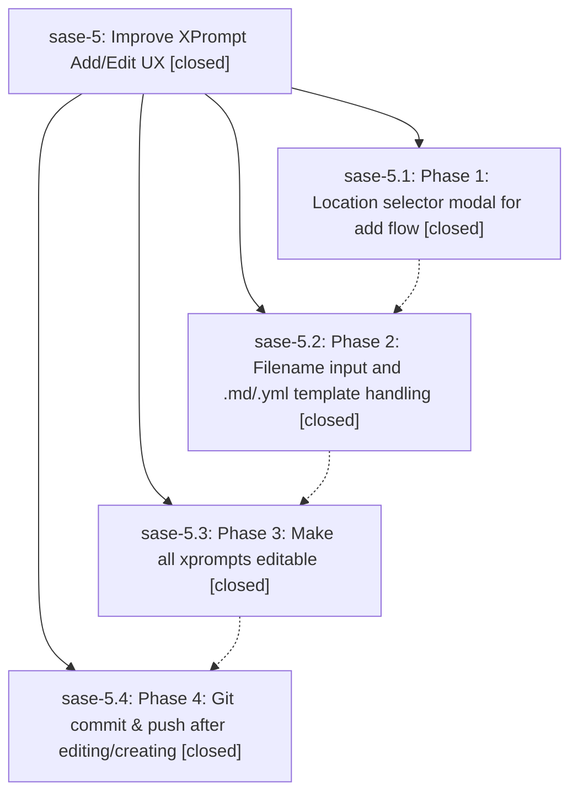

# Bead: sase-5 — Improve XPrompt Add/Edit UX

[Bead Pages](../README.md) / sase-5

**Status:** ✓ closed · **Resolution:** (unrecorded) · **Type:** plan · **Tier:** epic
**Owner:** `bryanbugyi34@gmail.com`
**Created:** 2026-03-20 05:03:44 UTC · **Closed:** 2026-03-20 05:39:41 UTC
**Plan:** [202603/xprompt\_add\_edit\_ux.md](https://github.com/sase-org/sase--plans/blob/main/202603/xprompt_add_edit_ux.md)

## Phases

| Bead | Title | Status | Size | Agents | Commits |
|---|---|---|---|---:|---:|
| [sase-5.1](sase-5.1.md) | Phase 1: Location selector modal for add flow | ✓ closed | small | 0 | 1 |
| [sase-5.2](sase-5.2.md) | Phase 2: Filename input and .md/.yml template handling | ✓ closed | small | 0 | 1 |
| [sase-5.3](sase-5.3.md) | Phase 3: Make all xprompts editable | ✓ closed | small | 0 | 1 |
| [sase-5.4](sase-5.4.md) | Phase 4: Git commit & push after editing/creating | ✓ closed | small | 0 | 1 |

## Lineage

## Commits

| Commit | Subject | Bead | Committed (UTC) |
|---|---|---|---|
| [`5a32821`](https://github.com/sase-org/sase/commit/5a3282120ce78a42c825a467cb404e9736513cff) | feat: Add XPromptLocationModal for location-aware xprompt creation (sase-5.1) | [sase-5.1](sase-5.1.md) | 2026-03-20 05:23:35 |
| [`ee039bd`](https://github.com/sase-org/sase/commit/ee039bd16ce00c9f4a19813fe966c153d19d6a1a) | feat: Add XPromptFilenameModal with .md/.yml validation and YAML template support (sase-5.2) | [sase-5.2](sase-5.2.md) | 2026-03-20 05:28:07 |
| [`08a5da7`](https://github.com/sase-org/sase/commit/08a5da7a4f0751ae6013b45ece3f694dbb0f4900) | feat: Make all xprompts editable including plugin and built-in sources (sase-5.3) | [sase-5.3](sase-5.3.md) | 2026-03-20 05:32:39 |
| [`7797598`](https://github.com/sase-org/sase/commit/77975989e277576f9b5d60179ae84aa77a7a3d9f) | feat: Add git commit & push flow after editing/creating xprompts (sase-5.4) | [sase-5.4](sase-5.4.md) | 2026-03-20 05:37:54 |
