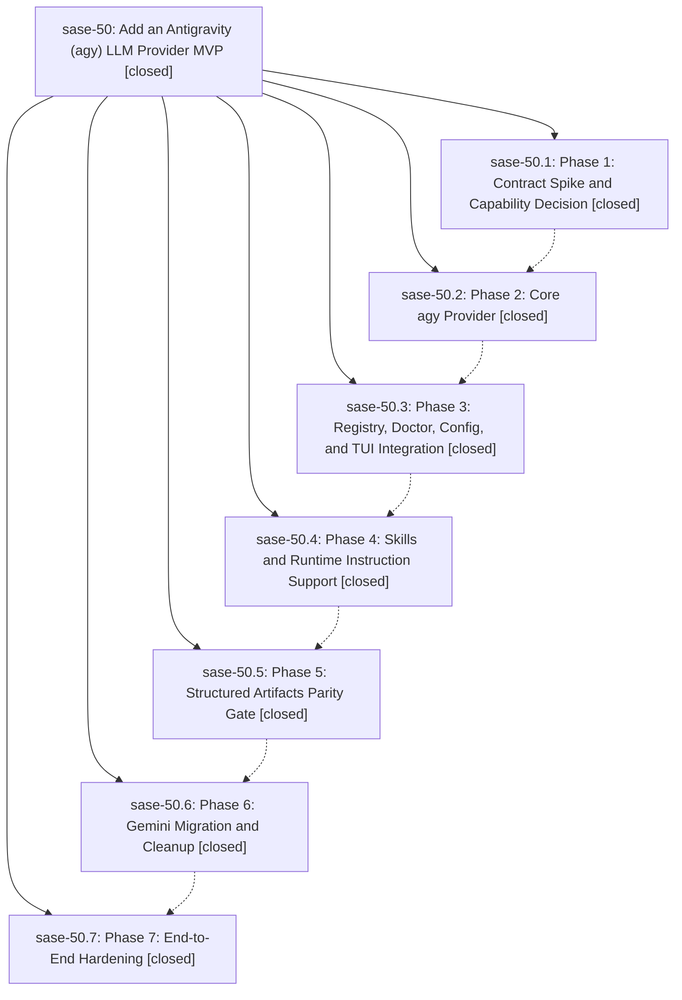

# Bead: sase-50 — Add an Antigravity (agy) LLM Provider MVP

[Bead Pages](../README.md) / sase-50

**Status:** ✓ closed · **Resolution:** (unrecorded) · **Type:** plan · **Tier:** epic
**Owner:** `bryanbugyi34@gmail.com`
**Created:** 2026-06-19 22:56:46 UTC · **Closed:** 2026-06-20 01:48:43 UTC
**Plan:** /home/bryan/.local/state/sase/workspaces/sase-org/sase/sase\_10/sdd/plans/202606/agy\_provider\_mvp.md

## Notes

COMMIT: 7db720b50

## Phases

| Bead | Title | Status | Size | Agents | Commits |
|---|---|---|---|---:|---:|
| [sase-50.1](sase-50.1.md) | Phase 1: Contract Spike and Capability Decision | ✓ closed | small | 0 | 0 |
| [sase-50.2](sase-50.2.md) | Phase 2: Core agy Provider | ✓ closed | small | 1 | 1 |
| [sase-50.3](sase-50.3.md) | Phase 3: Registry, Doctor, Config, and TUI Integration | ✓ closed | small | 1 | 1 |
| [sase-50.4](sase-50.4.md) | Phase 4: Skills and Runtime Instruction Support | ✓ closed | small | 1 | 1 |
| [sase-50.5](sase-50.5.md) | Phase 5: Structured Artifacts Parity Gate | ✓ closed | small | 1 | 1 |
| [sase-50.6](sase-50.6.md) | Phase 6: Gemini Migration and Cleanup | ✓ closed | small | 1 | 1 |
| [sase-50.7](sase-50.7.md) | Phase 7: End-to-End Hardening | ✓ closed | small | 1 | 1 |

## Lineage

## Agents

| Agent | Bead | Commits |
|---|---|---:|
| [bbugyi200.athena.sase-50](https://github.com/sase-org/sase--agents/blob/main/agents/bbugyi200.athena.sase-50/README.md) | [sase-50](README.md) | 1 |
| [bbugyi200.athena.sase-50.2](https://github.com/sase-org/sase--agents/blob/main/agents/bbugyi200.athena.sase-50.2/README.md) | [sase-50.2](sase-50.2.md) | 1 |
| [bbugyi200.athena.sase-50.3](https://github.com/sase-org/sase--agents/blob/main/agents/bbugyi200.athena.sase-50.3/README.md) | [sase-50.3](sase-50.3.md) | 1 |
| [bbugyi200.athena.sase-50.4](https://github.com/sase-org/sase--agents/blob/main/agents/bbugyi200.athena.sase-50.4/README.md) | [sase-50.4](sase-50.4.md) | 1 |
| [bbugyi200.athena.sase-50.5](https://github.com/sase-org/sase--agents/blob/main/agents/bbugyi200.athena.sase-50.5/README.md) | [sase-50.5](sase-50.5.md) | 1 |
| [bbugyi200.athena.sase-50.6](https://github.com/sase-org/sase--agents/blob/main/agents/bbugyi200.athena.sase-50.6/README.md) | [sase-50.6](sase-50.6.md) | 1 |
| [bbugyi200.athena.sase-50.7](https://github.com/sase-org/sase--agents/blob/main/agents/bbugyi200.athena.sase-50.7/README.md) | [sase-50.7](sase-50.7.md) | 1 |

## Commits

| Commit | Subject | Bead | Committed (UTC) |
|---|---|---|---|
| [`86c8614`](https://github.com/sase-org/sase/commit/86c8614726acac65409a55ff39d7b43869294328) | feat(llm): add core Antigravity (agy) provider (MVP) (sase-50.2) | [sase-50.2](sase-50.2.md) | 2026-06-19 23:53:51 |
| [`2428355`](https://github.com/sase-org/sase/commit/2428355bebd5095829885b8d32f32b848e46a1c3) | feat(llm): integrate agy provider into registry, doctor, config, and TUI (sase-50.3) | [sase-50.3](sase-50.3.md) | 2026-06-20 00:12:59 |
| [`7931c7e`](https://github.com/sase-org/sase/commit/7931c7e57f44c45c2db3092ab4409408b7079ec0) | feat(llm): support agy provider in skill init (sase-50.4) | [sase-50.4](sase-50.4.md) | 2026-06-20 00:25:53 |
| [`7e22e78`](https://github.com/sase-org/sase/commit/7e22e786e932043dff165585e4cd0a662b1d5307) | test(llm): gate agy structured-artifacts parity gap (sase-50.5) | [sase-50.5](sase-50.5.md) | 2026-06-20 00:37:29 |
| [`6a623cd`](https://github.com/sase-org/sase/commit/6a623cd7a2a277993a9787bf744804a2e6152cef) | feat(llm)!: remove Gemini CLI provider in favor of agy (sase-50.6) | [sase-50.6](sase-50.6.md) | 2026-06-20 01:24:54 |
| [`9b90ef0`](https://github.com/sase-org/sase/commit/9b90ef0815e6fad4bfab5eaa59b311a2c3cc872b) | test(llm): harden agy provider end-to-end (sase-50.7) | [sase-50.7](sase-50.7.md) | 2026-06-20 01:41:07 |
| [`cb54659`](https://github.com/sase-org/sase/commit/cb54659c5ff4b04938e392f039e116dcb9192aa7) | chore: Add SDD prompt and plan for agy\_provider\_final\_gap (sase-50) | [sase-50](README.md) | 2026-06-20 01:49:36 |
