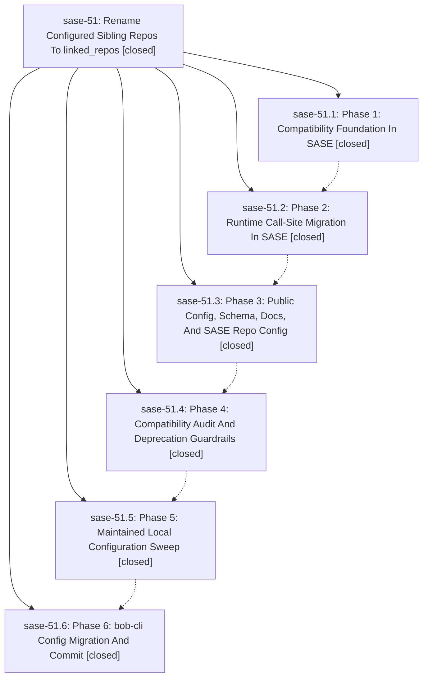

# Bead: sase-51 — Rename Configured Sibling Repos To linked\_repos

[Bead Pages](../README.md) / sase-51

**Status:** ✓ closed · **Resolution:** (unrecorded) · **Type:** plan · **Tier:** epic
**Owner:** `bryanbugyi34@gmail.com`
**Created:** 2026-06-20 17:51:24 UTC · **Closed:** 2026-06-20 21:47:13 UTC
**Plan:** [202606/linked\_repos\_rename\_codex.md](https://github.com/sase-org/sase--plans/blob/main/202606/linked_repos_rename_codex.md)

## Phases

| Bead | Title | Status | Size | Agents | Commits |
|---|---|---|---|---:|---:|
| [sase-51.1](sase-51.1.md) | Phase 1: Compatibility Foundation In SASE | ✓ closed | small | 1 | 1 |
| [sase-51.2](sase-51.2.md) | Phase 2: Runtime Call-Site Migration In SASE | ✓ closed | small | 1 | 1 |
| [sase-51.3](sase-51.3.md) | Phase 3: Public Config, Schema, Docs, And SASE Repo Config | ✓ closed | small | 1 | 1 |
| [sase-51.4](sase-51.4.md) | Phase 4: Compatibility Audit And Deprecation Guardrails | ✓ closed | small | 1 | 1 |
| [sase-51.5](sase-51.5.md) | Phase 5: Maintained Local Configuration Sweep | ✓ closed | small | 0 | 0 |
| [sase-51.6](sase-51.6.md) | Phase 6: bob-cli Config Migration And Commit | ✓ closed | small | 0 | 0 |

## Lineage

## Agents

| Agent | Bead | Commits |
|---|---|---:|
| [bbugyi200.athena.sase-51.1](https://github.com/sase-org/sase--agents/blob/main/agents/bbugyi200.athena.sase-51.1/README.md) | [sase-51.1](sase-51.1.md) | 1 |
| [bbugyi200.athena.sase-51.2](https://github.com/sase-org/sase--agents/blob/main/agents/bbugyi200.athena.sase-51.2/README.md) | [sase-51.2](sase-51.2.md) | 1 |
| [bbugyi200.athena.sase-51.3](https://github.com/sase-org/sase--agents/blob/main/agents/bbugyi200.athena.sase-51.3/README.md) | [sase-51.3](sase-51.3.md) | 1 |
| [bbugyi200.athena.sase-51.4](https://github.com/sase-org/sase--agents/blob/main/agents/bbugyi200.athena.sase-51.4/README.md) | [sase-51.4](sase-51.4.md) | 1 |

## Commits

| Commit | Subject | Bead | Committed (UTC) |
|---|---|---|---|
| [`81ef778`](https://github.com/sase-org/sase/commit/81ef778a1aba18535e8244dc6cfe091ae6efb190) | feat(linked\_repos): add canonical linked\_repos module with sibling\_repos compat (sase-51.1) | [sase-51.1](sase-51.1.md) | 2026-06-20 18:33:52 |
| [`56031dd`](https://github.com/sase-org/sase/commit/56031ddb995c4454c250e8f48e8af42943393cfa) | refactor(linked\_repos): migrate runtime call-sites to canonical module (sase-51.2) | [sase-51.2](sase-51.2.md) | 2026-06-20 19:02:39 |
| [`b0f316a`](https://github.com/sase-org/sase/commit/b0f316ab71ef2d7371c22d92f406755fd7169a0d) | feat(config): surface linked\_repos as the public configured-repo key (sase-51.3) | [sase-51.3](sase-51.3.md) | 2026-06-20 20:10:27 |
| [`d5f3fca`](https://github.com/sase-org/sase/commit/d5f3fca9269bf7cbb9bb3e08826bcccc513ac439) | feat(config): warn on deprecated sibling\_repos key (sase-51.4) | [sase-51.4](sase-51.4.md) | 2026-06-20 20:37:08 |
