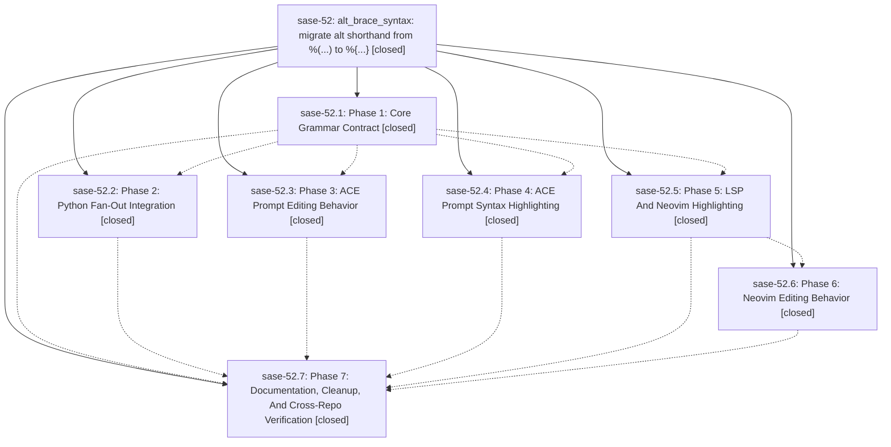

# Bead: sase-52 — alt\_brace\_syntax: migrate alt shorthand from %(...) to %{...}

[Bead Pages](../README.md) / sase-52

**Status:** ✓ closed · **Resolution:** (unrecorded) · **Type:** plan · **Tier:** epic
**Owner:** `bryanbugyi34@gmail.com`
**Created:** 2026-06-20 18:27:13 UTC · **Closed:** 2026-06-20 21:07:11 UTC
**Plan:** [202606/alt\_brace\_syntax.md](https://github.com/sase-org/sase--plans/blob/main/202606/alt_brace_syntax.md)

## Notes

COMMIT: 631e31d96

## Phases

| Bead | Title | Status | Size | Agents | Commits |
|---|---|---|---|---:|---:|
| [sase-52.1](sase-52.1.md) | Phase 1: Core Grammar Contract | ✓ closed | small | 0 | 0 |
| [sase-52.2](sase-52.2.md) | Phase 2: Python Fan-Out Integration | ✓ closed | small | 1 | 1 |
| [sase-52.3](sase-52.3.md) | Phase 3: ACE Prompt Editing Behavior | ✓ closed | small | 1 | 1 |
| [sase-52.4](sase-52.4.md) | Phase 4: ACE Prompt Syntax Highlighting | ✓ closed | small | 1 | 1 |
| [sase-52.5](sase-52.5.md) | Phase 5: LSP And Neovim Highlighting | ✓ closed | small | 0 | 0 |
| [sase-52.6](sase-52.6.md) | Phase 6: Neovim Editing Behavior | ✓ closed | small | 0 | 0 |
| [sase-52.7](sase-52.7.md) | Phase 7: Documentation, Cleanup, And Cross-Repo Verification | ✓ closed | small | 1 | 1 |

## Lineage

## Agents

| Agent | Bead | Commits |
|---|---|---:|
| [bbugyi200.athena.sase-52](https://github.com/sase-org/sase--agents/blob/main/agents/bbugyi200.athena.sase-52/README.md) | [sase-52](README.md) | 1 |
| [bbugyi200.athena.sase-52.2](https://github.com/sase-org/sase--agents/blob/main/agents/bbugyi200.athena.sase-52.2/README.md) | [sase-52.2](sase-52.2.md) | 1 |
| [bbugyi200.athena.sase-52.3](https://github.com/sase-org/sase--agents/blob/main/agents/bbugyi200.athena.sase-52.3/README.md) | [sase-52.3](sase-52.3.md) | 1 |
| [bbugyi200.athena.sase-52.4](https://github.com/sase-org/sase--agents/blob/main/agents/bbugyi200.athena.sase-52.4/README.md) | [sase-52.4](sase-52.4.md) | 1 |
| [bbugyi200.athena.sase-52.7](https://github.com/sase-org/sase--agents/blob/main/agents/bbugyi200.athena.sase-52.7/README.md) | [sase-52.7](sase-52.7.md) | 1 |

## Commits

| Commit | Subject | Bead | Committed (UTC) |
|---|---|---|---|
| [`2cb2239`](https://github.com/sase-org/sase/commit/2cb2239e4018902d9b4c5ba2921f011ccec2c371) | feat(xprompt): wire %{...} brace alt shorthand through Python fan-out (sase-52.2) | [sase-52.2](sase-52.2.md) | 2026-06-20 19:24:01 |
| [`57e9fd6`](https://github.com/sase-org/sase/commit/57e9fd6f35f9ef2f197d65ffe97a6dd422b426df) | feat(tui): highlight %{...} alt shorthand in ACE prompt input (sase-52.4) | [sase-52.4](sase-52.4.md) | 2026-06-20 19:37:49 |
| [`2e5d157`](https://github.com/sase-org/sase/commit/2e5d1578bc4b4b154507414687354c059784c477) | feat(ace): add %{...} alt-shorthand prompt editing behavior (sase-52.3) | [sase-52.3](sase-52.3.md) | 2026-06-20 19:48:18 |
| [`f338e8a`](https://github.com/sase-org/sase/commit/f338e8a5eb51eb209e87a03334afdcf17214cd43) | docs(xprompt): document %{} alt brace shorthand (sase-52.7) | [sase-52.7](sase-52.7.md) | 2026-06-20 21:01:30 |
| [`47237dc`](https://github.com/sase-org/sase/commit/47237dcc1874e8849ae12a857f9f6d073a119bc8) | chore: Add SDD prompt and plan for complete\_sase\_52\_alt\_directive\_predicate (sase-52) | [sase-52](README.md) | 2026-06-20 21:08:11 |
