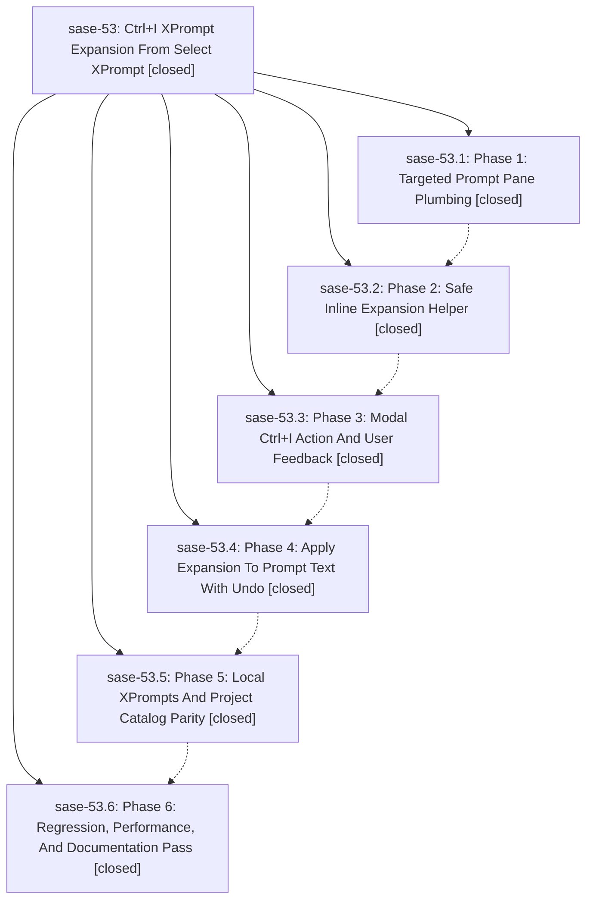

# Bead: sase-53 — Ctrl+I XPrompt Expansion From Select XPrompt

[Bead Pages](../README.md) / sase-53

**Status:** ✓ closed · **Resolution:** (unrecorded) · **Type:** plan · **Tier:** epic
**Owner:** `bryanbugyi34@gmail.com`
**Created:** 2026-06-21 14:44:12 UTC · **Closed:** 2026-06-21 16:53:27 UTC
**Plan:** [202606/xprompt\_expand\_keymap.md](https://github.com/sase-org/sase--plans/blob/main/202606/xprompt_expand_keymap.md)

## Phases

| Bead | Title | Status | Size | Agents | Commits |
|---|---|---|---|---:|---:|
| [sase-53.1](sase-53.1.md) | Phase 1: Targeted Prompt Pane Plumbing | ✓ closed | small | 1 | 1 |
| [sase-53.2](sase-53.2.md) | Phase 2: Safe Inline Expansion Helper | ✓ closed | small | 1 | 1 |
| [sase-53.3](sase-53.3.md) | Phase 3: Modal Ctrl+I Action And User Feedback | ✓ closed | small | 1 | 1 |
| [sase-53.4](sase-53.4.md) | Phase 4: Apply Expansion To Prompt Text With Undo | ✓ closed | small | 1 | 1 |
| [sase-53.5](sase-53.5.md) | Phase 5: Local XPrompts And Project Catalog Parity | ✓ closed | small | 1 | 1 |
| [sase-53.6](sase-53.6.md) | Phase 6: Regression, Performance, And Documentation Pass | ✓ closed | small | 0 | 0 |

## Lineage

## Agents

| Agent | Bead | Commits |
|---|---|---:|
| [bbugyi200.athena.sase-53.1](https://github.com/sase-org/sase--agents/blob/main/agents/bbugyi200.athena.sase-53.1/README.md) | [sase-53.1](sase-53.1.md) | 1 |
| [bbugyi200.athena.sase-53.2](https://github.com/sase-org/sase--agents/blob/main/agents/bbugyi200.athena.sase-53.2/README.md) | [sase-53.2](sase-53.2.md) | 1 |
| [bbugyi200.athena.sase-53.3](https://github.com/sase-org/sase--agents/blob/main/agents/bbugyi200.athena.sase-53.3/README.md) | [sase-53.3](sase-53.3.md) | 1 |
| [bbugyi200.athena.sase-53.4](https://github.com/sase-org/sase--agents/blob/main/agents/bbugyi200.athena.sase-53.4/README.md) | [sase-53.4](sase-53.4.md) | 1 |
| [bbugyi200.athena.sase-53.5](https://github.com/sase-org/sase--agents/blob/main/agents/bbugyi200.athena.sase-53.5/README.md) | [sase-53.5](sase-53.5.md) | 1 |

## Commits

| Commit | Subject | Bead | Committed (UTC) |
|---|---|---|---|
| [`93f9dbf`](https://github.com/sase-org/sase/commit/93f9dbfd03b3c6b75d261852e065b80c959220d9) | feat(tui): target originating pane for #@ snippet selector (sase-53.1) | [sase-53.1](sase-53.1.md) | 2026-06-21 15:21:49 |
| [`3c9d6cf`](https://github.com/sase-org/sase/commit/3c9d6cff939490f79c6c8f10d96ad15c06d29b37) | feat(tui): add safe inline xprompt expansion helper (sase-53.2) | [sase-53.2](sase-53.2.md) | 2026-06-21 15:41:45 |
| [`f8b80df`](https://github.com/sase-org/sase/commit/f8b80df762ef9192c0a003dda0e098999bcdec8e) | feat(tui): add Ctrl+I expand action to xprompt select modal (sase-53.3) | [sase-53.3](sase-53.3.md) | 2026-06-21 16:02:54 |
| [`5def141`](https://github.com/sase-org/sase/commit/5def141cc2539bba4ab348c13d8807a6dcb7a09c) | feat(tui): apply xprompt expansion to prompt text with undo (sase-53.4) | [sase-53.4](sase-53.4.md) | 2026-06-21 16:22:43 |
| [`60c504a`](https://github.com/sase-org/sase/commit/60c504a678e741157ae9b22c63601c52d563b88b) | feat(tui): expand local xprompts in #@ selector with parity (sase-53.5) | [sase-53.5](sase-53.5.md) | 2026-06-21 16:36:45 |
