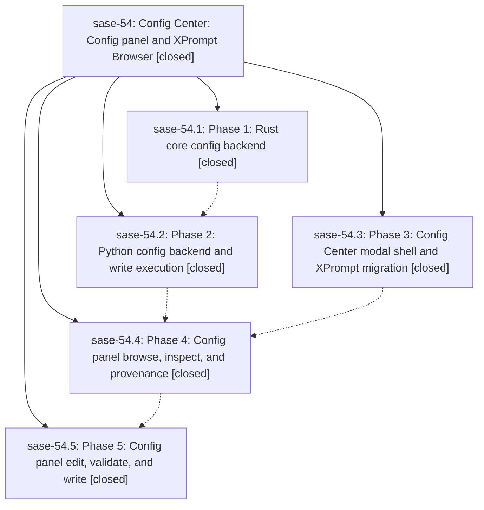

# Bead: sase-54 — Config Center: Config panel and XPrompt Browser

[Bead Pages](../README.md) / sase-54

**Status:** ✓ closed · **Resolution:** (unrecorded) · **Type:** plan · **Tier:** epic
**Owner:** `bryanbugyi34@gmail.com`
**Created:** 2026-06-23 12:27:06 UTC · **Closed:** 2026-06-23 15:46:57 UTC
**Plan:** /home/bryan/.sase/plans/202606/config\_xprompts\_panel.md

## Phases

| Bead | Title | Status | Size | Agents | Commits |
|---|---|---|---|---:|---:|
| [sase-54.1](sase-54.1.md) | Phase 1: Rust core config backend | ✓ closed | small | 0 | 0 |
| [sase-54.2](sase-54.2.md) | Phase 2: Python config backend and write execution | ✓ closed | small | 1 | 1 |
| [sase-54.3](sase-54.3.md) | Phase 3: Config Center modal shell and XPrompt migration | ✓ closed | small | 1 | 1 |
| [sase-54.4](sase-54.4.md) | Phase 4: Config panel browse, inspect, and provenance | ✓ closed | small | 1 | 1 |
| [sase-54.5](sase-54.5.md) | Phase 5: Config panel edit, validate, and write | ✓ closed | small | 1 | 1 |

## Lineage

## Agents

| Agent | Bead | Commits |
|---|---|---:|
| [bbugyi200.athena.sase-54.2](https://github.com/sase-org/sase--agents/blob/main/agents/bbugyi200.athena.sase-54.2/README.md) | [sase-54.2](sase-54.2.md) | 1 |
| [bbugyi200.athena.sase-54.3](https://github.com/sase-org/sase--agents/blob/main/agents/bbugyi200.athena.sase-54.3/README.md) | [sase-54.3](sase-54.3.md) | 1 |
| [bbugyi200.athena.sase-54.4](https://github.com/sase-org/sase--agents/blob/main/agents/bbugyi200.athena.sase-54.4/README.md) | [sase-54.4](sase-54.4.md) | 1 |
| [bbugyi200.athena.sase-54.5](https://github.com/sase-org/sase--agents/blob/main/agents/bbugyi200.athena.sase-54.5/README.md) | [sase-54.5](sase-54.5.md) | 1 |

## Commits

| Commit | Subject | Bead | Committed (UTC) |
|---|---|---|---|
| [`9a32303`](https://github.com/sase-org/sase/commit/9a32303963d0b5052395e2cac0fe3942d07d6028) | feat(tui): add Config Center modal and migrate XPrompt Browser (sase-54.3) | [sase-54.3](sase-54.3.md) | 2026-06-23 13:24:53 |
| [`618c275`](https://github.com/sase-org/sase/commit/618c27537c6624c12571556f3a8bb60ef09e13ca) | feat(config): add Python config backend and write execution (sase-54.2) | [sase-54.2](sase-54.2.md) | 2026-06-23 14:06:52 |
| [`8792e87`](https://github.com/sase-org/sase/commit/8792e87dc538b81ec9c23159965fec7e5f12e792) | feat(config): add read-only config browser to Config Center (sase-54.4) | [sase-54.4](sase-54.4.md) | 2026-06-23 14:39:05 |
| [`710d8a1`](https://github.com/sase-org/sase/commit/710d8a104be5682db846288b98e89fe2787cc497) | feat(config): add edit, validate, and write to Config Center (sase-54.5) | [sase-54.5](sase-54.5.md) | 2026-06-23 15:36:09 |
