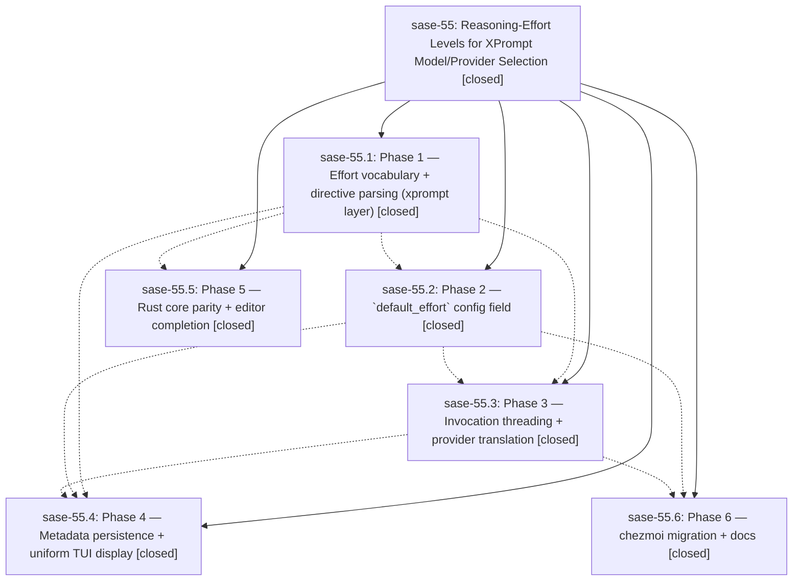

# Bead: sase-55 — Reasoning-Effort Levels for XPrompt Model/Provider Selection

[Bead Pages](../README.md) / sase-55

**Status:** ✓ closed · **Resolution:** (unrecorded) · **Type:** plan · **Tier:** epic
**Owner:** `bryanbugyi34@gmail.com`
**Created:** 2026-06-23 15:22:11 UTC · **Closed:** 2026-06-23 18:33:28 UTC
**Plan:** [202606/xprompt\_effort\_levels.md](https://github.com/sase-org/sase--plans/blob/main/202606/xprompt_effort_levels.md)

## Phases

| Bead | Title | Status | Size | Agents | Commits |
|---|---|---|---|---:|---:|
| [sase-55.1](sase-55.1.md) | Phase 1 — Effort vocabulary + directive parsing (xprompt layer) | ✓ closed | small | 1 | 1 |
| [sase-55.2](sase-55.2.md) | Phase 2 — \`default\_effort\` config field | ✓ closed | small | 1 | 1 |
| [sase-55.3](sase-55.3.md) | Phase 3 — Invocation threading + provider translation | ✓ closed | small | 1 | 1 |
| [sase-55.4](sase-55.4.md) | Phase 4 — Metadata persistence + uniform TUI display | ✓ closed | small | 1 | 1 |
| [sase-55.5](sase-55.5.md) | Phase 5 — Rust core parity + editor completion | ✓ closed | small | 1 | 1 |
| [sase-55.6](sase-55.6.md) | Phase 6 — chezmoi migration + docs | ✓ closed | small | 1 | 1 |

## Lineage

## Agents

| Agent | Bead | Commits |
|---|---|---:|
| [bbugyi200.athena.sase-55.1](https://github.com/sase-org/sase--agents/blob/main/agents/bbugyi200.athena.sase-55.1/README.md) | [sase-55.1](sase-55.1.md) | 1 |
| [bbugyi200.athena.sase-55.2](https://github.com/sase-org/sase--agents/blob/main/agents/bbugyi200.athena.sase-55.2/README.md) | [sase-55.2](sase-55.2.md) | 1 |
| [bbugyi200.athena.sase-55.3](https://github.com/sase-org/sase--agents/blob/main/agents/bbugyi200.athena.sase-55.3/README.md) | [sase-55.3](sase-55.3.md) | 1 |
| [bbugyi200.athena.sase-55.4](https://github.com/sase-org/sase--agents/blob/main/agents/bbugyi200.athena.sase-55.4/README.md) | [sase-55.4](sase-55.4.md) | 1 |
| [bbugyi200.athena.sase-55.5](https://github.com/sase-org/sase--agents/blob/main/agents/bbugyi200.athena.sase-55.5/README.md) | [sase-55.5](sase-55.5.md) | 1 |
| [bbugyi200.athena.sase-55.6](https://github.com/sase-org/sase--agents/blob/main/agents/bbugyi200.athena.sase-55.6/README.md) | [sase-55.6](sase-55.6.md) | 1 |

## Commits

| Commit | Subject | Bead | Committed (UTC) |
|---|---|---|---|
| [`9b5a715`](https://github.com/sase-org/sase/commit/9b5a715f21995ffdd6b455aaa6e59756a5eafb0c) | feat(xprompt): parse reasoning-effort levels in directives (sase-55.1) | [sase-55.1](sase-55.1.md) | 2026-06-23 16:23:00 |
| [`88bc7f1`](https://github.com/sase-org/sase/commit/88bc7f1266df53f98078c5322b7895491ba0a67c) | feat(llm\_provider): add default\_effort config field (sase-55.2) | [sase-55.2](sase-55.2.md) | 2026-06-23 16:39:14 |
| [`b979c54`](https://github.com/sase-org/sase/commit/b979c54bb12ae328b845f1605fc7d9d865a6f945) | test(core): cover model@effort suffix stripping in agent-launch fanout (sase-55.5) | [sase-55.5](sase-55.5.md) | 2026-06-23 17:03:18 |
| [`7535d98`](https://github.com/sase-org/sase/commit/7535d98b718faaa5489e7ea7bc447e210b3edff1) | feat(llm\_provider): translate reasoning effort into per-run CLI args (sase-55.3) | [sase-55.3](sase-55.3.md) | 2026-06-23 17:10:21 |
| [`85ebbe6`](https://github.com/sase-org/sase/commit/85ebbe6733b647ff6de0c65932cfae4111d523ef) | docs: document reasoning-effort directive and default\_effort config (sase-55.6) | [sase-55.6](sase-55.6.md) | 2026-06-23 17:23:14 |
| [`d6b9ebe`](https://github.com/sase-org/sase/commit/d6b9ebe1bf1e3f7bdc742783a8eb281feb7136bd) | feat(ace): persist and display reasoning effort uniformly (sase-55.4) | [sase-55.4](sase-55.4.md) | 2026-06-23 17:53:41 |
