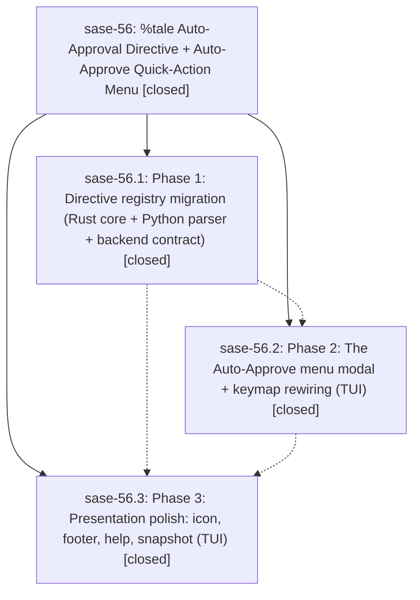

# Bead: sase-56 — %tale Auto-Approval Directive + Auto-Approve Quick-Action Menu

[Bead Pages](../README.md) / sase-56

**Status:** ✓ closed · **Resolution:** (unrecorded) · **Type:** plan · **Tier:** epic
**Owner:** `bryanbugyi34@gmail.com`
**Created:** 2026-06-23 22:32:50 UTC · **Closed:** 2026-06-24 00:22:59 UTC
**Plan:** [202606/auto\_approve\_menu\_and\_tale\_directive.md](https://github.com/sase-org/sase--plans/blob/main/202606/auto_approve_menu_and_tale_directive.md)

## Notes

COMMIT: 1a53b790b

[2026-07-27T21:37:01Z · sase-a1.land] [2026-06-24T00:07:42Z · bryanbugyi34@gmail.com] (restored 2026-07-27) COMMIT: 3ed4d85d1

## Phases

| Bead | Title | Status | Size | Agents | Commits |
|---|---|---|---|---:|---:|
| [sase-56.1](sase-56.1.md) | Phase 1: Directive registry migration (Rust core + Python parser + backend contract) | ✓ closed | small | 1 | 2 |
| [sase-56.2](sase-56.2.md) | Phase 2: The Auto-Approve menu modal + keymap rewiring (TUI) | ✓ closed | small | 1 | 1 |
| [sase-56.3](sase-56.3.md) | Phase 3: Presentation polish: icon, footer, help, snapshot (TUI) | ✓ closed | small | 1 | 1 |

## Lineage

## Agents

| Agent | Bead | Commits |
|---|---|---:|
| [bbugyi200.athena.sase-56](https://github.com/sase-org/sase--agents/blob/main/agents/bbugyi200.athena.sase-56/README.md) | [sase-56](README.md) | 3 |
| [bbugyi200.athena.sase-56.1](https://github.com/sase-org/sase--agents/blob/main/agents/bbugyi200.athena.sase-56.1/README.md) | [sase-56.1](sase-56.1.md) | 2 |
| [bbugyi200.athena.sase-56.2](https://github.com/sase-org/sase--agents/blob/main/agents/bbugyi200.athena.sase-56.2/README.md) | [sase-56.2](sase-56.2.md) | 1 |
| [bbugyi200.athena.sase-56.3](https://github.com/sase-org/sase--agents/blob/main/agents/bbugyi200.athena.sase-56.3/README.md) | [sase-56.3](sase-56.3.md) | 1 |

## Commits

| Commit | Subject | Bead | Committed (UTC) |
|---|---|---|---|
| [`4b22421`](https://github.com/sase-org/sase/commit/4b224219c1e52b68e163409b91f7b2c16b870361) | feat(directives)!: add %tale directive and repurpose %plan for plan auto-approval (sase-56.1) | [sase-56.1](sase-56.1.md) | 2026-06-23 23:22:07 |
| [`sase-core@50c6e82`](https://github.com/sase-org/sase-core/commit/50c6e8232e42a2953c9af61b8f20578b2dba984b) | feat(editor)!: add %tale directive and repurpose %plan for plan auto-approval (sase-56.1) | [sase-56.1](sase-56.1.md) | 2026-06-23 23:22:37 |
| [`b44dda1`](https://github.com/sase-org/sase/commit/b44dda18dec4b6e07b577c73ba9b8aab0b53f1be) | feat(ace): add Auto-Approve menu modal and rewire approve keymap (sase-56.2) | [sase-56.2](sase-56.2.md) | 2026-06-23 23:38:22 |
| [`52cbe00`](https://github.com/sase-org/sase/commit/52cbe00d54ed8892c4a83a8ff5a29a6344de85ec) | feat(ace): polish auto-approve presentation in agent list, footer, and help (sase-56.3) | [sase-56.3](sase-56.3.md) | 2026-06-24 00:01:26 |
| [`f3144e6`](https://github.com/sase-org/sase/commit/f3144e633821248fbf751d13b1778e683595e602) | chore: Add SDD prompt and plan for sase\_56\_completion (sase-56) | [sase-56](README.md) | 2026-06-24 00:07:55 |
| [`d605ae5`](https://github.com/sase-org/sase/commit/d605ae5119e31d0055a0dd8d823bd97fc177ccc0) | docs(ace): update auto-approve docs for the Auto-Approve menu (sase-56) | [sase-56](README.md) | 2026-06-24 00:25:53 |
| [`sase-core@5a2fa51`](https://github.com/sase-org/sase-core/commit/5a2fa511455dac4b5b21d15fb3c9902bd01fccf4) | fix(agent\_launch): align directive aliases with the shared registry (sase-56) | [sase-56](README.md) | 2026-06-24 00:26:41 |
