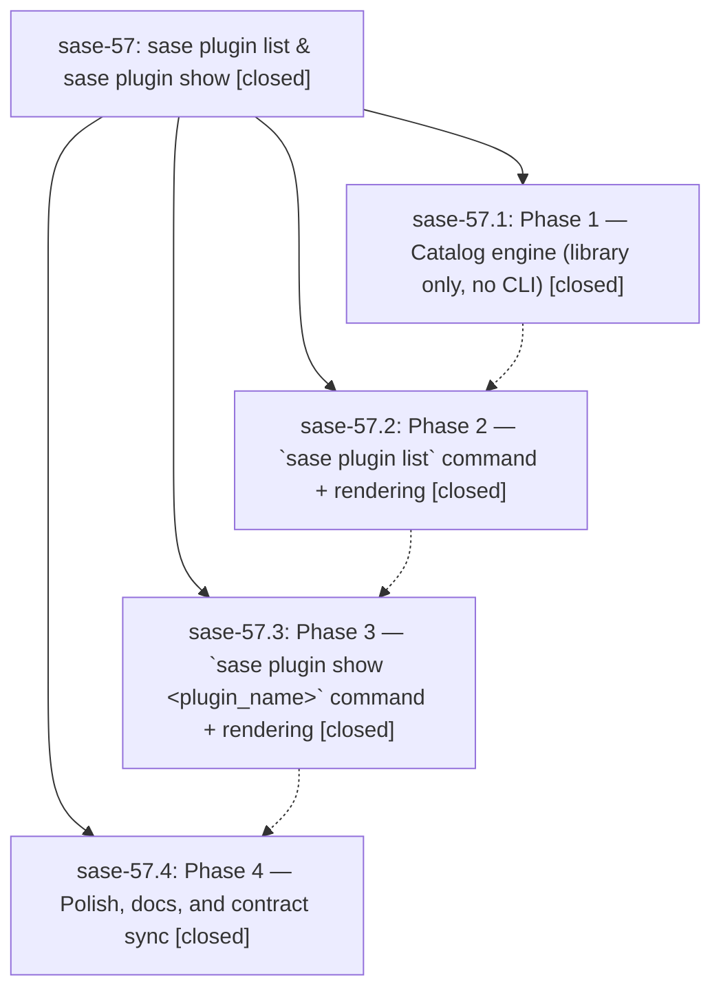

# Bead: sase-57 — sase plugin list & sase plugin show

[Bead Pages](../README.md) / sase-57

**Status:** ✓ closed · **Resolution:** (unrecorded) · **Type:** plan · **Tier:** epic
**Owner:** `bryanbugyi34@gmail.com`
**Created:** 2026-06-25 22:37:08 UTC · **Closed:** 2026-06-26 00:15:12 UTC
**Plan:** [202606/plugin\_catalog.md](https://github.com/sase-org/sase--plans/blob/main/202606/plugin_catalog.md)

## Notes

COMMIT: beca96d75

[2026-07-27T21:37:11Z · sase-a1.land] [2026-06-25T23:59:43Z · bryanbugyi34@gmail.com] (restored 2026-07-27) COMMIT: 8c9e2b560

## Phases

| Bead | Title | Status | Size | Agents | Commits |
|---|---|---|---|---:|---:|
| [sase-57.1](sase-57.1.md) | Phase 1 — Catalog engine (library only, no CLI) | ✓ closed | small | 1 | 1 |
| [sase-57.2](sase-57.2.md) | Phase 2 — \`sase plugin list\` command + rendering | ✓ closed | small | 1 | 1 |
| [sase-57.3](sase-57.3.md) | Phase 3 — \`sase plugin show \<plugin\_name\>\` command + rendering | ✓ closed | small | 1 | 1 |
| [sase-57.4](sase-57.4.md) | Phase 4 — Polish, docs, and contract sync | ✓ closed | small | 1 | 1 |

## Lineage

## Agents

| Agent | Bead | Commits |
|---|---|---:|
| [bbugyi200.athena.sase-57](https://github.com/sase-org/sase--agents/blob/main/agents/bbugyi200.athena.sase-57/README.md) | [sase-57](README.md) | 2 |
| [bbugyi200.athena.sase-57.1](https://github.com/sase-org/sase--agents/blob/main/agents/bbugyi200.athena.sase-57.1/README.md) | [sase-57.1](sase-57.1.md) | 1 |
| [bbugyi200.athena.sase-57.2](https://github.com/sase-org/sase--agents/blob/main/agents/bbugyi200.athena.sase-57.2/README.md) | [sase-57.2](sase-57.2.md) | 1 |
| [bbugyi200.athena.sase-57.3](https://github.com/sase-org/sase--agents/blob/main/agents/bbugyi200.athena.sase-57.3/README.md) | [sase-57.3](sase-57.3.md) | 1 |
| [bbugyi200.athena.sase-57.4](https://github.com/sase-org/sase--agents/blob/main/agents/bbugyi200.athena.sase-57.4/README.md) | [sase-57.4](sase-57.4.md) | 1 |

## Commits

| Commit | Subject | Bead | Committed (UTC) |
|---|---|---|---|
| [`cc0e304`](https://github.com/sase-org/sase/commit/cc0e304ce1807e14c724e38ac18f49df6cd9e46f) | feat(plugins): add plugin catalog engine (library-only) (sase-57.1) | [sase-57.1](sase-57.1.md) | 2026-06-25 23:12:46 |
| [`cd7f4f6`](https://github.com/sase-org/sase/commit/cd7f4f67f1ea69dab9b145519b5d5b0baa4a7a56) | feat(plugins): add \`sase plugin list\` command + rendering (sase-57.2) | [sase-57.2](sase-57.2.md) | 2026-06-25 23:28:14 |
| [`518e4f8`](https://github.com/sase-org/sase/commit/518e4f8854c3f50909e62866b1f6dbe333bfe5b8) | feat(plugins): add \`sase plugin show\` command + rendering (sase-57.3) | [sase-57.3](sase-57.3.md) | 2026-06-25 23:44:04 |
| [`2c7ec47`](https://github.com/sase-org/sase/commit/2c7ec4718b178047d505eb839bf7817adefc39ee) | docs(plugins): polish \`sase plugin\` help text and document catalog commands (sase-57.4) | [sase-57.4](sase-57.4.md) | 2026-06-25 23:54:29 |
| [`12d5323`](https://github.com/sase-org/sase/commit/12d5323259e228fee58d956cd9fba9dcabf1e2d9) | chore: Add SDD prompt and plan for plugin\_catalog\_verification (sase-57) | [sase-57](README.md) | 2026-06-25 23:59:52 |
| [`ecfa971`](https://github.com/sase-org/sase/commit/ecfa971a5e6d51322b4a81f1872c01c8f5d0532d) | refactor(plugins): privatize internal catalog exceptions and correct cache-fallback docs (sase-57) | [sase-57](README.md) | 2026-06-26 00:17:16 |
