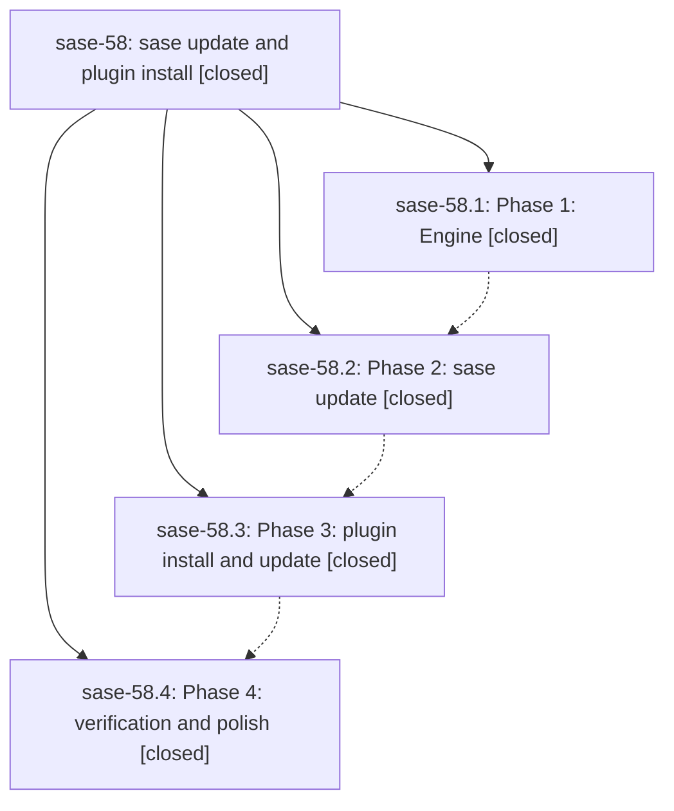

# Bead: sase-58 — sase update and plugin install

[Bead Pages](../README.md) / sase-58

**Status:** ✓ closed · **Resolution:** (unrecorded) · **Type:** plan · **Tier:** epic
**Owner:** `bryanbugyi34@gmail.com`
**Created:** 2026-06-26 01:16:38 UTC · **Closed:** 2026-06-26 03:21:39 UTC
**Plan:** [202606/sase\_update\_and\_plugin\_install.md](https://github.com/sase-org/sase--plans/blob/main/202606/sase_update_and_plugin_install.md)

## Notes

COMMIT: 95c430d56

## Phases

| Bead | Title | Status | Size | Agents | Commits |
|---|---|---|---|---:|---:|
| [sase-58.1](sase-58.1.md) | Phase 1: Engine | ✓ closed | small | 1 | 1 |
| [sase-58.2](sase-58.2.md) | Phase 2: sase update | ✓ closed | small | 1 | 1 |
| [sase-58.3](sase-58.3.md) | Phase 3: plugin install and update | ✓ closed | small | 1 | 1 |
| [sase-58.4](sase-58.4.md) | Phase 4: verification and polish | ✓ closed | small | 1 | 1 |

## Lineage

## Agents

| Agent | Bead | Commits |
|---|---|---:|
| [bbugyi200.athena.sase-58.1](https://github.com/sase-org/sase--agents/blob/main/agents/bbugyi200.athena.sase-58.1/README.md) | [sase-58.1](sase-58.1.md) | 1 |
| [bbugyi200.athena.sase-58.2](https://github.com/sase-org/sase--agents/blob/main/agents/bbugyi200.athena.sase-58.2/README.md) | [sase-58.2](sase-58.2.md) | 1 |
| [bbugyi200.athena.sase-58.3](https://github.com/sase-org/sase--agents/blob/main/agents/bbugyi200.athena.sase-58.3/README.md) | [sase-58.3](sase-58.3.md) | 1 |
| [bbugyi200.athena.sase-58.4](https://github.com/sase-org/sase--agents/blob/main/agents/bbugyi200.athena.sase-58.4/README.md) | [sase-58.4](sase-58.4.md) | 1 |

## Commits

| Commit | Subject | Bead | Committed (UTC) |
|---|---|---|---|
| [`5357c14`](https://github.com/sase-org/sase/commit/5357c14c7dd16c38c8cbc390050ec77411761616) | feat(uv\_tool): add shared uv tool engine (sase-58.1) | [sase-58.1](sase-58.1.md) | 2026-06-26 01:52:40 |
| [`6578bb3`](https://github.com/sase-org/sase/commit/6578bb36846bbc147c9219398dbe1361d409a5f7) | feat(main): add top-level \`sase update\` command (sase-58.2) | [sase-58.2](sase-58.2.md) | 2026-06-26 02:14:42 |
| [`e9d1742`](https://github.com/sase-org/sase/commit/e9d17424efc8c7813c232ce0c2d64bb45ca8bd56) | feat(plugin): add \`sase plugin install\` and \`sase plugin update\` (sase-58.3) | [sase-58.3](sase-58.3.md) | 2026-06-26 02:40:48 |
| [`5d1a5bd`](https://github.com/sase-org/sase/commit/5d1a5bd4152b65651e039e8d93cb47ae22ec7ced) | fix(uv\_tool): polish update/plugin output and add real-uv harness (sase-58.4) | [sase-58.4](sase-58.4.md) | 2026-06-26 03:07:09 |
