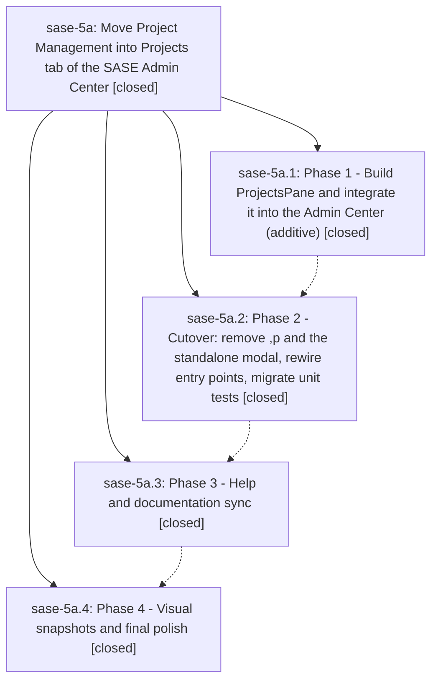

# Bead: sase-5a — Move Project Management into Projects tab of the SASE Admin Center

[Bead Pages](../README.md) / sase-5a

**Status:** ✓ closed · **Resolution:** (unrecorded) · **Type:** plan · **Tier:** epic
**Owner:** `bryanbugyi34@gmail.com`
**Created:** 2026-06-26 16:53:01 UTC · **Closed:** 2026-06-26 19:15:11 UTC
**Plan:** [202606/projects\_admin\_center\_tab.md](https://github.com/sase-org/sase--plans/blob/main/202606/projects_admin_center_tab.md)

## Notes

COMMIT: 399b76662

[2026-07-27T21:37:38Z · sase-a1.land] [2026-06-26T19:10:23Z · bryanbugyi34@gmail.com] (restored 2026-07-27) COMMIT: 667761b94

## Phases

| Bead | Title | Status | Size | Agents | Commits |
|---|---|---|---|---:|---:|
| [sase-5a.1](sase-5a.1.md) | Phase 1 - Build ProjectsPane and integrate it into the Admin Center (additive) | ✓ closed | small | 1 | 1 |
| [sase-5a.2](sase-5a.2.md) | Phase 2 - Cutover: remove ,p and the standalone modal, rewire entry points, migrate unit tests | ✓ closed | small | 1 | 1 |
| [sase-5a.3](sase-5a.3.md) | Phase 3 - Help and documentation sync | ✓ closed | small | 1 | 1 |
| [sase-5a.4](sase-5a.4.md) | Phase 4 - Visual snapshots and final polish | ✓ closed | small | 1 | 1 |

## Lineage

## Agents

| Agent | Bead | Commits |
|---|---|---:|
| [bbugyi200.athena.sase-5a](https://github.com/sase-org/sase--agents/blob/main/agents/bbugyi200.athena.sase-5a/README.md) | [sase-5a](README.md) | 1 |
| [bbugyi200.athena.sase-5a.1](https://github.com/sase-org/sase--agents/blob/main/agents/bbugyi200.athena.sase-5a.1/README.md) | [sase-5a.1](sase-5a.1.md) | 1 |
| [bbugyi200.athena.sase-5a.2](https://github.com/sase-org/sase--agents/blob/main/agents/bbugyi200.athena.sase-5a.2/README.md) | [sase-5a.2](sase-5a.2.md) | 1 |
| [bbugyi200.athena.sase-5a.3](https://github.com/sase-org/sase--agents/blob/main/agents/bbugyi200.athena.sase-5a.3/README.md) | [sase-5a.3](sase-5a.3.md) | 1 |
| [bbugyi200.athena.sase-5a.4](https://github.com/sase-org/sase--agents/blob/main/agents/bbugyi200.athena.sase-5a.4/README.md) | [sase-5a.4](sase-5a.4.md) | 1 |

## Commits

| Commit | Subject | Bead | Committed (UTC) |
|---|---|---|---|
| [`be370bd`](https://github.com/sase-org/sase/commit/be370bd2ce08a6f024415688a2e0aefa2b428fa2) | feat(tui): add Projects pane to the ACE Admin Center (sase-5a.1) | [sase-5a.1](sase-5a.1.md) | 2026-06-26 17:46:47 |
| [`5a6a9bb`](https://github.com/sase-org/sase/commit/5a6a9bb286d7ed0eb55f38f27e6ce9d1b11a9d5c) | refactor(tui): cut over project management to the Projects tab (sase-5a.2) | [sase-5a.2](sase-5a.2.md) | 2026-06-26 18:27:13 |
| [`9e3de03`](https://github.com/sase-org/sase/commit/9e3de039c7eafc6f13b42b0fb668c4e453be97ee) | docs(ace): sync help and docs to Projects tab (sase-5a.3) | [sase-5a.3](sase-5a.3.md) | 2026-06-26 18:45:26 |
| [`300fe2e`](https://github.com/sase-org/sase/commit/300fe2efeb64760c0f1a7c990447449f63d0bb92) | test(ace): add Projects-tab PNG snapshots and refresh config-center goldens (sase-5a.4) | [sase-5a.4](sase-5a.4.md) | 2026-06-26 19:05:49 |
| [`865d6fe`](https://github.com/sase-org/sase/commit/865d6fe078041e24610acc3605a2686161ad7fa0) | chore: Add SDD prompt and plan for sase\_5a\_remaining (sase-5a) | [sase-5a](README.md) | 2026-06-26 19:10:35 |
