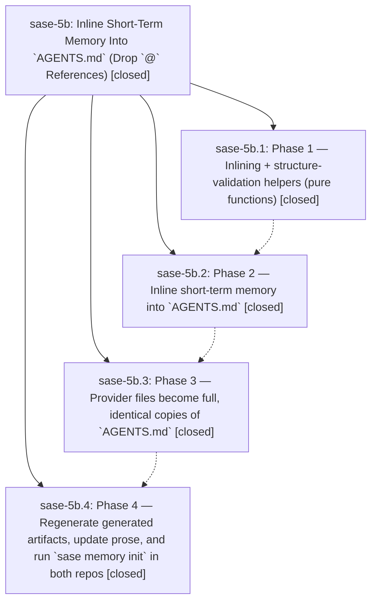

# Bead: sase-5b — Inline Short-Term Memory Into \`AGENTS.md\` (Drop \`@\` References)

[Bead Pages](../README.md) / sase-5b

**Status:** ✓ closed · **Resolution:** (unrecorded) · **Type:** plan · **Tier:** epic
**Owner:** `bryanbugyi34@gmail.com`
**Created:** 2026-06-26 19:49:45 UTC · **Closed:** 2026-06-26 21:45:15 UTC
**Plan:** [202606/inline\_short\_term\_memory.md](https://github.com/sase-org/sase--plans/blob/main/202606/inline_short_term_memory.md)

## Notes

COMMIT: b1d940e3b

[2026-07-27T21:37:41Z · sase-a1.land] [2026-06-26T21:43:57Z · bryanbugyi34@gmail.com] (restored 2026-07-27) COMMIT: b9a17e21e

## Phases

| Bead | Title | Status | Size | Agents | Commits |
|---|---|---|---|---:|---:|
| [sase-5b.1](sase-5b.1.md) | Phase 1 — Inlining + structure-validation helpers (pure functions) | ✓ closed | small | 1 | 1 |
| [sase-5b.2](sase-5b.2.md) | Phase 2 — Inline short-term memory into \`AGENTS.md\` | ✓ closed | small | 1 | 1 |
| [sase-5b.3](sase-5b.3.md) | Phase 3 — Provider files become full, identical copies of \`AGENTS.md\` | ✓ closed | small | 1 | 1 |
| [sase-5b.4](sase-5b.4.md) | Phase 4 — Regenerate generated artifacts, update prose, and run \`sase memory init\` in both repos | ✓ closed | small | 1 | 1 |

## Lineage

## Agents

| Agent | Bead | Commits |
|---|---|---:|
| [bbugyi200.athena.sase-5b](https://github.com/sase-org/sase--agents/blob/main/agents/bbugyi200.athena.sase-5b/README.md) | [sase-5b](README.md) | 1 |
| [bbugyi200.athena.sase-5b.1](https://github.com/sase-org/sase--agents/blob/main/agents/bbugyi200.athena.sase-5b.1/README.md) | [sase-5b.1](sase-5b.1.md) | 1 |
| [bbugyi200.athena.sase-5b.2](https://github.com/sase-org/sase--agents/blob/main/agents/bbugyi200.athena.sase-5b.2/README.md) | [sase-5b.2](sase-5b.2.md) | 1 |
| [bbugyi200.athena.sase-5b.3](https://github.com/sase-org/sase--agents/blob/main/agents/bbugyi200.athena.sase-5b.3/README.md) | [sase-5b.3](sase-5b.3.md) | 1 |
| [bbugyi200.athena.sase-5b.4](https://github.com/sase-org/sase--agents/blob/main/agents/bbugyi200.athena.sase-5b.4/README.md) | [sase-5b.4](sase-5b.4.md) | 1 |

## Commits

| Commit | Subject | Bead | Committed (UTC) |
|---|---|---|---|
| [`4827c09`](https://github.com/sase-org/sase/commit/4827c093e0180e121d76d6699e53d69dd73402dc) | feat(memory): add fence-aware short-term memory inlining helpers (sase-5b.1) | [sase-5b.1](sase-5b.1.md) | 2026-06-26 20:12:56 |
| [`41de8f1`](https://github.com/sase-org/sase/commit/41de8f1b3ee20673802a4a6817a65bb354f3a3ba) | feat(memory): inline short-term memory into \`AGENTS.md\` (sase-5b.2) | [sase-5b.2](sase-5b.2.md) | 2026-06-26 20:47:21 |
| [`394f41b`](https://github.com/sase-org/sase/commit/394f41b878b8010ee69b68b8f2caf37ee6d198c2) | feat(memory): provider files become full copies of \`AGENTS.md\` (sase-5b.3) | [sase-5b.3](sase-5b.3.md) | 2026-06-26 21:09:42 |
| [`17bc99c`](https://github.com/sase-org/sase/commit/17bc99cbd8a7d340f2c9547ff9a77d95e41ca4e6) | feat(memory): regenerate artifacts with inlined short-term memory (sase-5b.4) | [sase-5b.4](sase-5b.4.md) | 2026-06-26 21:24:46 |
| [`81d4f53`](https://github.com/sase-org/sase/commit/81d4f53b85b49bb85c436dd405918c09e57fdcf5) | chore: Add SDD prompt and plan for sase\_5b\_pyvision\_cleanup\_1 (sase-5b) | [sase-5b](README.md) | 2026-06-26 21:46:19 |
