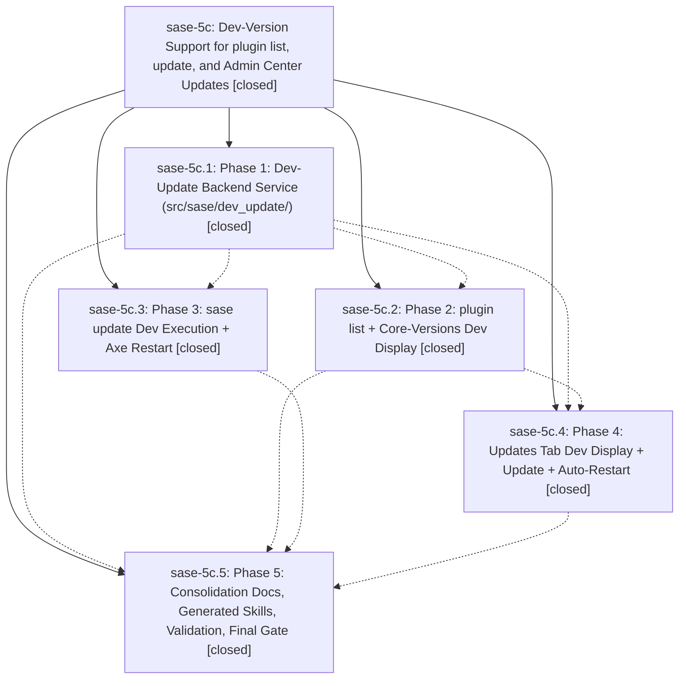

# Bead: sase-5c — Dev-Version Support for plugin list, update, and Admin Center Updates

[Bead Pages](../README.md) / sase-5c

**Status:** ✓ closed · **Resolution:** (unrecorded) · **Type:** plan · **Tier:** epic
**Owner:** `bryanbugyi34@gmail.com`
**Created:** 2026-06-27 18:39:41 UTC · **Closed:** 2026-06-27 21:26:26 UTC
**Plan:** [202606/dev\_version\_support.md](https://github.com/sase-org/sase--plans/blob/main/202606/dev_version_support.md)

## Notes

COMMIT: 84e45fd80

## Phases

| Bead | Title | Status | Size | Agents | Commits |
|---|---|---|---|---:|---:|
| [sase-5c.1](sase-5c.1.md) | Phase 1: Dev-Update Backend Service (src/sase/dev\_update/) | ✓ closed | small | 1 | 1 |
| [sase-5c.2](sase-5c.2.md) | Phase 2: plugin list + Core-Versions Dev Display | ✓ closed | small | 1 | 1 |
| [sase-5c.3](sase-5c.3.md) | Phase 3: sase update Dev Execution + Axe Restart | ✓ closed | small | 1 | 1 |
| [sase-5c.4](sase-5c.4.md) | Phase 4: Updates Tab Dev Display + Update + Auto-Restart | ✓ closed | small | 1 | 1 |
| [sase-5c.5](sase-5c.5.md) | Phase 5: Consolidation Docs, Generated Skills, Validation, Final Gate | ✓ closed | small | 1 | 1 |

## Lineage

## Agents

| Agent | Bead | Commits |
|---|---|---:|
| [bbugyi200.athena.sase-5c.1](https://github.com/sase-org/sase--agents/blob/main/agents/bbugyi200.athena.sase-5c.1/README.md) | [sase-5c.1](sase-5c.1.md) | 1 |
| [bbugyi200.athena.sase-5c.2](https://github.com/sase-org/sase--agents/blob/main/agents/bbugyi200.athena.sase-5c.2/README.md) | [sase-5c.2](sase-5c.2.md) | 1 |
| [bbugyi200.athena.sase-5c.3](https://github.com/sase-org/sase--agents/blob/main/agents/bbugyi200.athena.sase-5c.3/README.md) | [sase-5c.3](sase-5c.3.md) | 1 |
| [bbugyi200.athena.sase-5c.4](https://github.com/sase-org/sase--agents/blob/main/agents/bbugyi200.athena.sase-5c.4/README.md) | [sase-5c.4](sase-5c.4.md) | 1 |
| [bbugyi200.athena.sase-5c.5](https://github.com/sase-org/sase--agents/blob/main/agents/bbugyi200.athena.sase-5c.5/README.md) | [sase-5c.5](sase-5c.5.md) | 1 |

## Commits

| Commit | Subject | Bead | Committed (UTC) |
|---|---|---|---|
| [`c4581d9`](https://github.com/sase-org/sase/commit/c4581d91dc1ea42faf41b6fbe81d51c89d020c4a) | feat: add editable dev update backend (sase-5c.1) | [sase-5c.1](sase-5c.1.md) | 2026-06-27 19:14:23 |
| [`4a06b31`](https://github.com/sase-org/sase/commit/4a06b3128522f340f2c5c09ad7a69ef3a73d7b39) | feat(plugins): show dev latest versions (sase-5c.2) | [sase-5c.2](sase-5c.2.md) | 2026-06-27 20:11:57 |
| [`d80fc0c`](https://github.com/sase-org/sase/commit/d80fc0c3fcc75a8489e9d38373c82f6d8acc814e) | feat: support dev execution in sase update (sase-5c.3) | [sase-5c.3](sase-5c.3.md) | 2026-06-27 20:23:25 |
| [`571fdbb`](https://github.com/sase-org/sase/commit/571fdbbe7a080643dbd3f05c74bceda7caf8b479) | feat(tui): support editable dev updates in admin center (sase-5c.4) | [sase-5c.4](sase-5c.4.md) | 2026-06-27 20:46:01 |
| [`4f76c7b`](https://github.com/sase-org/sase/commit/4f76c7b033113c69535f3643d54c82e642d6adbb) | chore: consolidate dev-version update docs (sase-5c.5) | [sase-5c.5](sase-5c.5.md) | 2026-06-27 21:11:57 |
