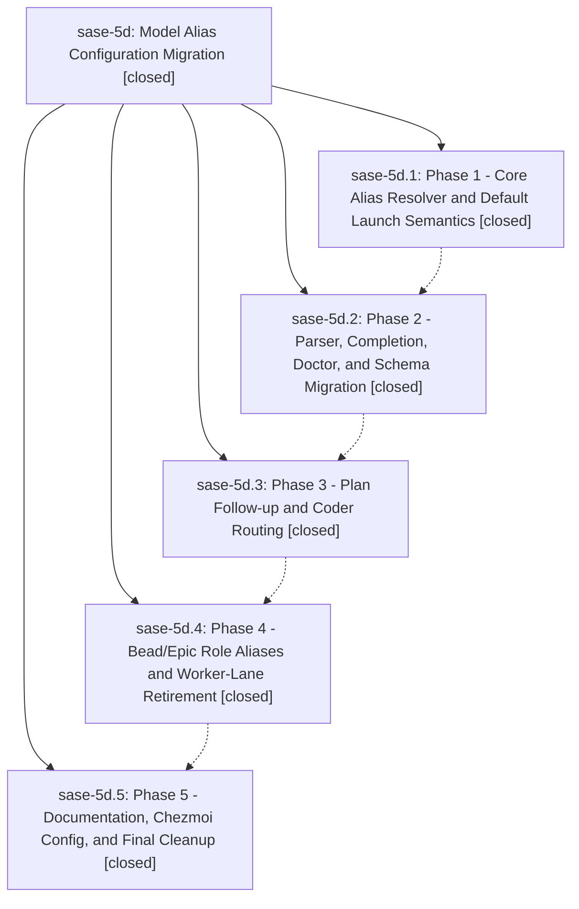

# Bead: sase-5d — Model Alias Configuration Migration

[Bead Pages](../README.md) / sase-5d

**Status:** ✓ closed · **Resolution:** (unrecorded) · **Type:** plan · **Tier:** epic
**Owner:** `bryanbugyi34@gmail.com`
**Created:** 2026-06-30 13:24:12 UTC · **Closed:** 2026-06-30 16:39:48 UTC
**Plan:** [202606/model\_alias\_configuration\_migration.md](https://github.com/sase-org/sase--plans/blob/main/202606/model_alias_configuration_migration.md)

## Notes

COMMIT: 0b0b66a8c

## Phases

| Bead | Title | Status | Size | Agents | Commits |
|---|---|---|---|---:|---:|
| [sase-5d.1](sase-5d.1.md) | Phase 1 - Core Alias Resolver and Default Launch Semantics | ✓ closed | small | 1 | 1 |
| [sase-5d.2](sase-5d.2.md) | Phase 2 - Parser, Completion, Doctor, and Schema Migration | ✓ closed | small | 1 | 1 |
| [sase-5d.3](sase-5d.3.md) | Phase 3 - Plan Follow-up and Coder Routing | ✓ closed | small | 1 | 1 |
| [sase-5d.4](sase-5d.4.md) | Phase 4 - Bead/Epic Role Aliases and Worker-Lane Retirement | ✓ closed | small | 1 | 1 |
| [sase-5d.5](sase-5d.5.md) | Phase 5 - Documentation, Chezmoi Config, and Final Cleanup | ✓ closed | small | 1 | 1 |

## Lineage

## Agents

| Agent | Bead | Commits |
|---|---|---:|
| [bbugyi200.athena.sase-5d.1](https://github.com/sase-org/sase--agents/blob/main/agents/bbugyi200.athena.sase-5d.1/README.md) | [sase-5d.1](sase-5d.1.md) | 1 |
| [bbugyi200.athena.sase-5d.2](https://github.com/sase-org/sase--agents/blob/main/agents/bbugyi200.athena.sase-5d.2/README.md) | [sase-5d.2](sase-5d.2.md) | 1 |
| [bbugyi200.athena.sase-5d.3](https://github.com/sase-org/sase--agents/blob/main/agents/bbugyi200.athena.sase-5d.3/README.md) | [sase-5d.3](sase-5d.3.md) | 1 |
| [bbugyi200.athena.sase-5d.4](https://github.com/sase-org/sase--agents/blob/main/agents/bbugyi200.athena.sase-5d.4/README.md) | [sase-5d.4](sase-5d.4.md) | 1 |
| [bbugyi200.athena.sase-5d.5](https://github.com/sase-org/sase--agents/blob/main/agents/bbugyi200.athena.sase-5d.5/README.md) | [sase-5d.5](sase-5d.5.md) | 1 |

## Commits

| Commit | Subject | Bead | Committed (UTC) |
|---|---|---|---|
| [`4d1a4b7`](https://github.com/sase-org/sase/commit/4d1a4b71ff832c07364f242848371a85dfa7a0e9) | feat(llm\_provider): add core alias resolver and @default launch semantics (sase-5d.1) | [sase-5d.1](sase-5d.1.md) | 2026-06-30 14:13:58 |
| [`829b43d`](https://github.com/sase-org/sase/commit/829b43d25ddf4a164cd0a44e88c9bf034a2c7805) | feat(llm\_provider)!: migrate alias parser, completion, doctor, and schema (sase-5d.2) | [sase-5d.2](sase-5d.2.md) | 2026-06-30 14:40:05 |
| [`02a9d4d`](https://github.com/sase-org/sase/commit/02a9d4db9496a6a821f05234e547fdb79edcd19d) | feat(axe)!: route plan coder follow-ups through provider coder alias (sase-5d.3) | [sase-5d.3](sase-5d.3.md) | 2026-06-30 15:11:52 |
| [`788e321`](https://github.com/sase-org/sase/commit/788e321c6445309771f65c300d91841d7e1a55f1) | feat(llm\_provider)!: route bead/epic launches through role aliases and retire worker lane (sase-5d.4) | [sase-5d.4](sase-5d.4.md) | 2026-06-30 15:59:46 |
| [`a27b457`](https://github.com/sase-org/sase/commit/a27b4572ecc94114f06e808ba0697390678bdb98) | docs(llm\_provider): align docs and shipped config with role-alias model (sase-5d.5) | [sase-5d.5](sase-5d.5.md) | 2026-06-30 16:21:00 |
