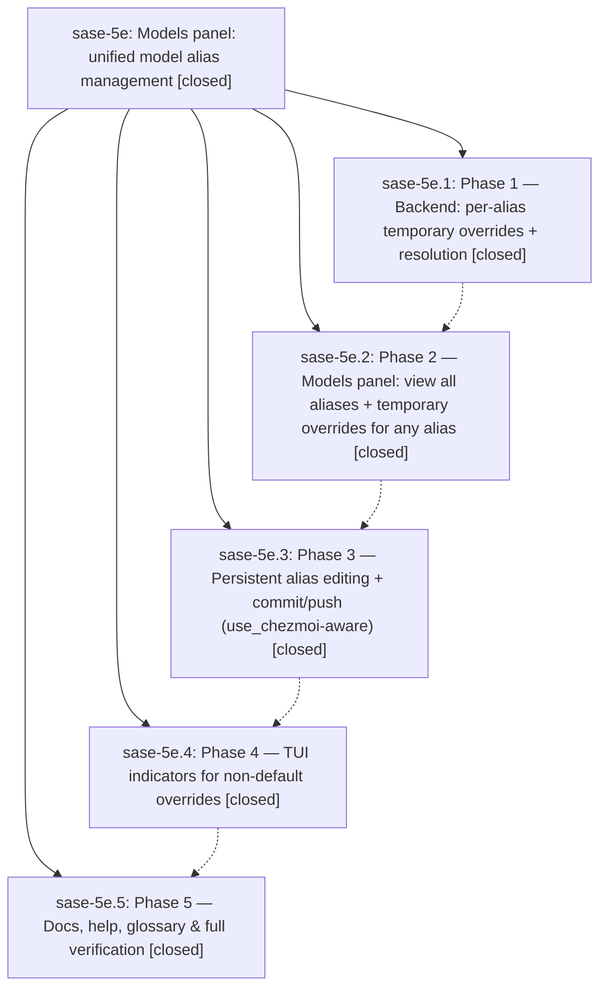

# Bead: sase-5e — Models panel: unified model alias management

[Bead Pages](../README.md) / sase-5e

**Status:** ✓ closed · **Resolution:** (unrecorded) · **Type:** plan · **Tier:** epic
**Owner:** `bryanbugyi34@gmail.com`
**Created:** 2026-06-30 18:00:44 UTC · **Closed:** 2026-06-30 20:21:42 UTC
**Plan:** [202606/models\_panel.md](https://github.com/sase-org/sase--plans/blob/main/202606/models_panel.md)

## Notes

COMMIT: 1f1575da9

## Phases

| Bead | Title | Status | Size | Agents | Commits |
|---|---|---|---|---:|---:|
| [sase-5e.1](sase-5e.1.md) | Phase 1 — Backend: per-alias temporary overrides + resolution | ✓ closed | small | 1 | 1 |
| [sase-5e.2](sase-5e.2.md) | Phase 2 — Models panel: view all aliases + temporary overrides for any alias | ✓ closed | small | 1 | 1 |
| [sase-5e.3](sase-5e.3.md) | Phase 3 — Persistent alias editing + commit/push (use\_chezmoi-aware) | ✓ closed | small | 1 | 1 |
| [sase-5e.4](sase-5e.4.md) | Phase 4 — TUI indicators for non-default overrides | ✓ closed | small | 1 | 1 |
| [sase-5e.5](sase-5e.5.md) | Phase 5 — Docs, help, glossary & full verification | ✓ closed | small | 1 | 1 |

## Lineage

## Agents

| Agent | Bead | Commits |
|---|---|---:|
| [bbugyi200.athena.sase-5e.1](https://github.com/sase-org/sase--agents/blob/main/agents/bbugyi200.athena.sase-5e.1/README.md) | [sase-5e.1](sase-5e.1.md) | 1 |
| [bbugyi200.athena.sase-5e.2](https://github.com/sase-org/sase--agents/blob/main/agents/bbugyi200.athena.sase-5e.2/README.md) | [sase-5e.2](sase-5e.2.md) | 1 |
| [bbugyi200.athena.sase-5e.3](https://github.com/sase-org/sase--agents/blob/main/agents/bbugyi200.athena.sase-5e.3/README.md) | [sase-5e.3](sase-5e.3.md) | 1 |
| [bbugyi200.athena.sase-5e.4](https://github.com/sase-org/sase--agents/blob/main/agents/bbugyi200.athena.sase-5e.4/README.md) | [sase-5e.4](sase-5e.4.md) | 1 |
| [bbugyi200.athena.sase-5e.5](https://github.com/sase-org/sase--agents/blob/main/agents/bbugyi200.athena.sase-5e.5/README.md) | [sase-5e.5](sase-5e.5.md) | 1 |

## Commits

| Commit | Subject | Bead | Committed (UTC) |
|---|---|---|---|
| [`9f93305`](https://github.com/sase-org/sase/commit/9f933053e8b9e9b75c200d1ae72d82f9d2fc98f7) | feat(llm\_provider): per-alias temporary model overrides (sase-5e.1) | [sase-5e.1](sase-5e.1.md) | 2026-06-30 18:36:12 |
| [`df160e3`](https://github.com/sase-org/sase/commit/df160e361c289688cf097727c0c4041eff12ba28) | feat(ace): models panel for viewing aliases and per-alias overrides (sase-5e.2) | [sase-5e.2](sase-5e.2.md) | 2026-06-30 19:12:07 |
| [`aebfbf2`](https://github.com/sase-org/sase/commit/aebfbf247cef8d783fffdc327b90c46c3cfeaee3) | feat(ace): persistent alias editing + commit/push in models panel (sase-5e.3) | [sase-5e.3](sase-5e.3.md) | 2026-06-30 19:37:10 |
| [`c1cd662`](https://github.com/sase-org/sase/commit/c1cd66291d8071d4192fd820ca692e347bdd56b2) | feat(ace): top-bar indicator for non-default alias overrides (sase-5e.4) | [sase-5e.4](sase-5e.4.md) | 2026-06-30 19:55:34 |
| [`37b8257`](https://github.com/sase-org/sase/commit/37b8257d2fd96fe48cb42f0bee1628991ec0a433) | docs(ace): document unified Models panel and per-alias overrides (sase-5e.5) | [sase-5e.5](sase-5e.5.md) | 2026-06-30 20:10:58 |
