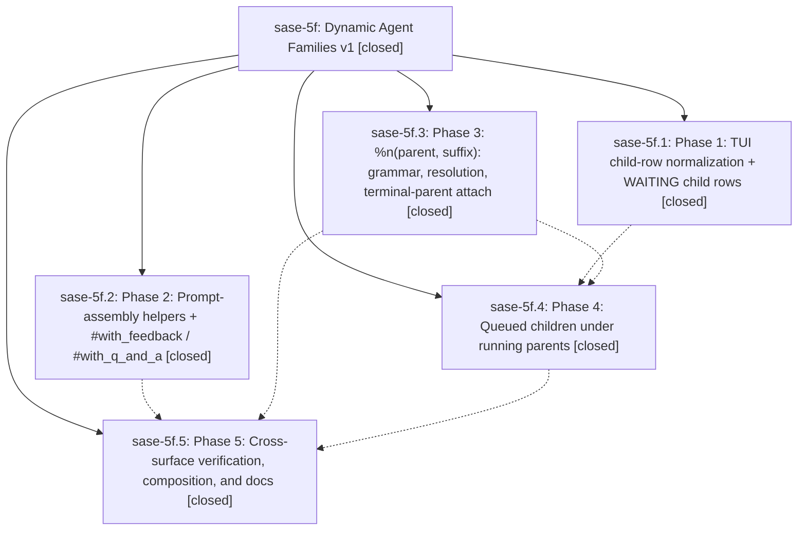

# Bead: sase-5f — Dynamic Agent Families v1

[Bead Pages](../README.md) / sase-5f

**Status:** ✓ closed · **Resolution:** (unrecorded) · **Type:** plan · **Tier:** epic
**Owner:** `bryanbugyi34@gmail.com`
**Created:** 2026-07-06 01:17:58 UTC · **Closed:** 2026-07-06 05:40:36 UTC
**Plan:** [202607/dynamic\_agent\_families\_v1.md](https://github.com/sase-org/sase--plans/blob/main/202607/dynamic_agent_families_v1.md)

## Notes

COMMIT: c5f18ae90

## Phases

| Bead | Title | Status | Size | Agents | Commits |
|---|---|---|---|---:|---:|
| [sase-5f.1](sase-5f.1.md) | Phase 1: TUI child-row normalization + WAITING child rows | ✓ closed | small | 1 | 1 |
| [sase-5f.2](sase-5f.2.md) | Phase 2: Prompt-assembly helpers + #with\_feedback / #with\_q\_and\_a | ✓ closed | small | 1 | 1 |
| [sase-5f.3](sase-5f.3.md) | Phase 3: %n(parent, suffix): grammar, resolution, terminal-parent attach | ✓ closed | small | 1 | 1 |
| [sase-5f.4](sase-5f.4.md) | Phase 4: Queued children under running parents | ✓ closed | small | 1 | 1 |
| [sase-5f.5](sase-5f.5.md) | Phase 5: Cross-surface verification, composition, and docs | ✓ closed | small | 1 | 1 |

## Lineage

## Agents

| Agent | Bead | Commits |
|---|---|---:|
| [bbugyi200.athena.sase-5f](https://github.com/sase-org/sase--agents/blob/main/agents/bbugyi200.athena.sase-5f/README.md) | [sase-5f](README.md) | 1 |
| [bbugyi200.athena.sase-5f.1](https://github.com/sase-org/sase--agents/blob/main/agents/bbugyi200.athena.sase-5f.1/README.md) | [sase-5f.1](sase-5f.1.md) | 1 |
| [bbugyi200.athena.sase-5f.2](https://github.com/sase-org/sase--agents/blob/main/agents/bbugyi200.athena.sase-5f.2/README.md) | [sase-5f.2](sase-5f.2.md) | 1 |
| [bbugyi200.athena.sase-5f.3](https://github.com/sase-org/sase--agents/blob/main/agents/bbugyi200.athena.sase-5f.3/README.md) | [sase-5f.3](sase-5f.3.md) | 1 |
| [bbugyi200.athena.sase-5f.4](https://github.com/sase-org/sase--agents/blob/main/agents/bbugyi200.athena.sase-5f.4/README.md) | [sase-5f.4](sase-5f.4.md) | 1 |
| [bbugyi200.athena.sase-5f.5](https://github.com/sase-org/sase--agents/blob/main/agents/bbugyi200.athena.sase-5f.5/README.md) | [sase-5f.5](sase-5f.5.md) | 1 |

## Commits

| Commit | Subject | Bead | Committed (UTC) |
|---|---|---|---|
| [`41b27fb`](https://github.com/sase-org/sase/commit/41b27fbaa8481568c1655feb561ac5a51063e0a2) | feat: add embedded follow-up prompt xprompts (sase-5f.2) | [sase-5f.2](sase-5f.2.md) | 2026-07-06 02:11:12 |
| [`9caeb0d`](https://github.com/sase-org/sase/commit/9caeb0d37921f403d0a9eb3e5a95f2136ba27e94) | fix(ace): normalize family child rows (sase-5f.1) | [sase-5f.1](sase-5f.1.md) | 2026-07-06 02:15:15 |
| [`7b357a0`](https://github.com/sase-org/sase/commit/7b357a097d70fb92bffe90c2659f2883a20a9b3b) | feat: support dynamic agent family attach launches (sase-5f.3) | [sase-5f.3](sase-5f.3.md) | 2026-07-06 02:20:43 |
| [`dfd9f50`](https://github.com/sase-org/sase/commit/dfd9f50f07181b96940a33c1987084c42f402df9) | feat: queue family children behind running parents (sase-5f.4) | [sase-5f.4](sase-5f.4.md) | 2026-07-06 03:07:02 |
| [`a660d92`](https://github.com/sase-org/sase/commit/a660d92277d2f348a4fb67c4025bc19fdd10763b) | feat: compose follow-up xprompts with family attach (sase-5f.5) | [sase-5f.5](sase-5f.5.md) | 2026-07-06 03:47:21 |
| [`c5f18ae`](https://github.com/sase-org/sase/commit/c5f18ae90c284e866aa79f1ffce9656886af1146) | fix: close dynamic family edge cases (sase-5f) | [sase-5f](README.md) | 2026-07-06 05:40:44 |
