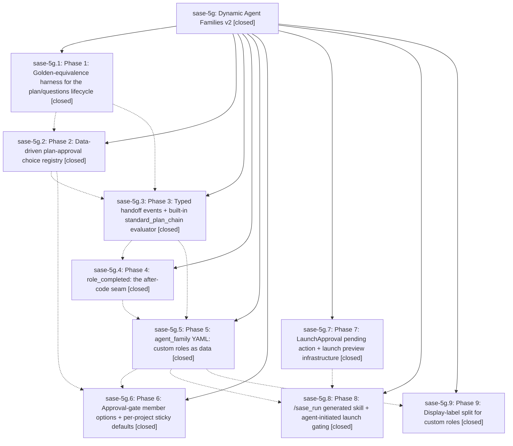

# Bead: sase-5g — Dynamic Agent Families v2

[Bead Pages](../README.md) / sase-5g

**Status:** ✓ closed · **Resolution:** (unrecorded) · **Type:** plan · **Tier:** epic
**Owner:** `bryanbugyi34@gmail.com`
**Created:** 2026-07-06 06:18:35 UTC · **Closed:** 2026-07-06 13:18:03 UTC
**Plan:** [202607/dynamic\_agent\_families\_v2.md](https://github.com/sase-org/sase--plans/blob/main/202607/dynamic_agent_families_v2.md)

## Phases

| Bead | Title | Status | Size | Agents | Commits |
|---|---|---|---|---:|---:|
| [sase-5g.1](sase-5g.1.md) | Phase 1: Golden-equivalence harness for the plan/questions lifecycle | ✓ closed | small | 1 | 1 |
| [sase-5g.2](sase-5g.2.md) | Phase 2: Data-driven plan-approval choice registry | ✓ closed | small | 1 | 1 |
| [sase-5g.3](sase-5g.3.md) | Phase 3: Typed handoff events + built-in standard\_plan\_chain evaluator | ✓ closed | small | 1 | 1 |
| [sase-5g.4](sase-5g.4.md) | Phase 4: role\_completed: the after-code seam | ✓ closed | small | 0 | 0 |
| [sase-5g.5](sase-5g.5.md) | Phase 5: agent\_family YAML: custom roles as data | ✓ closed | small | 1 | 1 |
| [sase-5g.6](sase-5g.6.md) | Phase 6: Approval-gate member options + per-project sticky defaults | ✓ closed | small | 1 | 1 |
| [sase-5g.7](sase-5g.7.md) | Phase 7: LaunchApproval pending action + launch preview infrastructure | ✓ closed | small | 1 | 1 |
| [sase-5g.8](sase-5g.8.md) | Phase 8: /sase\_run generated skill + agent-initiated launch gating | ✓ closed | small | 1 | 1 |
| [sase-5g.9](sase-5g.9.md) | Phase 9: Display-label split for custom roles | ✓ closed | small | 1 | 1 |

## Lineage

## Agents

| Agent | Bead | Commits |
|---|---|---:|
| [bbugyi200.athena.sase-5g.1](https://github.com/sase-org/sase--agents/blob/main/agents/bbugyi200.athena.sase-5g.1/README.md) | [sase-5g.1](sase-5g.1.md) | 1 |
| [bbugyi200.athena.sase-5g.2](https://github.com/sase-org/sase--agents/blob/main/agents/bbugyi200.athena.sase-5g.2/README.md) | [sase-5g.2](sase-5g.2.md) | 1 |
| [bbugyi200.athena.sase-5g.3](https://github.com/sase-org/sase--agents/blob/main/agents/bbugyi200.athena.sase-5g.3/README.md) | [sase-5g.3](sase-5g.3.md) | 1 |
| [bbugyi200.athena.sase-5g.5](https://github.com/sase-org/sase--agents/blob/main/agents/bbugyi200.athena.sase-5g.5/README.md) | [sase-5g.5](sase-5g.5.md) | 1 |
| [bbugyi200.athena.sase-5g.6](https://github.com/sase-org/sase--agents/blob/main/agents/bbugyi200.athena.sase-5g.6/README.md) | [sase-5g.6](sase-5g.6.md) | 1 |
| [bbugyi200.athena.sase-5g.7](https://github.com/sase-org/sase--agents/blob/main/agents/bbugyi200.athena.sase-5g.7/README.md) | [sase-5g.7](sase-5g.7.md) | 1 |
| [bbugyi200.athena.sase-5g.8](https://github.com/sase-org/sase--agents/blob/main/agents/bbugyi200.athena.sase-5g.8/README.md) | [sase-5g.8](sase-5g.8.md) | 1 |
| [bbugyi200.athena.sase-5g.9](https://github.com/sase-org/sase--agents/blob/main/agents/bbugyi200.athena.sase-5g.9/README.md) | [sase-5g.9](sase-5g.9.md) | 1 |

## Commits

| Commit | Subject | Bead | Committed (UTC) |
|---|---|---|---|
| [`1466dbf`](https://github.com/sase-org/sase/commit/1466dbf77349b5dab09b17bcca0b68787c5ee0a2) | test: add plan chain golden harness (sase-5g.1) | [sase-5g.1](sase-5g.1.md) | 2026-07-06 07:46:27 |
| [`19a0785`](https://github.com/sase-org/sase/commit/19a07856d3dd8c7be92c828f478f87ea0cc4fc21) | feat: add launch approval pending-action infrastructure (sase-5g.7) | [sase-5g.7](sase-5g.7.md) | 2026-07-06 08:04:00 |
| [`5f39034`](https://github.com/sase-org/sase/commit/5f390345a4398b549c87953ab4cae82cca21a1f8) | fix(plan): archive run approvals through shared choice registry (sase-5g.2) | [sase-5g.2](sase-5g.2.md) | 2026-07-06 08:54:46 |
| [`bfe4cc2`](https://github.com/sase-org/sase/commit/bfe4cc29893c86e3a4a4efd661352be862fa7afd) | feat: add typed plan-chain handoff evaluator (sase-5g.3) | [sase-5g.3](sase-5g.3.md) | 2026-07-06 09:26:39 |
| [`72fc527`](https://github.com/sase-org/sase/commit/72fc527b2286b8eea4e122cda332f13b24f97455) | feat: add file-backed custom agent-family roles (sase-5g.5) | [sase-5g.5](sase-5g.5.md) | 2026-07-06 11:18:16 |
| [`deaf571`](https://github.com/sase-org/sase/commit/deaf571e08fbd1b1577308e4bffac627dcba23ce) | feat: add approved agent launch requests (sase-5g.8) | [sase-5g.8](sase-5g.8.md) | 2026-07-06 11:40:49 |
| [`b762964`](https://github.com/sase-org/sase/commit/b762964a53714994d8c578f7fc6475428b14ff24) | feat: add plan approval member selection (sase-5g.6) | [sase-5g.6](sase-5g.6.md) | 2026-07-06 11:45:44 |
| [`5eb4508`](https://github.com/sase-org/sase/commit/5eb450842dd30b31777259c202e4b722e83e2339) | feat(agent-family): display custom role status labels (sase-5g.9) | [sase-5g.9](sase-5g.9.md) | 2026-07-06 11:51:25 |
