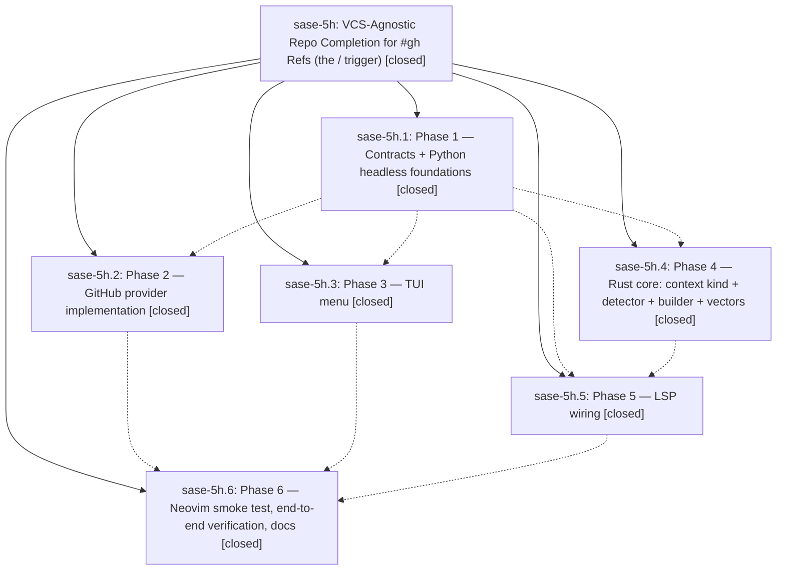

# Bead: sase-5h — VCS-Agnostic Repo Completion for #gh Refs (the / trigger)

[Bead Pages](../README.md) / sase-5h

**Status:** ✓ closed · **Resolution:** (unrecorded) · **Type:** plan · **Tier:** epic
**Owner:** `bryanbugyi34@gmail.com`
**Created:** 2026-07-07 17:11:26 UTC · **Closed:** 2026-07-07 19:24:07 UTC
**Plan:** [202607/vcs\_repo\_slash\_completion.md](https://github.com/sase-org/sase--plans/blob/main/202607/vcs_repo_slash_completion.md)

## Notes

COMMIT: 0800a0db9

## Phases

| Bead | Title | Status | Size | Agents | Commits |
|---|---|---|---|---:|---:|
| [sase-5h.1](sase-5h.1.md) | Phase 1 — Contracts + Python headless foundations | ✓ closed | small | 1 | 1 |
| [sase-5h.2](sase-5h.2.md) | Phase 2 — GitHub provider implementation | ✓ closed | small | 0 | 0 |
| [sase-5h.3](sase-5h.3.md) | Phase 3 — TUI menu | ✓ closed | small | 1 | 1 |
| [sase-5h.4](sase-5h.4.md) | Phase 4 — Rust core: context kind + detector + builder + vectors | ✓ closed | small | 0 | 0 |
| [sase-5h.5](sase-5h.5.md) | Phase 5 — LSP wiring | ✓ closed | small | 0 | 0 |
| [sase-5h.6](sase-5h.6.md) | Phase 6 — Neovim smoke test, end-to-end verification, docs | ✓ closed | small | 1 | 1 |

## Lineage

## Agents

| Agent | Bead | Commits |
|---|---|---:|
| [bbugyi200.athena.sase-5h](https://github.com/sase-org/sase--agents/blob/main/agents/bbugyi200.athena.sase-5h/README.md) | [sase-5h](README.md) | 1 |
| [bbugyi200.athena.sase-5h--code](https://github.com/sase-org/sase--agents/blob/main/families/bbugyi200.athena.sase-5h.md#member-code) | [sase-5h](README.md) | 0 |
| [bbugyi200.athena.sase-5h.1](https://github.com/sase-org/sase--agents/blob/main/agents/bbugyi200.athena.sase-5h.1/README.md) | [sase-5h.1](sase-5h.1.md) | 1 |
| [bbugyi200.athena.sase-5h.3](https://github.com/sase-org/sase--agents/blob/main/agents/bbugyi200.athena.sase-5h.3/README.md) | [sase-5h.3](sase-5h.3.md) | 1 |
| [bbugyi200.athena.sase-5h.6](https://github.com/sase-org/sase--agents/blob/main/agents/bbugyi200.athena.sase-5h.6/README.md) | [sase-5h.6](sase-5h.6.md) | 1 |

## Commits

| Commit | Subject | Bead | Committed (UTC) |
|---|---|---|---|
| [`0547413`](https://github.com/sase-org/sase/commit/0547413c10677ea6bce1505597a7ea0934ac7f19) | feat: add VCS repo completion foundations (sase-5h.1) | [sase-5h.1](sase-5h.1.md) | 2026-07-07 17:45:21 |
| [`6405eac`](https://github.com/sase-org/sase/commit/6405eac1a3d3df9a29fd95e44c941e3d10734119) | feat(ace): add VCS repo completion menu (sase-5h.3) | [sase-5h.3](sase-5h.3.md) | 2026-07-07 18:16:52 |
| [`852c622`](https://github.com/sase-org/sase/commit/852c622c1f1efc2948436a122a82f82c70ac5b04) | docs: document VCS repository completion (sase-5h.6) | [sase-5h.6](sase-5h.6.md) | 2026-07-07 19:06:13 |
| [`5449f87`](https://github.com/sase-org/sase/commit/5449f871cdad3c2c1bc80a1feafe1cd7359120d1) | test: close repo completion verification gaps (sase-5h) | [sase-5h](README.md) | 2026-07-07 19:24:45 |
