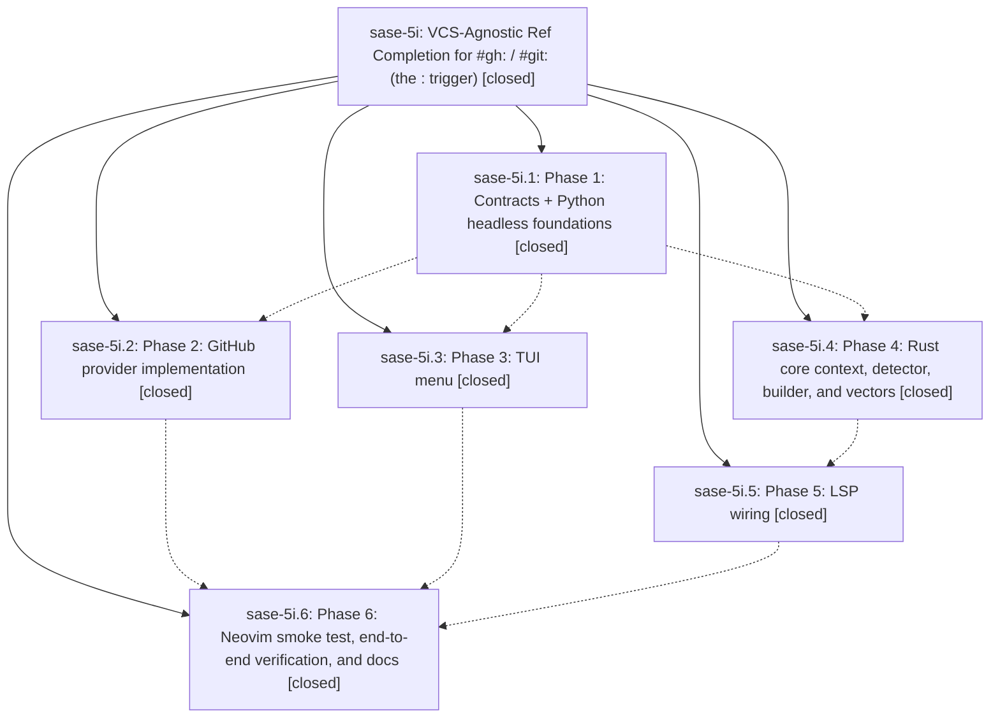

# Bead: sase-5i — VCS-Agnostic Ref Completion for #gh: / #git: (the : trigger)

[Bead Pages](../README.md) / sase-5i

**Status:** ✓ closed · **Resolution:** (unrecorded) · **Type:** plan · **Tier:** epic
**Owner:** `bryanbugyi34@gmail.com`
**Created:** 2026-07-07 20:09:55 UTC · **Closed:** 2026-07-07 22:00:51 UTC
**Plan:** [202607/vcs\_ref\_colon\_completion.md](https://github.com/sase-org/sase--plans/blob/main/202607/vcs_ref_colon_completion.md)

## Notes

COMMIT: 1e47b9483

[2026-07-27T21:38:41Z · sase-a1.land] [2026-07-07T22:01:25Z · bryanbugyi34@gmail.com] (restored 2026-07-27) COMMIT: a4f475759

## Phases

| Bead | Title | Status | Size | Agents | Commits |
|---|---|---|---|---:|---:|
| [sase-5i.1](sase-5i.1.md) | Phase 1: Contracts + Python headless foundations | ✓ closed | small | 1 | 1 |
| [sase-5i.2](sase-5i.2.md) | Phase 2: GitHub provider implementation | ✓ closed | small | 0 | 0 |
| [sase-5i.3](sase-5i.3.md) | Phase 3: TUI menu | ✓ closed | small | 1 | 1 |
| [sase-5i.4](sase-5i.4.md) | Phase 4: Rust core context, detector, builder, and vectors | ✓ closed | small | 0 | 0 |
| [sase-5i.5](sase-5i.5.md) | Phase 5: LSP wiring | ✓ closed | small | 0 | 0 |
| [sase-5i.6](sase-5i.6.md) | Phase 6: Neovim smoke test, end-to-end verification, and docs | ✓ closed | small | 1 | 1 |

## Lineage

## Agents

| Agent | Bead | Commits |
|---|---|---:|
| [bbugyi200.athena.sase-5i](https://github.com/sase-org/sase--agents/blob/main/agents/bbugyi200.athena.sase-5i/README.md) | [sase-5i](README.md) | 2 |
| [bbugyi200.athena.sase-5i--code](https://github.com/sase-org/sase--agents/blob/main/families/bbugyi200.athena.sase-5i.md#member-code) | [sase-5i](README.md) | 0 |
| [bbugyi200.athena.sase-5i.1](https://github.com/sase-org/sase--agents/blob/main/agents/bbugyi200.athena.sase-5i.1/README.md) | [sase-5i.1](sase-5i.1.md) | 1 |
| [bbugyi200.athena.sase-5i.3](https://github.com/sase-org/sase--agents/blob/main/agents/bbugyi200.athena.sase-5i.3/README.md) | [sase-5i.3](sase-5i.3.md) | 1 |
| [bbugyi200.athena.sase-5i.6](https://github.com/sase-org/sase--agents/blob/main/agents/bbugyi200.athena.sase-5i.6/README.md) | [sase-5i.6](sase-5i.6.md) | 1 |

## Commits

| Commit | Subject | Bead | Committed (UTC) |
|---|---|---|---|
| [`52349bd`](https://github.com/sase-org/sase/commit/52349bdf0c64920942ee50d885c87f158e895111) | feat: add VCS ref completion foundations (sase-5i.1) | [sase-5i.1](sase-5i.1.md) | 2026-07-07 20:47:07 |
| [`461aae3`](https://github.com/sase-org/sase/commit/461aae3b8384187ac4df208a117a81e55a6db4ea) | feat: wire VCS ref completion into TUI (sase-5i.3) | [sase-5i.3](sase-5i.3.md) | 2026-07-07 21:22:38 |
| [`9f3c911`](https://github.com/sase-org/sase/commit/9f3c911e585df7b1c04b204430769fccd170f921) | docs: document VCS ref completion (sase-5i.6) | [sase-5i.6](sase-5i.6.md) | 2026-07-07 21:46:41 |
| [`1a73a30`](https://github.com/sase-org/sase/commit/1a73a30c9b5e805d4ba4e834878f4b3fc3ecf02b) | chore: Add SDD prompt and plan for close\_sase\_5i\_parity\_and\_test\_gaps (sase-5i) | [sase-5i](README.md) | 2026-07-07 22:01:45 |
| [`b596d78`](https://github.com/sase-org/sase/commit/b596d78dbbcd9d93712a11332a6078e59723efb7) | fix: align VCS ref completion parity (sase-5i) | [sase-5i](README.md) | 2026-07-07 22:23:03 |
