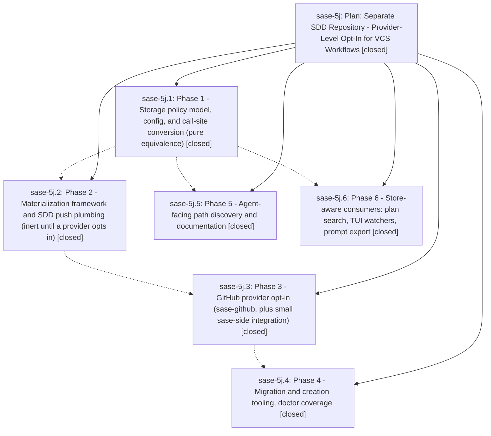

# Bead: sase-5j — Plan: Separate SDD Repository - Provider-Level Opt-In for VCS Workflows

[Bead Pages](../README.md) / sase-5j

**Status:** ✓ closed · **Resolution:** (unrecorded) · **Type:** plan · **Tier:** epic
**Owner:** `bryanbugyi34@gmail.com`
**Created:** 2026-07-08 03:23:34 UTC · **Closed:** 2026-07-08 06:54:14 UTC
**Plan:** [202607/sdd\_separate\_repo.md](https://github.com/sase-org/sase--plans/blob/main/202607/sdd_separate_repo.md)

## Phases

| Bead | Title | Status | Size | Agents | Commits |
|---|---|---|---|---:|---:|
| [sase-5j.1](sase-5j.1.md) | Phase 1 - Storage policy model, config, and call-site conversion (pure equivalence) | ✓ closed | small | 1 | 1 |
| [sase-5j.2](sase-5j.2.md) | Phase 2 - Materialization framework and SDD push plumbing (inert until a provider opts in) | ✓ closed | small | 1 | 1 |
| [sase-5j.3](sase-5j.3.md) | Phase 3 - GitHub provider opt-in (sase-github, plus small sase-side integration) | ✓ closed | small | 1 | 1 |
| [sase-5j.4](sase-5j.4.md) | Phase 4 - Migration and creation tooling, doctor coverage | ✓ closed | small | 1 | 1 |
| [sase-5j.5](sase-5j.5.md) | Phase 5 - Agent-facing path discovery and documentation | ✓ closed | small | 1 | 1 |
| [sase-5j.6](sase-5j.6.md) | Phase 6 - Store-aware consumers: plan search, TUI watchers, prompt export | ✓ closed | small | 1 | 1 |

## Lineage

## Agents

| Agent | Bead | Commits |
|---|---|---:|
| [bbugyi200.athena.sase-5j--code](https://github.com/sase-org/sase--agents/blob/main/families/bbugyi200.athena.sase-5j.md#member-code) | [sase-5j](README.md) | 0 |
| [bbugyi200.athena.sase-5j.1](https://github.com/sase-org/sase--agents/blob/main/agents/bbugyi200.athena.sase-5j.1/README.md) | [sase-5j.1](sase-5j.1.md) | 1 |
| [bbugyi200.athena.sase-5j.2](https://github.com/sase-org/sase--agents/blob/main/agents/bbugyi200.athena.sase-5j.2/README.md) | [sase-5j.2](sase-5j.2.md) | 1 |
| [bbugyi200.athena.sase-5j.3](https://github.com/sase-org/sase--agents/blob/main/agents/bbugyi200.athena.sase-5j.3/README.md) | [sase-5j.3](sase-5j.3.md) | 1 |
| [bbugyi200.athena.sase-5j.4](https://github.com/sase-org/sase--agents/blob/main/agents/bbugyi200.athena.sase-5j.4/README.md) | [sase-5j.4](sase-5j.4.md) | 1 |
| [bbugyi200.athena.sase-5j.5](https://github.com/sase-org/sase--agents/blob/main/agents/bbugyi200.athena.sase-5j.5/README.md) | [sase-5j.5](sase-5j.5.md) | 1 |
| [bbugyi200.athena.sase-5j.6](https://github.com/sase-org/sase--agents/blob/main/agents/bbugyi200.athena.sase-5j.6/README.md) | [sase-5j.6](sase-5j.6.md) | 1 |

## Commits

| Commit | Subject | Bead | Committed (UTC) |
|---|---|---|---|
| [`4637a8a`](https://github.com/sase-org/sase/commit/4637a8aa15539c4955eb696fb9a83d1c4362013a) | refactor(sdd): introduce storage policy resolver (sase-5j.1) | [sase-5j.1](sase-5j.1.md) | 2026-07-08 03:55:25 |
| [`8cf369d`](https://github.com/sase-org/sase/commit/8cf369de2c9826176129371691796445f0d7ab0c) | feat(sdd): use resolved SDD store in consumers (sase-5j.6) | [sase-5j.6](sase-5j.6.md) | 2026-07-08 04:14:45 |
| [`d105287`](https://github.com/sase-org/sase/commit/d1052879babb499661ae4fd9873974cbcb44e5c2) | feat(sdd): add provider SDD materialization plumbing (sase-5j.2) | [sase-5j.2](sase-5j.2.md) | 2026-07-08 04:17:34 |
| [`ee106e0`](https://github.com/sase-org/sase/commit/ee106e0b398465119898e01836584d95f709c7a7) | feat: add SDD path discovery for agents (sase-5j.5) | [sase-5j.5](sase-5j.5.md) | 2026-07-08 04:23:25 |
| [`5568489`](https://github.com/sase-org/sase/commit/556848902da6b636b3c46e55cc6377852350f894) | feat: add SDD companion repo config (sase-5j.3) | [sase-5j.3](sase-5j.3.md) | 2026-07-08 04:37:11 |
| [`9ea3c7b`](https://github.com/sase-org/sase/commit/9ea3c7b983ce28c1ffc357e19369b03fc7b3ec4f) | feat: add SDD separate-repo migration tooling (sase-5j.4) | [sase-5j.4](sase-5j.4.md) | 2026-07-08 05:07:07 |
