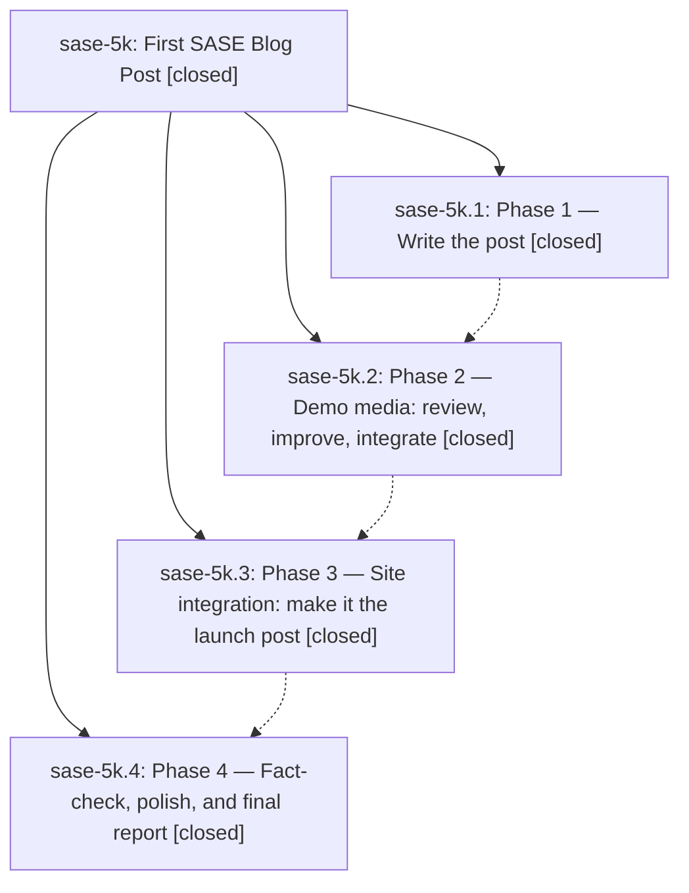

# Bead: sase-5k — First SASE Blog Post

[Bead Pages](../README.md) / sase-5k

**Status:** ✓ closed · **Resolution:** (unrecorded) · **Type:** plan · **Tier:** epic
**Owner:** `bryanbugyi34@gmail.com`
**Created:** 2026-07-08 04:00:22 UTC · **Closed:** 2026-07-08 16:22:16 UTC
**Plan:** [202607/first\_blog\_post.md](https://github.com/sase-org/sase--plans/blob/main/202607/first_blog_post.md)

## Phases

| Bead | Title | Status | Size | Agents | Commits |
|---|---|---|---|---:|---:|
| [sase-5k.1](sase-5k.1.md) | Phase 1 — Write the post | ✓ closed | small | 1 | 1 |
| [sase-5k.2](sase-5k.2.md) | Phase 2 — Demo media: review, improve, integrate | ✓ closed | small | 1 | 1 |
| [sase-5k.3](sase-5k.3.md) | Phase 3 — Site integration: make it the launch post | ✓ closed | small | 1 | 1 |
| [sase-5k.4](sase-5k.4.md) | Phase 4 — Fact-check, polish, and final report | ✓ closed | small | 1 | 1 |

## Lineage

## Agents

| Agent | Bead | Commits |
|---|---|---:|
| [bbugyi200.athena.sase-5k.1](https://github.com/sase-org/sase--agents/blob/main/agents/bbugyi200.athena.sase-5k.1/README.md) | [sase-5k.1](sase-5k.1.md) | 1 |
| [bbugyi200.athena.sase-5k.2](https://github.com/sase-org/sase--agents/blob/main/agents/bbugyi200.athena.sase-5k.2/README.md) | [sase-5k.2](sase-5k.2.md) | 1 |
| [bbugyi200.athena.sase-5k.3](https://github.com/sase-org/sase--agents/blob/main/agents/bbugyi200.athena.sase-5k.3/README.md) | [sase-5k.3](sase-5k.3.md) | 1 |
| [bbugyi200.athena.sase-5k.4](https://github.com/sase-org/sase--agents/blob/main/agents/bbugyi200.athena.sase-5k.4/README.md) | [sase-5k.4](sase-5k.4.md) | 1 |

## Commits

| Commit | Subject | Bead | Committed (UTC) |
|---|---|---|---|
| [`d08dd54`](https://github.com/sase-org/sase/commit/d08dd540f2f407a988d760c0947d6c909696d450) | docs: add SASE launch post draft (sase-5k.1) | [sase-5k.1](sase-5k.1.md) | 2026-07-08 04:20:46 |
| [`f877bd8`](https://github.com/sase-org/sase/commit/f877bd8457136e53c0dac424f193c075f4017dbf) | docs: integrate SASE blog demo media (sase-5k.2) | [sase-5k.2](sase-5k.2.md) | 2026-07-08 04:41:05 |
| [`a280878`](https://github.com/sase-org/sase/commit/a280878c380502e4c929e314baddb667e4c9f73c) | docs: publish SASE launch post (sase-5k.3) | [sase-5k.3](sase-5k.3.md) | 2026-07-08 05:06:22 |
| [`9851ae7`](https://github.com/sase-org/sase/commit/9851ae756a0d3aac6c801fc53bf99e549892313a) | docs: polish SASE launch post xprompt example (sase-5k.4) | [sase-5k.4](sase-5k.4.md) | 2026-07-08 05:24:39 |
