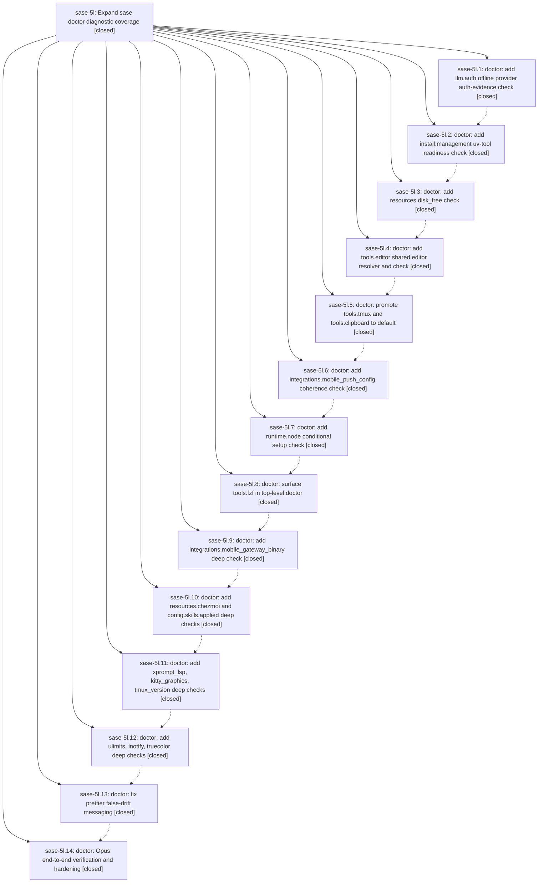

# Bead: sase-5l — Expand sase doctor diagnostic coverage

[Bead Pages](../README.md) / sase-5l

**Status:** ✓ closed · **Resolution:** (unrecorded) · **Type:** plan · **Tier:** epic
**Owner:** `bryanbugyi34@gmail.com`
**Created:** 2026-07-08 05:07:37 UTC · **Closed:** 2026-07-08 22:06:29 UTC
**Plan:** [202607/sase\_doctor\_diagnostics.md](https://github.com/sase-org/sase--plans/blob/main/202607/sase_doctor_diagnostics.md)

## Phases

| Bead | Title | Status | Size | Agents | Commits |
|---|---|---|---|---:|---:|
| [sase-5l.1](sase-5l.1.md) | doctor: add llm.auth offline provider auth-evidence check | ✓ closed | small | 1 | 1 |
| [sase-5l.10](sase-5l.10.md) | doctor: add resources.chezmoi and config.skills.applied deep checks | ✓ closed | small | 1 | 1 |
| [sase-5l.11](sase-5l.11.md) | doctor: add xprompt\_lsp, kitty\_graphics, tmux\_version deep checks | ✓ closed | small | 1 | 1 |
| [sase-5l.12](sase-5l.12.md) | doctor: add ulimits, inotify, truecolor deep checks | ✓ closed | small | 1 | 1 |
| [sase-5l.13](sase-5l.13.md) | doctor: fix prettier false-drift messaging | ✓ closed | small | 1 | 1 |
| [sase-5l.14](sase-5l.14.md) | doctor: Opus end-to-end verification and hardening | ✓ closed | small | 1 | 1 |
| [sase-5l.2](sase-5l.2.md) | doctor: add install.management uv-tool readiness check | ✓ closed | small | 1 | 1 |
| [sase-5l.3](sase-5l.3.md) | doctor: add resources.disk\_free check | ✓ closed | small | 1 | 1 |
| [sase-5l.4](sase-5l.4.md) | doctor: add tools.editor shared editor resolver and check | ✓ closed | small | 1 | 1 |
| [sase-5l.5](sase-5l.5.md) | doctor: promote tools.tmux and tools.clipboard to default | ✓ closed | small | 1 | 1 |
| [sase-5l.6](sase-5l.6.md) | doctor: add integrations.mobile\_push\_config coherence check | ✓ closed | small | 1 | 1 |
| [sase-5l.7](sase-5l.7.md) | doctor: add runtime.node conditional setup check | ✓ closed | small | 1 | 1 |
| [sase-5l.8](sase-5l.8.md) | doctor: surface tools.fzf in top-level doctor | ✓ closed | small | 1 | 1 |
| [sase-5l.9](sase-5l.9.md) | doctor: add integrations.mobile\_gateway\_binary deep check | ✓ closed | small | 1 | 1 |

## Lineage

## Agents

| Agent | Bead | Commits |
|---|---|---:|
| [bbugyi200.athena.sase-5l.1](https://github.com/sase-org/sase--agents/blob/main/agents/bbugyi200.athena.sase-5l.1/README.md) | [sase-5l.1](sase-5l.1.md) | 1 |
| [bbugyi200.athena.sase-5l.10](https://github.com/sase-org/sase--agents/blob/main/agents/bbugyi200.athena.sase-5l.10/README.md) | [sase-5l.10](sase-5l.10.md) | 1 |
| [bbugyi200.athena.sase-5l.11](https://github.com/sase-org/sase--agents/blob/main/agents/bbugyi200.athena.sase-5l.11/README.md) | [sase-5l.11](sase-5l.11.md) | 1 |
| [bbugyi200.athena.sase-5l.12](https://github.com/sase-org/sase--agents/blob/main/agents/bbugyi200.athena.sase-5l.12/README.md) | [sase-5l.12](sase-5l.12.md) | 1 |
| [bbugyi200.athena.sase-5l.13](https://github.com/sase-org/sase--agents/blob/main/agents/bbugyi200.athena.sase-5l.13/README.md) | [sase-5l.13](sase-5l.13.md) | 1 |
| [bbugyi200.athena.sase-5l.14](https://github.com/sase-org/sase--agents/blob/main/agents/bbugyi200.athena.sase-5l.14/README.md) | [sase-5l.14](sase-5l.14.md) | 1 |
| [bbugyi200.athena.sase-5l.2](https://github.com/sase-org/sase--agents/blob/main/agents/bbugyi200.athena.sase-5l.2/README.md) | [sase-5l.2](sase-5l.2.md) | 1 |
| [bbugyi200.athena.sase-5l.3](https://github.com/sase-org/sase--agents/blob/main/agents/bbugyi200.athena.sase-5l.3/README.md) | [sase-5l.3](sase-5l.3.md) | 1 |
| [bbugyi200.athena.sase-5l.4](https://github.com/sase-org/sase--agents/blob/main/agents/bbugyi200.athena.sase-5l.4/README.md) | [sase-5l.4](sase-5l.4.md) | 1 |
| [bbugyi200.athena.sase-5l.5](https://github.com/sase-org/sase--agents/blob/main/agents/bbugyi200.athena.sase-5l.5/README.md) | [sase-5l.5](sase-5l.5.md) | 1 |
| [bbugyi200.athena.sase-5l.6](https://github.com/sase-org/sase--agents/blob/main/agents/bbugyi200.athena.sase-5l.6/README.md) | [sase-5l.6](sase-5l.6.md) | 1 |
| [bbugyi200.athena.sase-5l.7](https://github.com/sase-org/sase--agents/blob/main/agents/bbugyi200.athena.sase-5l.7/README.md) | [sase-5l.7](sase-5l.7.md) | 1 |
| [bbugyi200.athena.sase-5l.8](https://github.com/sase-org/sase--agents/blob/main/agents/bbugyi200.athena.sase-5l.8/README.md) | [sase-5l.8](sase-5l.8.md) | 1 |
| [bbugyi200.athena.sase-5l.9](https://github.com/sase-org/sase--agents/blob/main/agents/bbugyi200.athena.sase-5l.9/README.md) | [sase-5l.9](sase-5l.9.md) | 1 |

## Commits

| Commit | Subject | Bead | Committed (UTC) |
|---|---|---|---|
| [`141fcbe`](https://github.com/sase-org/sase/commit/141fcbe29e53f077970a72b2fd234227fe6c2f7e) | feat(doctor): add offline LLM auth evidence check (sase-5l.1) | [sase-5l.1](sase-5l.1.md) | 2026-07-08 05:52:58 |
| [`6bdd008`](https://github.com/sase-org/sase/commit/6bdd00894b11267f06cf49b7c8a0a25f8fbcd94d) | feat: add install management doctor check (sase-5l.2) | [sase-5l.2](sase-5l.2.md) | 2026-07-08 06:03:31 |
| [`df19d58`](https://github.com/sase-org/sase/commit/df19d586b53cd0db2f63d512178ff43e5ced770f) | feat(doctor): add disk resource diagnostic (sase-5l.3) | [sase-5l.3](sase-5l.3.md) | 2026-07-08 06:17:51 |
| [`a788d8c`](https://github.com/sase-org/sase/commit/a788d8cbe44da8be000748943a1914e4c320942b) | feat(doctor): add editor command diagnostic (sase-5l.4) | [sase-5l.4](sase-5l.4.md) | 2026-07-08 06:38:26 |
| [`0ea4f7d`](https://github.com/sase-org/sase/commit/0ea4f7d19aa113b3d6854293d153e13457276aee) | feat(doctor): promote tmux and clipboard checks (sase-5l.5) | [sase-5l.5](sase-5l.5.md) | 2026-07-08 06:50:35 |
| [`274a0ad`](https://github.com/sase-org/sase/commit/274a0ad8fc5461f356c5b748e28bbecfdfd81e2f) | feat(doctor): add mobile push config diagnostic (sase-5l.6) | [sase-5l.6](sase-5l.6.md) | 2026-07-08 07:05:51 |
| [`9ea0828`](https://github.com/sase-org/sase/commit/9ea0828c35d0a409737c107a152ac060b8b39465) | feat(doctor): add conditional node runtime check (sase-5l.7) | [sase-5l.7](sase-5l.7.md) | 2026-07-08 07:19:36 |
| [`35d813f`](https://github.com/sase-org/sase/commit/35d813fb2df084180bd70d353e7b422fd044071a) | feat(doctor): add fzf tool diagnostic (sase-5l.8) | [sase-5l.8](sase-5l.8.md) | 2026-07-08 07:29:24 |
| [`0ee1b55`](https://github.com/sase-org/sase/commit/0ee1b55b8f2b219a9b13c8fae6432edb9cff2c22) | feat(doctor): add mobile gateway binary check (sase-5l.9) | [sase-5l.9](sase-5l.9.md) | 2026-07-08 07:42:39 |
| [`1db06a5`](https://github.com/sase-org/sase/commit/1db06a547c618912538a50434fb646b933a7fe38) | feat(doctor): add deep chezmoi skill diagnostics (sase-5l.10) | [sase-5l.10](sase-5l.10.md) | 2026-07-08 20:39:16 |
| [`7fbfc56`](https://github.com/sase-org/sase/commit/7fbfc5620664696b155e90ae80f32fa4d51465db) | feat(doctor): add xprompt and terminal deep checks (sase-5l.11) | [sase-5l.11](sase-5l.11.md) | 2026-07-08 20:56:15 |
| [`f15c9a3`](https://github.com/sase-org/sase/commit/f15c9a33758bf82d0cc1e4a4372b5edd5d8b38ed) | feat(doctor): add deep host limit checks (sase-5l.12) | [sase-5l.12](sase-5l.12.md) | 2026-07-08 21:07:57 |
| [`2e7861a`](https://github.com/sase-org/sase/commit/2e7861a2fe4ee80bbb5db832ce66c67c88f15bee) | fix(doctor): clarify prettier skill drift diagnostics (sase-5l.13) | [sase-5l.13](sase-5l.13.md) | 2026-07-08 21:17:53 |
| [`64e48bd`](https://github.com/sase-org/sase/commit/64e48bdaa8f23ac21f9800efbecf7c863f1f2419) | fix(doctor): strip doubled program token from tmux version summary (sase-5l.14) | [sase-5l.14](sase-5l.14.md) | 2026-07-08 21:41:31 |
