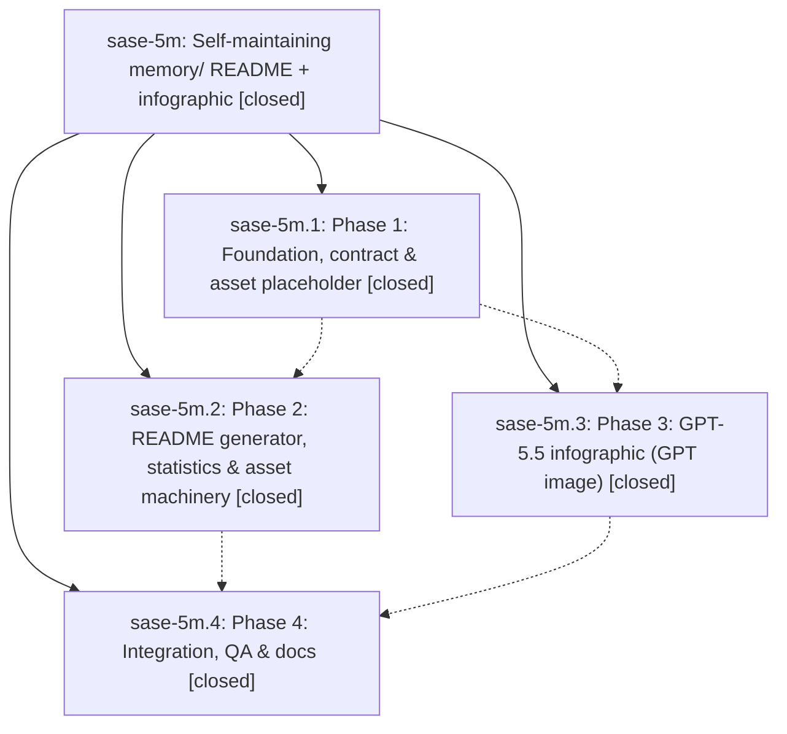

# Bead: sase-5m — Self-maintaining memory/ README + infographic

[Bead Pages](../README.md) / sase-5m

**Status:** ✓ closed · **Resolution:** (unrecorded) · **Type:** plan · **Tier:** epic
**Owner:** `bryanbugyi34@gmail.com`
**Created:** 2026-07-08 23:01:31 UTC
**Plan:** [202607/memory\_readme\_infographic.md](https://github.com/sase-org/sase--plans/blob/main/202607/memory_readme_infographic.md)

## Phases

| Bead | Title | Status | Size | Agents | Commits |
|---|---|---|---|---:|---:|
| [sase-5m.1](sase-5m.1.md) | Phase 1: Foundation, contract & asset placeholder | ✓ closed | small | 1 | 1 |
| [sase-5m.2](sase-5m.2.md) | Phase 2: README generator, statistics & asset machinery | ✓ closed | small | 1 | 1 |
| [sase-5m.3](sase-5m.3.md) | Phase 3: GPT-5.5 infographic (GPT image) | ✓ closed | small | 1 | 1 |
| [sase-5m.4](sase-5m.4.md) | Phase 4: Integration, QA & docs | ✓ closed | small | 1 | 1 |

## Lineage

## Agents

| Agent | Bead | Commits |
|---|---|---:|
| [bbugyi200.athena.sase-5m.1](https://github.com/sase-org/sase--agents/blob/main/agents/bbugyi200.athena.sase-5m.1/README.md) | [sase-5m.1](sase-5m.1.md) | 1 |
| [bbugyi200.athena.sase-5m.2](https://github.com/sase-org/sase--agents/blob/main/agents/bbugyi200.athena.sase-5m.2/README.md) | [sase-5m.2](sase-5m.2.md) | 1 |
| [bbugyi200.athena.sase-5m.3](https://github.com/sase-org/sase--agents/blob/main/agents/bbugyi200.athena.sase-5m.3/README.md) | [sase-5m.3](sase-5m.3.md) | 1 |
| [bbugyi200.athena.sase-5m.4](https://github.com/sase-org/sase--agents/blob/main/agents/bbugyi200.athena.sase-5m.4/README.md) | [sase-5m.4](sase-5m.4.md) | 1 |

## Commits

| Commit | Subject | Bead | Committed (UTC) |
|---|---|---|---|
| [`a9007ab`](https://github.com/sase-org/sase/commit/a9007ab34b1be216de4e25a99033b7fb2c3ba4b9) | docs(memory): add memory directory map assets (sase-5m.1) | [sase-5m.1](sase-5m.1.md) | 2026-07-08 23:22:07 |
| [`b09de75`](https://github.com/sase-org/sase/commit/b09de751983a332fae4f4b8b42ee0a2389380ab7) | docs(memory): update memory directory map infographic (sase-5m.3) | [sase-5m.3](sase-5m.3.md) | 2026-07-08 23:38:58 |
| [`373c31c`](https://github.com/sase-org/sase/commit/373c31cf1692dbfaae14575ab0affbb5d8239a34) | feat(memory): generate data-driven memory README (sase-5m.2) | [sase-5m.2](sase-5m.2.md) | 2026-07-08 23:39:12 |
| [`cf901d5`](https://github.com/sase-org/sase/commit/cf901d5312a8783763d2a5611cb50d747b7c70bd) | docs(memory): refresh generated memory README (sase-5m.4) | [sase-5m.4](sase-5m.4.md) | 2026-07-08 23:47:06 |
