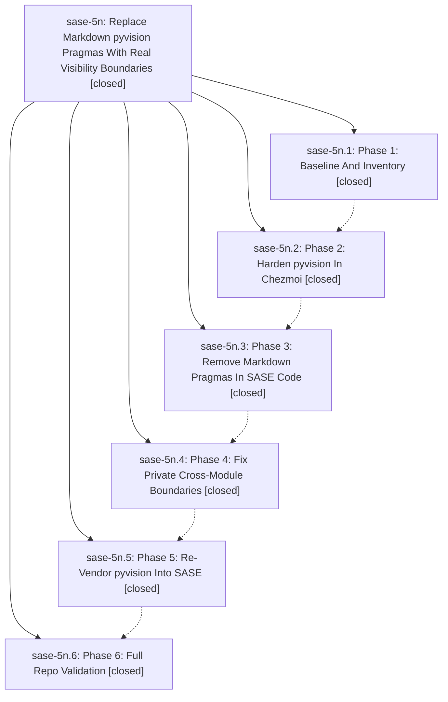

# Bead: sase-5n — Replace Markdown pyvision Pragmas With Real Visibility Boundaries

[Bead Pages](../README.md) / sase-5n

**Status:** ✓ closed · **Resolution:** (unrecorded) · **Type:** plan · **Tier:** epic
**Owner:** `bryanbugyi34@gmail.com`
**Created:** 2026-07-09 02:15:18 UTC · **Closed:** 2026-07-09 03:43:05 UTC
**Plan:** [202607/pyvision\_markdown\_pragmas.md](https://github.com/sase-org/sase--plans/blob/main/202607/pyvision_markdown_pragmas.md)

## Phases

| Bead | Title | Status | Size | Agents | Commits |
|---|---|---|---|---:|---:|
| [sase-5n.1](sase-5n.1.md) | Phase 1: Baseline And Inventory | ✓ closed | small | 0 | 0 |
| [sase-5n.2](sase-5n.2.md) | Phase 2: Harden pyvision In Chezmoi | ✓ closed | small | 0 | 0 |
| [sase-5n.3](sase-5n.3.md) | Phase 3: Remove Markdown Pragmas In SASE Code | ✓ closed | small | 1 | 1 |
| [sase-5n.4](sase-5n.4.md) | Phase 4: Fix Private Cross-Module Boundaries | ✓ closed | small | 1 | 1 |
| [sase-5n.5](sase-5n.5.md) | Phase 5: Re-Vendor pyvision Into SASE | ✓ closed | small | 1 | 1 |
| [sase-5n.6](sase-5n.6.md) | Phase 6: Full Repo Validation | ✓ closed | small | 0 | 0 |

## Lineage

## Agents

| Agent | Bead | Commits |
|---|---|---:|
| [bbugyi200.athena.sase-5n.3](https://github.com/sase-org/sase--agents/blob/main/agents/bbugyi200.athena.sase-5n.3/README.md) | [sase-5n.3](sase-5n.3.md) | 1 |
| [bbugyi200.athena.sase-5n.4](https://github.com/sase-org/sase--agents/blob/main/agents/bbugyi200.athena.sase-5n.4/README.md) | [sase-5n.4](sase-5n.4.md) | 1 |
| [bbugyi200.athena.sase-5n.5](https://github.com/sase-org/sase--agents/blob/main/agents/bbugyi200.athena.sase-5n.5/README.md) | [sase-5n.5](sase-5n.5.md) | 1 |

## Commits

| Commit | Subject | Bead | Committed (UTC) |
|---|---|---|---|
| [`a79df77`](https://github.com/sase-org/sase/commit/a79df7733386de41507804ae2d17866ca9c5d64d) | refactor: remove markdown pyvision pragmas (sase-5n.3) | [sase-5n.3](sase-5n.3.md) | 2026-07-09 02:59:50 |
| [`e20dde9`](https://github.com/sase-org/sase/commit/e20dde983edfa6c8aeb57a6b55c58675246f2bc1) | refactor: clean up private visibility boundaries (sase-5n.4) | [sase-5n.4](sase-5n.4.md) | 2026-07-09 03:21:44 |
| [`0767451`](https://github.com/sase-org/sase/commit/076745176b11757476355c271d57e59205bbfba7) | chore: re-vendor pyvision linter (sase-5n.5) | [sase-5n.5](sase-5n.5.md) | 2026-07-09 03:31:37 |
