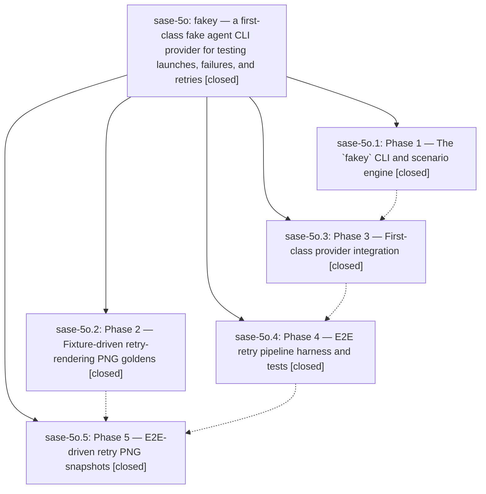

# Bead: sase-5o — fakey — a first-class fake agent CLI provider for testing launches, failures, and retries

[Bead Pages](../README.md) / sase-5o

**Status:** ✓ closed · **Resolution:** (unrecorded) · **Type:** plan · **Tier:** epic
**Owner:** `bryanbugyi34@gmail.com`
**Created:** 2026-07-10 21:00:46 UTC · **Closed:** 2026-07-10 23:00:43 UTC
**Plan:** [202607/fakey\_provider.md](https://github.com/sase-org/sase--plans/blob/main/202607/fakey_provider.md)

## Notes

COMMIT: 16969ee

## Phases

| Bead | Title | Status | Size | Agents | Commits |
|---|---|---|---|---:|---:|
| [sase-5o.1](sase-5o.1.md) | Phase 1 — The \`fakey\` CLI and scenario engine | ✓ closed | small | 1 | 1 |
| [sase-5o.2](sase-5o.2.md) | Phase 2 — Fixture-driven retry-rendering PNG goldens | ✓ closed | small | 1 | 1 |
| [sase-5o.3](sase-5o.3.md) | Phase 3 — First-class provider integration | ✓ closed | small | 1 | 1 |
| [sase-5o.4](sase-5o.4.md) | Phase 4 — E2E retry pipeline harness and tests | ✓ closed | small | 1 | 1 |
| [sase-5o.5](sase-5o.5.md) | Phase 5 — E2E-driven retry PNG snapshots | ✓ closed | small | 1 | 1 |

## Lineage

## Agents

| Agent | Bead | Commits |
|---|---|---:|
| [bbugyi200.athena.sase-5o](https://github.com/sase-org/sase--agents/blob/main/agents/bbugyi200.athena.sase-5o/README.md) | [sase-5o](README.md) | 1 |
| [bbugyi200.athena.sase-5o--code](https://github.com/sase-org/sase--agents/blob/main/families/bbugyi200.athena.sase-5o.md#member-code) | [sase-5o](README.md) | 0 |
| [bbugyi200.athena.sase-5o.1](https://github.com/sase-org/sase--agents/blob/main/agents/bbugyi200.athena.sase-5o.1/README.md) | [sase-5o.1](sase-5o.1.md) | 1 |
| [bbugyi200.athena.sase-5o.2](https://github.com/sase-org/sase--agents/blob/main/agents/bbugyi200.athena.sase-5o.2/README.md) | [sase-5o.2](sase-5o.2.md) | 1 |
| [bbugyi200.athena.sase-5o.3](https://github.com/sase-org/sase--agents/blob/main/agents/bbugyi200.athena.sase-5o.3/README.md) | [sase-5o.3](sase-5o.3.md) | 1 |
| [bbugyi200.athena.sase-5o.4](https://github.com/sase-org/sase--agents/blob/main/agents/bbugyi200.athena.sase-5o.4/README.md) | [sase-5o.4](sase-5o.4.md) | 1 |
| [bbugyi200.athena.sase-5o.5](https://github.com/sase-org/sase--agents/blob/main/agents/bbugyi200.athena.sase-5o.5/README.md) | [sase-5o.5](sase-5o.5.md) | 1 |

## Commits

| Commit | Subject | Bead | Committed (UTC) |
|---|---|---|---|
| [`ad3e1eb`](https://github.com/sase-org/sase/commit/ad3e1eba20969489ebd368118019f76209fb6e5e) | feat(fakey): add deterministic scenario CLI (sase-5o.1) | [sase-5o.1](sase-5o.1.md) | 2026-07-10 21:28:27 |
| [`ef28cc5`](https://github.com/sase-org/sase/commit/ef28cc5ae922bca3bcad1d675b50d238ce522e68) | test(ace): cover retry rendering states (sase-5o.2) | [sase-5o.2](sase-5o.2.md) | 2026-07-10 21:32:22 |
| [`7ecc017`](https://github.com/sase-org/sase/commit/7ecc0173eff527f7ec87cfd2ceea919936d7fa93) | feat: add first-class fakey provider integration (sase-5o.3) | [sase-5o.3](sase-5o.3.md) | 2026-07-10 21:54:04 |
| [`3648ce1`](https://github.com/sase-org/sase/commit/3648ce1d2a36fe04678b342e0fa887c62d41a9d0) | fix: honor retry fallback model overrides (sase-5o.4) | [sase-5o.4](sase-5o.4.md) | 2026-07-10 22:07:18 |
| [`46e7869`](https://github.com/sase-org/sase/commit/46e7869e69fabb412a093f0a2c7c27461131d105) | fix(ace): preserve retry state during workflow dedup (sase-5o.5) | [sase-5o.5](sase-5o.5.md) | 2026-07-10 22:34:20 |
| [`a035958`](https://github.com/sase-org/sase/commit/a035958ca96d7ab80a47f18a944c384b90291f67) | test(fakey): guard retry marker attribution (sase-5o) | [sase-5o](README.md) | 2026-07-10 23:01:23 |
